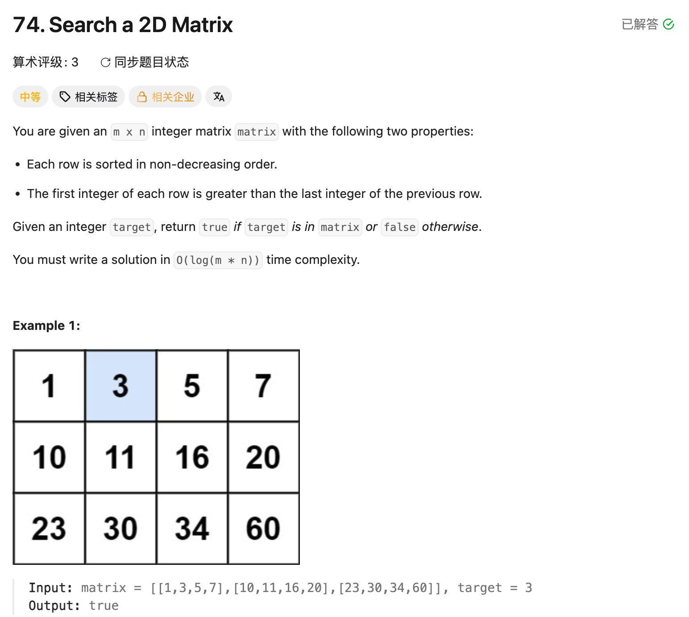

## 74. Search a 2D Matrix

Date: 9/19/2026
Difficulty: Medium
Tags: Array, Binary Search, Matrix



### 一刷 (9/19/2026) ❌ 没想到展开 index，不理解 row / col 的换算

**卡在哪**：知道 binary search，但面对 matrix 不知道怎么设置搜索范围；也不理解为什么求 row 却要除以 cols。

**真正的坎**：每行有 cols 个 element，所以每跨过 cols 个就换一行。**除法算跨过几整行，取余算当前行内的偏移。**

讨论后理解：把 index 展开、取值时换算回二维位置，剩下就和普通 binary search 一模一样。已能算出 index 9 对应 row 2、col 1；本轮未提供完整代码验证。

**自测点**：为什么求 row 和 col 都用 cols？什么条件保证展开后可以做 binary search？

---

### 核心思路（一句话）

**按行给所有格子统一编号，在 `[0, rows * cols - 1]` 上做 binary search，取值时把 mid 换算成 row / col。**

每行递增，且下一行第一个值大于上一行最后一个值 → 按行展开后整体有序。

### index 换算

下面是格子的 index，不是实际存储的值：

```text
           col 0   col 1   col 2   col 3
row 0        0       1       2       3
row 1        4       5       6       7
row 2        8       9      10      11
```

```text
index = row × cols + col

row = index / cols
col = index % cols
```

例如 index 11，每行 4 个：

```text
11 = 2 × 4 + 3
     ↑       ↑
    row     col
```

跨过 2 整行，当前行内偏移 3 → `matrix[2][3]`。

### 代码

```java
class Solution {
    public boolean searchMatrix(int[][] matrix, int target) {
        int rows = matrix.length;
        int cols = matrix[0].length;
        int left = 0;
        int right = rows * cols - 1;

        while (left <= right) {
            int mid = left + (right - left) / 2;
            int value = matrix[mid / cols][mid % cols];

            if (value == target) {
                return true;
            } else if (value < target) {
                left = mid + 1;
            } else {
                right = mid - 1;
            }
        }

        return false;
    }
}
```

### 复杂度分析

**Time: O(log(rows × cols))**：每轮排除一半候选位置。
**Space: O(1)**：只换算 index，没有创建展开后的 array。

对比 brute force O(rows × cols)：利用整体有序，避免逐格查找。

### 沉淀

- **搜索用一维 index，取值才换成二维位置**：left / right / mid 都是统一编号。
- **除以 cols 求 row，取余 cols 求 col**：cols 决定每隔几个 element 换行。
- **先确认整体有序**：只有每行递增还不够，跨行也必须有序。

### 关联

- LC704：binary search 的范围更新完全相同，只把 `nums[mid]` 换成 `matrix[mid / cols][mid % cols]`。
