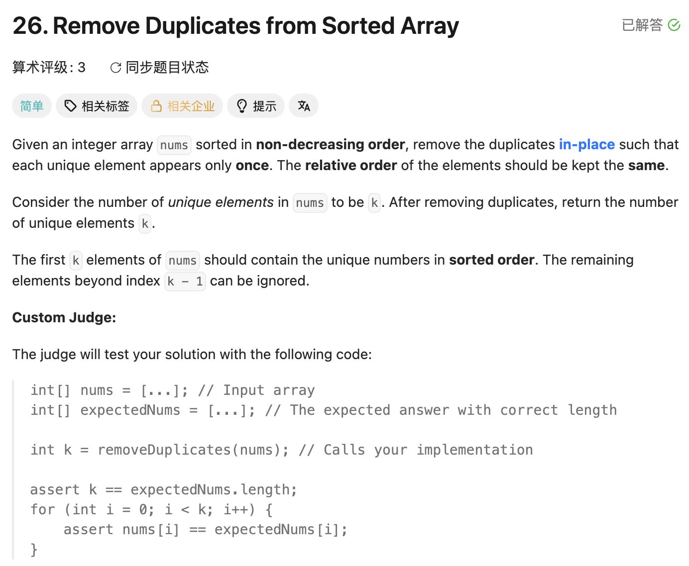

## 26. Remove Duplicates from Sorted Array

Date: 一刷 6/14/2025, 二刷 7/21/2025, 三刷 7/23/2026
Difficulty: Easy
Tags: two pointers



### 三刷 (7/23/2026) ❌ 同模板不同 slow 语义：27 的 return slow 习惯带进 26，少了 +1

和 27 同天连刷，循环体全对，只错 return。我的代码：

```java
class Solution {
    public int removeDuplicates(int[] nums) {
        int slow = 0;
        for (int fast = 1; fast < nums.length; fast++) {
            if (nums[fast] != nums[slow]) {
                slow++;
                nums[slow] = nums[fast];
            }
        }
        return slow;   // ❌❌ 核心错误：slow 是「最后一个确认元素的下标」，
                       //    长度 = 下标 + 1 → 应该 return slow + 1
    }
}
```

Dry run（`nums = [1,2]`）：fast=1 时 `2 != 1` → slow=1、写入；循环结束
return slow = **1 ❌**（正确长度 2）——静默错误，不崩，只少一个。

**根因**：26 和 27 用同一个 fast/slow 模板，但 slow 语义相反——
- **27**：比较对象是 val，slow 可以当纯写入 cursor（**先写后加**，指向下一个写入位）→ slow 本身 = 个数，`return slow`
- **26**：比较对象是 `nums[slow]`，slow 必须始终指向**已确认的真实元素**（**先加后写**，指向最后确认位）→ slow 是下标，`return slow + 1`

slow 用哪种 convention 不是随意选的，是**比较对象决定的**。return 前先问一句：slow 现在指着什么？下标转长度要 +1。

**自测点**：不看答案说出 26 和 27 的 slow 语义差异 + 为什么 26 的 slow 必须先加后写 + 各自 return 什么

---

<!-- ↓↓↓ 复习时先自己想一遍，再往下翻看答案 ↓↓↓ -->

### 正确写法

```java
class Solution {
    public int removeDuplicates(int[] nums) {
        int slow = 0;                          // 指向已去重区最后一个元素
        for (int fast = 1; fast < nums.length; fast++) {
            if (nums[fast] != nums[slow]) {    // 和最后确认的元素比 → slow 必须指真实元素
                slow++;
                nums[slow] = nums[fast];       // 先加后写
            }
        }
        return slow + 1;                       // slow 是下标，长度 = 下标 + 1
    }
}
```

### 复杂度分析

**Time: O(n)**：fast 从 1 走到末尾，每轮必进，loop 恰好 n-1 轮，每轮 O(1)。
**Space: O(1)**：in-place 覆盖，只有 slow/fast 两个 variable。

### 沉淀

- **fast/slow 模板的两种 slow convention**：「下一个写入位」（先写后加，27）vs「最后确认位」（先加后写，26）。选哪种由**比较对象**决定：要拿 `nums[slow]` 参与比较 → 必须用后者
- **return 前的固定自问**：slow 现在指着什么？指下标 → 长度 +1；指写入位 → 直接就是个数
- 和 69/34 的 return 错同族：都是「循环结束后说不清指针语义」→ 靠猜 return → 静默错误
- 27 → 26 连刷的教训：同模板不代表同语义，迁移时先核对指针 invariant 再套 return

### 关联

- 27（同模板反向对照：slow 语义、加写顺序、return 三处全相反，成对记忆）
- 69 / 34（「退出时指针语义决定 return 谁」同族）
- 80（26 的进阶：最多保留两个，同一模板第三种变化，待刷）
