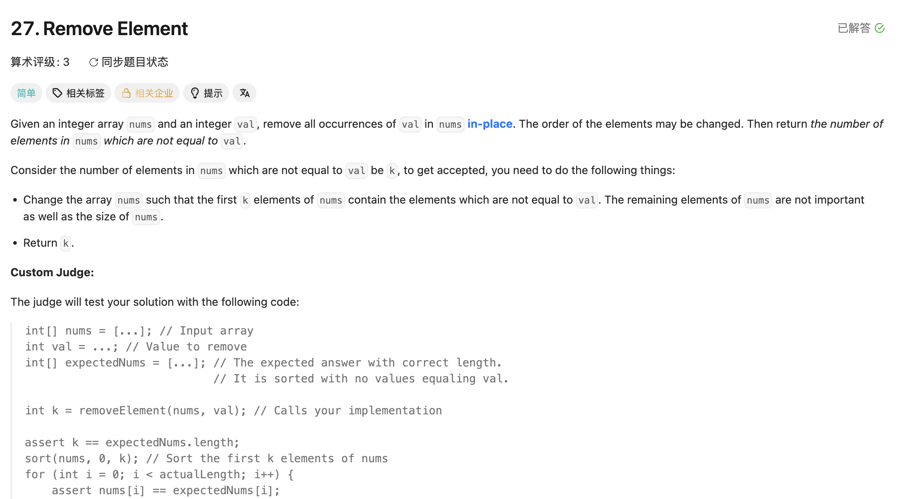

## 27. Remove Element

Date: 一刷(随想录，日期待补), 7/23/2026
Difficulty: Easy
Tags: two pointers



### 二刷 (7/23/2026) ❌ 改写循环结构时，无条件动作（指针推进）被错误地变成了条件动作

for 版本能 AC，改写成 while 就错了。我的代码：

```java
class Solution {
    public int removeElement(int[] nums, int val) {
        int slow = 0, fast = 0;

        while (fast >= 0 && fast < nums.length && slow < nums.length) {
            //     ❌② 冗余条件：fast 只增不减恒 ≥0；slow ≤ fast 恒成立
            //        slow < nums.length 反而把死循环"救"成了错误返回值，掩盖 bug
            if (nums[fast] == val) {
                fast++;
            } else {  // nums[fast] != val
                nums[slow] = nums[fast];
                slow++;
                // ❌① 核心错误：缺 fast++ → fast 卡在第一个非 val 元素上
                //    反复复制同一个元素，slow 涨满数组后靠冗余条件退出，return nums.length
            }
        }

        return slow;
    }
}
```

**①的根因**：for 头里的 `fast++` 每轮必执行、与分支无关；改写成 while 时把它塞进了
if 分支，只剩一个分支在推进。**for 转 while：update statement 放循环体末尾、
所有分支之外**。

---

<!-- ↓↓↓ 复习时先自己想一遍，再往下翻看答案 ↓↓↓ -->

### 正确写法

```java
class Solution {
    public int removeElement(int[] nums, int val) {
        int slow = 0, fast = 0;

        while (fast < nums.length) {       // 和 for 版条件完全一致
            if (nums[fast] != val) {
                nums[slow] = nums[fast];
                slow++;
            }
            fast++;                        // 所有分支之外，每轮必执行
        }

        return slow;
    }
}
```

### 复杂度分析

**Time: O(n)**：fast 每轮必进一格，loop 恰好 n 轮，每轮 O(1)。
（bug 版正是破坏了「每轮必进」→ loop 次数失去上界，复杂度分析失效）

**Space: O(1)**：in-place 覆盖，只有 slow/fast 两个 variable。

对比 brute force O(n²)（每删一个 val 整体前移）：two pointers 快在每个 element 最多读一次、写一次。

### 沉淀

- **two pointers 高频 bug 模式**：某个分支忘记推进 pointer → 死循环，或靠其他条件
  意外退出后返回错误结果。结果异常大/异常小时，先检查每个分支里 pointer 是否都在动
- **冗余 loop condition 是坏味道**：不会更安全，只会在出 bug 时干扰判断
  （本题 `slow < nums.length` 把死循环掩盖成静默错误）
- 改写循环结构不应改变终止条件：while 条件就该和 for 版一样只有 `fast < nums.length`
- Time: O(n) / Space: O(1)

### 引申：for vs while 怎么选

**判断标准：pointer 的推进是否无条件。**

- **每轮必进 → for**。推进逻辑写进循环头，语法上保证不会漏
  （27 的 fast、大多数遍历型 two pointers 的快 pointer）
- **推进与否取决于分支 → while**。此时 for 头反而写不下，比如：
  - binary search：left/right 谁动、动多少，由比较结果决定（704/69/367）
  - 对撞 pointers：`while (left < right)`，每轮只动一边（LC344 Reverse String、LC977 Squares of a Sorted Array）
  - sliding window：右 pointer 用 for 推进，左 pointer 在内层 while 里条件性收缩（两种混用）
- **灰色地带**：像 27 这种「fast 无条件进、slow 条件进」的题，for 和 while 都能写，
  但 for 更防呆——本题的 bug 正是因为 while 把「必执行」交给了人肉保证

**一句话**：能用 for 表达的无条件推进就用 for，让语法替你兜底；
推进本身是算法逻辑的一部分时才用 while。
