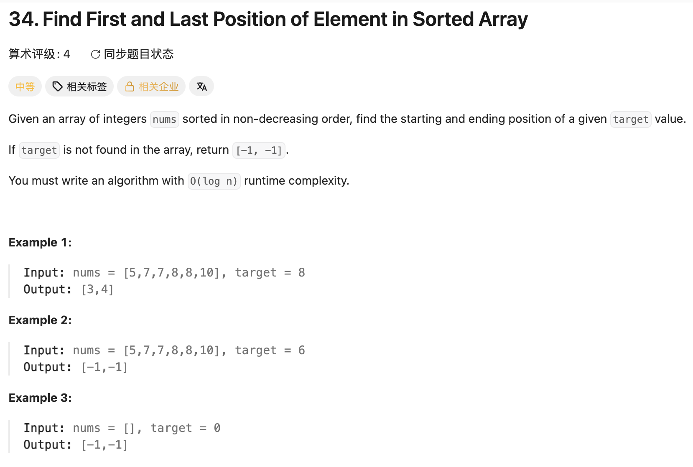

## 34. Find First and Last Position of Element in Sorted Array

Date: 二刷 7/21/2026
Difficulty: Medium
Tags: binary search, lower bound



### 一刷（代码随想录，看解析）

跟着随想录过的，属于教学性质，没有自己独立想过

---

### 二刷 (7/21/2026) ❌ 没思路

**卡在哪**：知道要用二分，但想不出「怎么同时找到左边界和右边界」。
下意识以为要写两套不同的二分（一套找左、一套找右），
一想到要重新推一遍「找右边界」的边界更新规则就卡住了。

**真正的坎**：没意识到「找右边界」可以**翻译**成「找左边界」——
只要有 `lowerBound`（第一个 ≥ x）这一个工具，两边都能解决，不需要第二套模板。

---

### 三刷 (7/22/2026 计划独立再刷一遍)

（明天独立做，不看笔记，把代码贴这里 + 标注卡点）

---

<!-- ↓↓↓ 复习时先自己想一遍，再往下翻看答案 ↓↓↓ -->

### 核心思路（一句话）

**只写一个 `lowerBound(x)` = 第一个 ≥ x 的位置，调用两次：**

- 左边界 = `L(target)`
- 右边界 = `L(target + 1) - 1`

### 右边界为什么是 `L(target+1) - 1`（推导）

手上只有「找第一个 ≥ x」这一个工具，它天生只会找**区域的左边缘**，
不会直接找「最后一个」。那就把问题翻译一下：

1. `L(x)` = 第一个 ≥ x 的位置
2. 代入 x+1 → `L(target+1)` = 第一个 ≥ target+1 的位置 = **第一个 > target 的位置**
   （整数数组才成立：≥ x+1 等价于 > x）
3. 再 -1 → **最后一个 ≤ target 的位置** = 右边界

> 直觉：没法直接问「最后一个 8 在哪」，但可以问「第一个比 8 大的在哪」，
> 然后往回退一格 —— 退到的就是最后一个 8。
> **「最后一个 X」= 「第一个 > X 的位置」- 1**

例：`nums = [5,7,7,8,8,8,10]`, target = 8

- `L(8)` = 3 → 左边界 ✅
- `L(9)` = 6（值 10 的下标）→ `6 - 1 = 5` → 右边界 ✅

### 代码

```java
class Solution {
    public int[] searchRange(int[] nums, int target) {
        int left = lowerBound(nums, target);        // first >= target

        // target 不存在 → 必须先挡住，否则下面的推导不成立
        if (left == nums.length || nums[left] != target) {
            return new int[]{-1, -1};
        }

        int right = lowerBound(nums, target + 1) - 1;  // (first > target) - 1 = last <= target
        return new int[]{left, right};
    }

    // 唯一的模板：返回第一个 >= target 的下标（不存在则返回 nums.length）
    private int lowerBound(int[] nums, int target) {
        int left = 0, right = nums.length - 1;   // closed interval
        while (left <= right) {
            int mid = left + (right - left) / 2;
            if (nums[mid] >= target) {           // = 归到 right 这侧 → left 不跳过等于的
                right = mid - 1;
            } else {
                left = mid + 1;
            }
        }
        return left;
    }
}
```

### 那行存在性检查为什么必须写、且顺序不能反

```java
if (left == nums.length || nums[left] != target) return new int[]{-1, -1};
```

- `lowerBound` **一定会返回一个数**，它是「分界线」，合法范围是 `[0, nums.length]`
  —— 右端比最大下标多一格。所以返回值作为「位置」永远有效，作为「下标」不一定有效。
- `left == nums.length`：所有元素都 < target，分界线落在数组末尾之外 → 直接 `nums[left]` 会越界崩溃
- `nums[left] != target`：没越界，但指向的值 > target，说明 target 不存在，left 只是插入缝隙
- **顺序不能反**：`||` 短路，越界时直接返回、不会执行 `nums[left]`。写反了会 ArrayIndexOutOfBoundsException
- 这行还守住了一个前提：**target 存在**时，「最后一个 ≤ target」才等于「最后一个 = target」

---

### 沉淀：边界映射速查（只用 L = lowerBound）

| 要找      | 写法           |
| --------- | -------------- |
| first ≥ x | `L(x)`         |
| first > x | `L(x + 1)`     |
| last < x  | `L(x) - 1`     |
| last ≤ x  | `L(x + 1) - 1` |

**不用背，两条规则当场推：**

1. **看符号定 x**：`≥` / `<` 用 `x`；`>` / `≤` 用 `x+1`（跨过 x 那一档）
2. **看 first/last 定尾巴**：`first` 不动；`last` 一律 `-1`（最后一个满足 = 第一个不满足的前一格）
   → **last 只会 `-1`，绝不会 `+1`**

### 沉淀：其他

- 一个 `lowerBound` 模板基本能打通二分这一类：704（查存在）、35（插入位置）、34（左右边界）都是它
- 拿 `L` 的返回值访问元素前，**永远先查越界**
- Time: O(log n) / Space: O(1)

### 关联

- 704（查存在，没找到返回 -1）
- 35（插入位置，直接返回 `L(target)`）
- 34（本题 = `L(target)` + `L(target+1) - 1`）

### Interview pitch (练口述)

> "I use a single lower-bound helper that returns the first index where
> nums[i] >= x. The left boundary is lowerBound(target). For the right
> boundary, instead of writing a separate right-bound search, I reuse the
> same helper: lowerBound(target + 1) - 1 gives the last index <= target.
> I check for existence first — if the index is out of range or the value
> isn't the target, I return [-1, -1]. O(log n) time, O(1) space."
