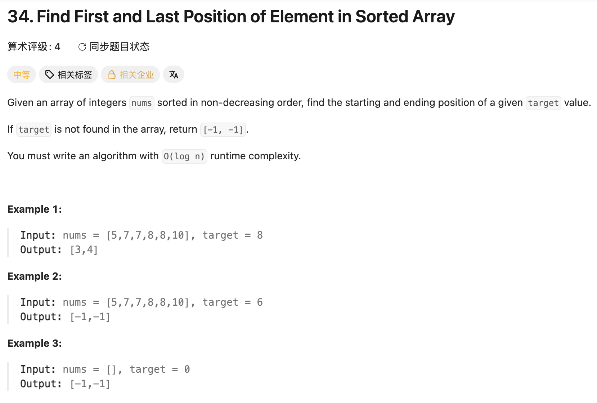

## 34. Find First and Last Position of Element in Sorted Array

Date: 一刷（代码随想录，看解析）, 二刷 7/21/2026, 三刷 7/22/2026, 四刷 7/29/2026
Difficulty: Medium
Tags: binary search, upper bound, lower bound



### 一刷（代码随想录，看解析）

跟着随想录过的，属于教学性质，没有自己独立想过。

---

### 二刷 (7/21/2026) ❌ 没思路

**卡在哪**：知道要用二分，但想不出「怎么同时找到左边界和右边界」。下意识以为要写两套不同的二分（一套找左、一套找右），一想到要重新推一遍「找右边界」的边界更新规则就卡住了。

**真正的坎**：没意识到「找右边界」可以**翻译**成「找左边界」——只要有一个 primitive，两边都能解决，不需要第二套模板。

---

### 三刷 (7/22/2026) ❌ 3 处手误 + 1 处真逻辑错

**思路层面 ✅**：两次 lowerBound、`target+1` 再 -1、存在性检查——框架完全记住了，独立写出来的。我的代码（错误点标在旁边）：

```java
class Solution {
    public int[] searchRange(int[] nums, int target) {
        int left = lowerBound(nums, target);
        if (left == nums.length || nums[left] != target) return int[]{-1,-1};  // ❌ 缺 new
        int right = lowerBound(nums, target + 1) - 1;
        return int[]{left, right};   // ❌ 同上，缺 new
    }

    private int[] lowerBound(int nums, int target){
        //      ↑❌ 返回类型应是 int（返回的是下标，不是数组）
        //                    ↑❌ 参数应是 int[] nums
        int left = 0, right = nums.length - 1;
        while (left <= right) {
            int mid = left + (right - left) / 2;
            if (nums[mid] < target) {
                left = mid + 1;
            } else if (nums[mid] > target) {
                rifht = mid - 1;      // ❌ 拼写：right
            } else {
                return mid;           // ❌❌ 核心错误：lowerBound 绝不能在相等时提前返回！
                                      //    它承诺的是「第一个 ≥ target」，提前返回只是「某一个 target」，
                                      //    不保证是第一个。把 704「找到就返回」的习惯带过来了。
            }
        }
        return left;
    }
}
```

**为什么 `return mid` 是错的 —— 反例 `nums = [8,8,8]`, target = 8**：

- left=0, right=2 → mid=1, `nums[1]==8` → 直接 return 1
- 但左边界应该是 **0**，返回了 1 ❌
- 更隐蔽的是：主函数 `nums[1]==8` 检查照样通过，不报错，最终返回 `[1,2]`，正确答案是 `[0,2]`——**静默错误，不会崩，只会答案错**

**正解**：相等时不返回，和 `>` 一起归到 `right = mid - 1`，继续往左压。这就是二刷笔记里那句「**`=` 归到 right 这侧 → left 不跳过等于的**」。

> **自检信号**：写 lowerBound 时如果出现了 `== target` 的分支，基本就写错了。它天然是**两个分支**，不是 704 那种三分支——因为 `=` 必须和 `>` 站一队，没有单独的位置。（这条对 U 版同样成立。）

**注**：存在性检查那行三刷是**对的**（只错在缺 `new`），边界检查本身完整。

---

### 四刷 (7/29/2026) ❌ 越界检查退化：笔记里写了三处的东西，写代码时没调用

20min。**换了 primitive 重推了一遍**：以 `U(x)` = 第一个 > x 为底（三刷用的是 `L(x)` = 第一个 ≥ x），左边界靠 `U(target-1)` 转译。偏移方向、`=` 的归队方向都跟着镜像反转过来，两处都对。这部分是独立推的，不是默写三刷。

错的是主函数的存在性检查：

```java
public int[] searchRange(int[] nums, int target) {
    int start = find(nums, target - 1);
    if(nums == null || nums[start] != target) return new int[]{-1,-1};
    // ❌❌① 漏 start == nums.length：U 的值域是 [0, n]，n 不是合法下标
    //      → nums=[] 或 target 大于所有元素时 nums[start] 越界崩
    //      → 题面自带的空数组样例（nums=[], target=0）直接挂
    // ❌② nums == null 是假 guard：放在 find 调用之后，find 里 nums.length
    //      已经先抛 NPE 了，这句永远轮不到执行
    int end = find(nums, target) - 1;
    return new int[]{start,end};
}
```

**①的根因**：不是「没想到边界」，是**对已立案条目的退化**。这行检查在笔记「代码」section 里一字不差存在，另有专门一节「那行存在性检查为什么必须写、且顺序不能反」，沉淀里还有「拿返回值访问元素前永远先查越界」——写了三处，写代码时一处都没调用。**三刷这行是对的（只错在缺 `new`），四刷反而丢了：不是同一个错重犯，是已经做对过的东西退化了。**

**②的机制**：**假 guard 比没 guard 更危险**——判据是「**guard 的位置必须早于它要防的那次访问**」。①和②是否有因果（假 guard 制造了「边界处理过了」的错觉，于是真正该查的不再去想）无法确定，但两者并存值得留意。

**跨题模式（写代码时不调用笔记，两天两次）**：LC27 7/28——`k = slow` 就写在两行之上，return 仍写了 `+1`；LC34 本次——越界检查写了三处，没调用。**知识在笔记里，没接到决策上。** 这一环不通，写笔记的收益会被截住。（相关但不同类：LC80 7/29 口答②取了浅层解释，代码本身全对——那是口述环节的问题，不是决策环节。）

> **自检信号（顺序前置）**：动手写代码**之前**先口答——`U`/`L` 的**值域**是什么、其中哪些值不能当下标用？答不出就先翻笔记再动手。写完再问没用，那时已经在自己的代码语境里，答得出也不代表当时会想起来。

**自测点**：不看答案说出 ① `U(x)` 的值域，以及为什么「作为位置永远有效、作为下标不一定有效」② 以 U 为底时左边界为什么是 `U(target-1)`（推导「跨一档」，不许背）③ `=` 在 U 里归哪一侧、为什么，和 L 里为什么相反 ④ 两个 primitive 各怕哪个 overflow

---

<!-- ↓↓↓ 复习时先自己想一遍，再往下翻看答案 ↓↓↓ -->

### 核心思路（一句话）

**只写一个 `U(x)` = 第一个 > x 的下标，调用两次：** 左边界 = `U(target - 1)`，右边界 = `U(target) - 1`。

### 两个端点为什么这么写（推导）

手上只有「找第一个 **>** x」这一个工具。它天生只找区域的**右**边缘，那就把两个需求都翻译成它：

**左边界 = 第一个 ≥ target**
整数上 `≥ target` ⇔ `> target - 1`，所以退一档代入 → `U(target - 1)`。

**右边界 = 最后一个 ≤ target**
`U(target)` 是第一个 > target 的位置，往回退一格就是最后一个 ≤ target → `U(target) - 1`。

> 直觉：没法直接问「最后一个 8 在哪」，但可以问「第一个比 8 大的在哪」，然后退一格。
> **「最后一个 X」= 「第一个 > X 的位置」- 1**

例：`nums = [5,7,7,8,8,8,10]`, target = 8

- `U(7)` = 3（第一个 > 7）→ 左边界 ✅
- `U(8)` = 6（值 10 的下标）→ `6 - 1 = 5` → 右边界 ✅

### 代码

```java
class Solution {
    public int[] searchRange(int[] nums, int target) {
        int start = find(nums, target - 1);              // first > target-1 = first >= target
        // start 的值域是 [0, n]，n 不是合法下标 → 必须先挡住再访问；|| 短路，顺序不能反
        if (start == nums.length || nums[start] != target) {
            return new int[]{-1, -1};
        }
        int end = find(nums, target) - 1;                // (first > target) - 1 = last <= target
        return new int[]{start, end};
    }

    // 唯一的模板：返回第一个 > target 的下标；不存在则返回 nums.length
    private int find(int[] nums, int target) {
        int left = 0, right = nums.length - 1;           // [left, right] 闭区间 → while 用 <=
        while (left <= right) {
            int mid = left + (right - left) / 2;         // 防 overflow 的写法
            if (nums[mid] <= target) {                   // = 归到 left 这侧 → 跳过所有等于的
                left = mid + 1;
            } else {                                     // nums[mid] > target
                right = mid - 1;
            }
        }
        return left;   // index of first element > target; ranges over [0, n], n means "none exists"
    }
}
```

### 那行存在性检查为什么必须写、且顺序不能反

- `find` **一定会返回一个数**，它是「分界线」，合法范围 `[0, nums.length]`——右端比最大下标多一格。所以返回值**作为「位置」永远有效，作为「下标」不一定有效**
- `start == nums.length`：所有元素都 ≤ target-1，分界线落在数组末尾之外 → 直接 `nums[start]` 越界崩溃
- `nums[start] != target`：没越界，但指向的值 > target，说明 target 不存在，start 只是插入缝隙
- **顺序不能反**：`||` 短路，越界时直接返回、不会执行 `nums[start]`
- 这行还守住一个前提：**target 存在**时，「最后一个 ≤ target」才等于「最后一个 = target」

---

### 沉淀：边界映射速查（只用 U = upperBound）

**`U(x)` = 第一个 > x 的下标。值域 `[0, n]`——n 表示「不存在比 x 大的」。**

| 要找      | 写法           |
| --------- | -------------- |
| first > x | `U(x)`         |
| first ≥ x | `U(x - 1)`     |
| last ≤ x  | `U(x) - 1`     |
| last < x  | `U(x - 1) - 1` |

**不用背，两条规则当场推：**

1. **看符号定 x**：`>` / `≤` 用 `x`；`≥` / `<` 用 `x - 1`（退一档，因为整数上 `≥ x` ⇔ `> x-1`）
2. **看 first/last 定尾巴**：`first` 不动；`last` 一律 `-1`（最后一个满足 = 第一个不满足的前一格）
   → **last 只会 `-1`，绝不会 `+1`**

本题即：左边界 = first ≥ target = `U(target - 1)`；右边界 = last ≤ target = `U(target) - 1`。

**`=` 在 U 里归 left 这侧**——`nums[mid] <= target → left = mid + 1`，必须跳过所有等于的，才能停在第一个真正大于的位置。（与 L 相反：L 里 `=` 归 right，才不跳过等于的。）两分支，没有第三支——**出现 `== target` 分支基本就写错了**。

### 沉淀：两个 primitive 互为对偶

- `L(x)` = first ≥ x，`U(x)` = first > x
- 换算：`U(x) = L(x + 1)`，`L(x) = U(x - 1)`
- **选定一个作底，另一个全靠平移 ±1 得到，不需要第二套模板**
- 偏移方向随 primitive 反转：以 L 为底找 `>` 用 `x+1`；以 U 为底找 `≥` 用 `x-1`。**方向搞反是这类题最常见的翻车点**——判据是「往哪边跨一档才能让符号变成 primitive 自带的那个」
- **overflow 风险也镜像**：L 版怕 `target = Integer.MAX_VALUE`（`x+1` 溢出成 MIN_VALUE），U 版怕 `target = Integer.MIN_VALUE`（`x-1` 溢出成 MAX_VALUE）。本题 constraint 是 `-10^9 ~ 10^9`，安全；无 constraint 保证时要挡

### 沉淀：其他

- 一个 primitive 打通二分这一类：704（查存在）、35（插入位置 = `U(target-1)` 或 `L(target)`）、34（本题）
- **拿返回值访问元素前，永远先查越界**——值域 `[0, n]` 比合法下标多一格，**作为「位置」永远有效，作为「下标」不一定有效**。四刷栽在这里
- **假 guard 比没 guard 更危险**：`nums == null` 写在 `find` 调用之后永不生效。判据：**guard 的位置必须早于它要防的那次访问**
- Time: O(log n) / Space: O(1)

### 关联

- 704（查存在，没找到返回 -1；三刷的 `return mid` 就是把 704 的习惯带了过来）
- 35（插入位置，`L(target)` 直接就是答案；以 U 为底要写 `U(target-1)`，多一次心算）
- 80 / 26（同日的「笔记里写着、决策时没调用」同族）

### Interview pitch (练口述)

> "I use a single helper that returns the first index where nums[i] is strictly greater than x — an upper bound. The right boundary is straightforward: the first index greater than target, minus one, gives the last index that's at most target. For the left boundary I reuse the same helper by shifting the argument: on integers, at-least-target is the same as greater-than-target-minus-one, so lowerBound is just upperBound of target minus one. That way I only maintain one search template instead of two. Before indexing with the result I have to guard it — the helper's return value ranges over zero to n inclusive, so n itself is not a valid index, and if the value there isn't the target then the target doesn't exist. O(log n) time, O(1) space."
