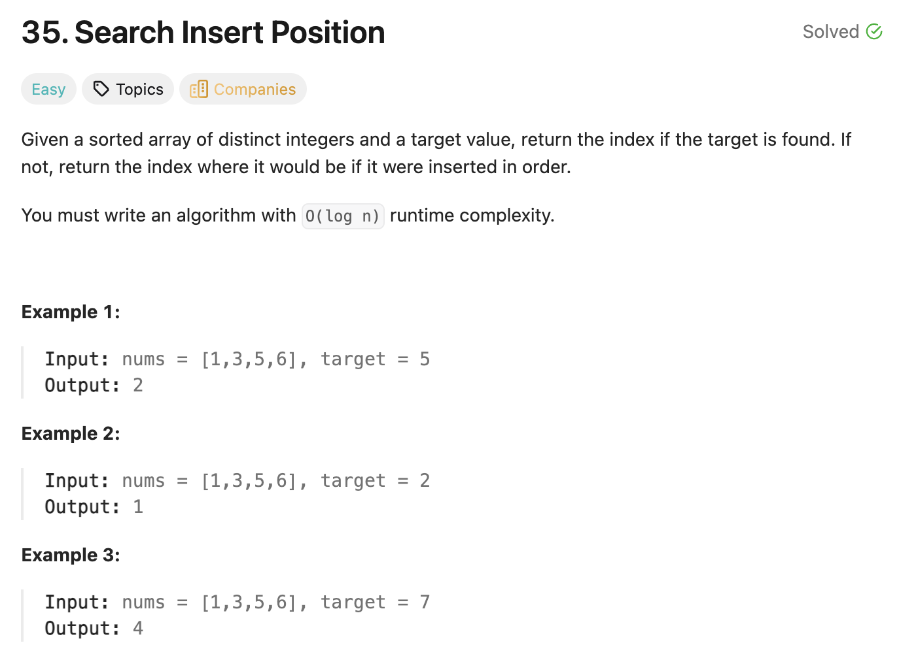

## 35. Search Insert Position

Date:4/28/2025, 11/13/2025, 7/21/2026
Difficulty: Easy
Tags: binary search



### 三刷 (7/21/2026) ✅

我的代码：

```java
class Solution {
    public int searchInsert(int[] nums, int target) {
        int left = 0, right = nums.length - 1;   // closed interval [left, right]

        while (left <= right) {
            int mid = left + (right - left) / 2;  // avoid overflow
            if (nums[mid] == target) {
                return mid;
            } else if (nums[mid] < target) {
                left = mid + 1;
            } else if (nums[mid] > target) {
                right = mid - 1;
            }
        }
        return left;   // 没找到 → left 就是插入位置
    }
}
```

复用 704 的闭区间模板，唯一区别是循环外的返回值：704 返回 -1，这题返回 left。

Dry run: `nums = [1,3,5,6], target = 2`

- 初始 left=0, right=3
- 轮1: mid=1, nums[1]=3 > 2 → right=0
- 轮2: mid=0, nums[0]=1 < 2 → left=1
- 轮3: left=1 > right=0 → 退出
- 返回 left=1 ✅（2 插在下标 1，数组变 [1,2,3,5,6]）

<!-- ↓↓↓ 复习时先自己想一遍，再往下翻看答案 ↓↓↓ -->

### 沉淀：核心洞察

- **本题 = 求 "first ≥ target 的下标"**。找到就是 target 本身的位置，找不到就是该插入的缝隙——同一个位置。
- **为什么没找到返回 `left`**：`left` 只在 `nums[mid] < target` 时右移，所以 `left` 左边(即nums[0]到nums[left-1])永远都是 < target 的元素；循环结束时 left 停在「第一个 ≥ target 的位置」，正是插入点。
- 这套推理**不依赖「数组里有没有 target」**：有 → left 停在 target 上；无 → left 停在插入缝隙。所以同一模板既能做 704（查存在）又能做 35（查插入点）。
- 复用 704 闭区间模板：`while (left <= right)`，`right = mid - 1` / `left = mid + 1`，`mid = left + (right-left)/2` 防溢出。
- Time: O(log n) / Space: O(1)
