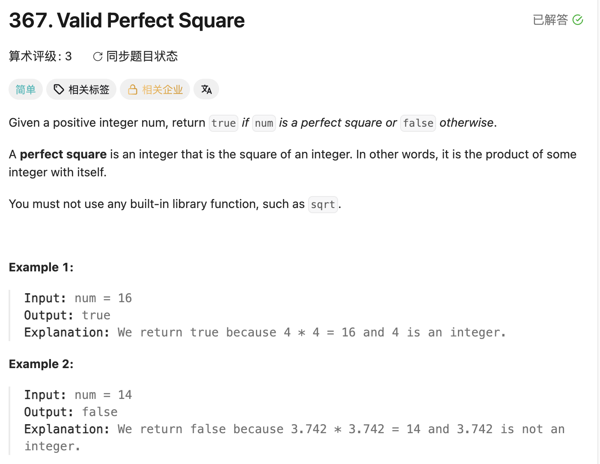

## 367. Valid Perfect Square

Date: 一刷(随想录，日期待补), 7/22/2026
Difficulty: Easy
Tags: binary search



### 二刷 (7/22/2026) ❌ 4 处错

我的代码（错误点标在旁边）：

```java
class Solution {
    public boolean isPerfectSquare(int num) {
        int left = 0, right = num;

        while (left <= right) {
            int mid = left + (right - left) / 2;
            long a = (long) mid * mid;      // ✅ overflow 防住了，69 的坑没白踩
            if (a*a == num) {               // ❌① a 已经是 mid²，a*a 是 mid⁴ → 应该 a == num
                return true;
            } else if (a*a > num) {
                mid = right - 1;            // ❌② 赋值方向反：应该 right = mid - 1
            } else if (a*a < num) {         //    改 mid 没用（下一轮立刻被重算覆盖），
                mid = left + 1;             //    left/right 永远不动 → 死循环
            }
            return false;                   // ❌③ 位置错：在循环体内，第一轮没命中就 false
        }                                   //    「搜完整个区间才 false」→ 应移到循环外
    }                                       // ❌④ 循环外没 return → 编译错 missing return statement
}
```

**②的定性**：暂记笔误（三刷验证）。但注意它和 704 二刷的 `right = right - 1` 是
同一族错——**边界更新那一行**，三次刷二分错了两次，形态不同（704 退化 O(n)，这次死循环）。

**③④是一对**：和 704 的「循环外缺 return」是同一个位置感问题的两面——
704 是循环外忘了写，这次是把它写进了循环内。

---

<!-- ↓↓↓ 复习时先自己想一遍，再往下翻看答案 ↓↓↓ -->

### 核心思路（一句话）

**367 = 69 的判定版，形态上更接近 704：查存在，不关心边界。**
满足 `mid² == num` 的位置唯一 → `==` 提前 return true 合法；
循环外唯一出口 return false（搜完整个区间都没有）。连 return left/right 的纠结都没有。

### 代码

```java
class Solution {
    public boolean isPerfectSquare(int num) {
        int left = 0, right = num;
        while (left <= right) {
            int mid = left + (right - left) / 2;
            long a = (long) mid * mid;
            if (a == num)      return true;
            else if (a > num)  right = mid - 1;
            else               left = mid + 1;
        }
        return false;   // 搜完整个区间，不存在
    }
}
```

### 沉淀

- **自检：更新分支写完，看一眼等号左边**——必须是 `left` 或 `right`，
  `mid` 永远只在等号右边（区间指针才是被更新的对象）
- 引入中间变量后注意概念绑定：`a` 就是 mid²，比较时用 `a`，别再平方
- return 的位置感：循环内 return = 「找到了」；循环外 return = 「搜完了没找到」。
  两个 return 各守一个语义，不能混
- Time: O(log num) / Space: O(1)

### 关联

- 69（同一个搜索空间，69 要 floor → return right；367 只问存在 → true/false）
- 704（同为「查存在」形态：命中提前 return，循环外统一返回未找到）

### Interview pitch (练口述)

> "Binary search on the answer space [0, num]. Since a perfect square root
> is unique, I can return true immediately when mid squared equals num —
> and if the loop finishes without a hit, no such integer exists, so I
> return false after the loop. I cast mid squared to long to avoid int
> overflow. O(log num) time, O(1) space."
