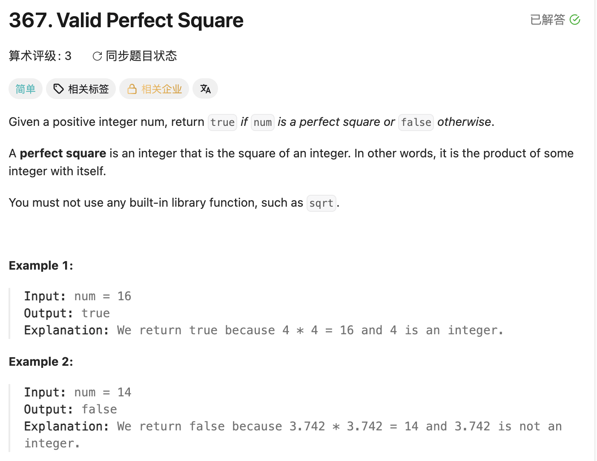

## 367. Valid Perfect Square

Date: 一刷(随想录，日期待补), 7/22/2026, 8/12/2026, 8/21/2026
Difficulty: Easy
Tags: binary search



### 二刷 (7/22/2026) ❌ 4 处错

```java
public boolean isPerfectSquare(int num) {
    int left = 0, right = num;
    while (left <= right) {
        int mid = left + (right - left) / 2;
        long a = (long) mid * mid;      // ✅ overflow 防住了，69 的坑没白踩
        if (a*a == num) {               // ❌① a 已经是 mid²，a*a 是 mid⁴ → 应为 a == num
            return true;
        } else if (a*a > num) {
            mid = right - 1;            // ❌② 赋值方向反：应为 right = mid - 1
        } else if (a*a < num) {         //    改 mid 没用（下一轮立刻被重算覆盖），
            mid = left + 1;             //    left/right 永远不动 → 死循环
        }
        return false;                   // ❌③ 位置错：在循环体内，第一轮没命中就 false
    }                                   //    「搜完整个区间才 false」→ 应移到循环外
}                                       // ❌④ 循环外没 return → 编译错
```

**②是笔误**（三刷未再犯），但和 704 二刷的 `right = right - 1` 同族——**都错在边界更新那一行**，只是后果不同（704 退化 O(n)，这次死循环）。

**③④是一对**：和 704 的「循环外缺 return」是同一个位置感问题的两面——704 是忘了写，这次是写进了循环里。

---

### 三刷 (8/12/2026) ⚠️卡推导 —— 代码全对，follow-up 口答栽了

代码一次写对，二刷四个错全未再犯。

**follow-up**：删掉 `if (a == num) return true;`，循环外要补什么判断？
我答 `left == num`，**应为 `(long) left * left == num`**。

错的源头不在那行代码，在我口答说的那句话里——「left 停在第一个 `>= num` 的位置」**把 mid 和 mid² 压成了一个词**。压扁之后再老实翻译，必然写出 `left == num`。不是翻译错了，是照着一句已经压扁的话翻译出来的。（num=16 时 left 停在 4，`4 == 16` 为 false。left 装的是**根**，num 是**平方数**，本来就不该相等。）

### 四刷 (8/21/2026) ⚠️卡推导 —— 同一条缝，换了个位置

问题：把 `right` 初值从 `num` 改成 `num / 2`，哪些 num 会出错、为什么？

**我列对了最关键那一步**：出错 ⟺ 要找的 x 掉出了新区间 ⟺ `x > num / 2`。卡在下一步——代入 `num = x²` 化简时把两边的 x 约没了，答成「x > 1/2」；以及卡在「x 和 num 到底谁是谁」。

**答案**：`x > x²/2` → `2x > x²` → `x < 2`。x 是正整数 → **只有 x = 1、即 num = 1 会出错**。此时 `right = 1/2 = 0`，循环一次都不进（我的版本 left 从 0 起，会跑一轮 mid=0 再退出），直接 `return false`，而 1 = 1×1 应为 true。
其余全部安全：`x ≥ 2` 时 `x² ≥ 2x`，即 `x ≤ num/2`，答案永远落在新区间内。

**措辞拧紧**：我说「x 掉到另一半区间上去了」——不准确。`right = num/2` 之后**右边那半根本不存在了**，不是没搜到，是没覆盖。这个区别决定修法：前者会引向「再搜一次另一半」，实际只能把上界放回去。（同 LC380 那次「找错保护对象」。）

**自测点**：在「删掉提前 return」的那一版里，循环外改成用 `right` 而不是 `left` 来判断——这个判断该怎么写？写出来之后它还成立吗？

---

<!-- ↓↓↓ 复习时先自己想一遍，再往下翻看答案 ↓↓↓ -->

### 核心思路（一句话）

**367 = 69 的判定版，形态上更接近 704：查存在，不关心边界。**
满足 `mid² == num` 的位置唯一 → `==` 提前 return true 合法；循环外唯一出口 return false。连 return left 还是 right 的纠结都没有。

### 代码

```java
public boolean isPerfectSquare(int num) {
    int left = 0, right = num;
    while (left <= right) {
        int mid = left + (right - left) / 2;
        long a = (long) mid * mid;
        if (a == num)      return true;
        else if (a > num)  right = mid - 1;
        else               left = mid + 1;
    }
    return false;   // 搜完整个区间，不存在
}
```

Time: O(log num) / Space: O(1)

### 引申一：left 停在哪，f 长什么样

**一句话记住：left 是第一个使 `f(x) >= target` 成立的位置。至于 f 长什么样，看 if 里比较的表达式——是 `square` 就 `left * left`，是 `nums[mid]` 就 `nums[left]`。**

mid 只是每轮拿来试的试探点，试完就扔；left 是最后落定的那个整数。所以「left 满足条件」要代入的是 **f 的定义**，不是 `mid = left + (right-left)/2` 那条公式（追下去是死路，会绕回自己）。

循环外写什么，再多问一句——**题目要的是 k 本身，还是 f(k) 那个值**：

- 要 k 本身 → 直接 `return left`。LC35 的插入下标、LC875 的最小速度都是这支，**绝大多数二分题都在这支**
- 要 f(k) 的值 → 拿 left 重算一次。367 问「平方数等不等于 num」，所以要 `left * left == num`。**三刷栽的就是漏了这一步重算**

只查 left 一个候选就够：`mid²` 单调递增，left 左边的平方全部严格小于 num、右边的全部大于，只有 left 这一格可能命中。

同族题：69（搜 mid、比 mid²）、875 / 1011（搜速度、比「按这个速度要多久」）。凡「二分答案」类，**搜索的量和比较的量必然分离**——这也正是本题两次卡推导的同一条缝。

### 引申二：搜索区间改了，先问「答案还在里面吗」

四刷带出来的通用动作：**任何时候改动 binary search 的区间边界，把「答案」和「边界」写成同一个量再比一次。**

本题就是 `x` vs `num/2`：代入 `num = x²` 统一成 x，一个不等式就把出错的输入全找出来了。不用挨个试数字，也不用 dry run。

它和引申一是一对：引申一管**循环内部**（f 长什么样），这条管**区间本身**（f 的定义域够不够）。

### 引申三：提前 return 删掉之后，判断没消失，只是挪了地方

| 版本                          | else 分支的条件 | 循环外的结论                        |
| ----------------------------- | --------------- | ----------------------------------- |
| 原代码（有 `== return true`） | `a > num`       | `left² > num` → `return false` 就够 |
| 删掉提前 return               | `a >= num`      | `left² >= num` → 必须再查一次 `==`  |

原来在 `a == num` 那一刻当场结清的事，现在攒到循环外统一结清。

**推论：`==` 那一格归谁，看 condition 的等号在哪边。** `square <= x` 推 left → 等号那格被 left 越过、归 right（LC69 的 right 是「最后一个 ≤ x」）；`square < x` 推 left → 等号那格留给 left。LC35 说「left 停在第一个 `>`」成立，也是因为提前 return 把 `==` 那格拿走了。

### 沉淀

- **说完「left 停在第一个 XXX」，把 f 的定义显式念出来**，别省成「第一个 >= num 的位置」——三刷四刷两次都栽在这句话上
- **卡住时先查身份**：手上这个符号是输入还是答案、是下标还是值、是个数还是位置。四刷问「x 和 num 各充当什么角色」是对的动作，应该更早做
- **改区间边界 → 立刻验一次「答案还在新区间里吗」**（引申二）
- **更新分支写完，看一眼等号左边**：必须是 `left` 或 `right`，`mid` 永远只在等号右边
- 引入中间变量后注意概念绑定：`a` 就是 mid²，比较时直接用 `a`，别再平方
- return 的位置感：循环内 return =「找到了」，循环外 return =「搜完了没找到」，各守一个语义

### 关联

- 69（同一搜索空间；69 要 floor → return right，367 只问存在 → true/false）
- 704（同为「查存在」形态）
- 35（提前 return 如何改变停位说法，正反两例）
- 875 / 1011（二分答案，搜索的量与比较的量分离得更彻底）
- 238 / 274（「变量角色抓错名字」同族，367 是其中「同一个量的两种形态被压扁」这一支）
