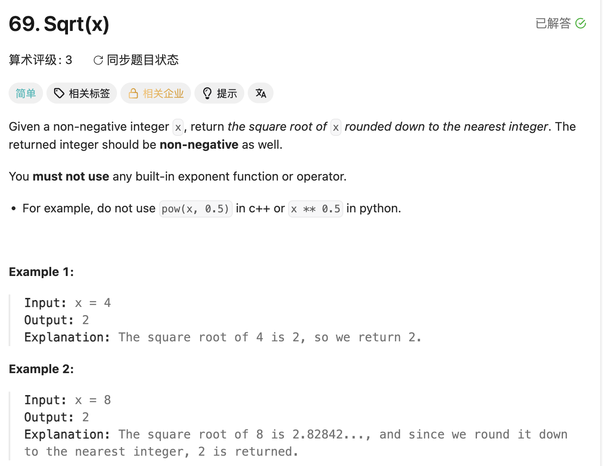

## 69. Sqrt(x)

Date: 一刷（随想录，日期待补）, 二刷 7/22/2026, 三刷 7/30/2026, 四刷 8/3/2026, 五刷 8/10/2026 ✅ **毕业**
Difficulty: Easy
Tags: binary search



### 一刷（代码随想录，看解析）

跟着随想录过的，教学性质，没有独立想过 return 谁的问题。

---

### 二刷 (7/22/2026) ⚠️ 结构写对，return 靠猜

```java
class Solution {
    public int mySqrt(int x) {
        int left = 0, right = x;
        while (left <= right) {
            int mid = left + (right - left) / 2;
            if (mid * mid == x) {
                //  ↑❌ int overflow：x 接近 MAX_VALUE 时 mid ≥ 46341，mid² 爆 int
                //     要写 (long) mid * mid，或除法写法 mid > x / mid
                return mid;
            } else if (mid * mid > x) {
                right = mid - 1;
            } else if (mid * mid < x) {
                left = mid + 1;
            }
        }
        return left;   // ❌❌ 核心错误：应该 return right
    }
}
```

**真正的坎**：没把「loop invariant 决定退出时 pointer 语义」和这题连起来——其实就是 34 那套 lower bound，只是比较对象从 `nums[mid]` 换成了 `mid²`。

Dry run（x = 8，答案 2）：left=0,right=8 → mid=4，16>8，right=3 → mid=1，1<8，left=2 → mid=2，4<8，left=3 → mid=3，9>8，right=2 → 退出。`return left` 给出 **3 ❌**。和 34 的 `return mid` 同族，都是**静默错误**：不崩，只多 1。

---

### 三刷 (7/30/2026) ❌ overflow 退化：二刷已立案的同一处

二刷的 ❌❌（`return left`）没再犯。但 overflow 又犯：

```java
int sqrt = mid * mid;   // ❌❌ 二刷笔记里已标注过这一行，且「沉淀」单列一条
                        //    x 最大 2^31-1 → right 初值 2.1e9 → 首轮 mid ≈ 1.07e9
                        //    mid² ≈ 1.15e18 溢出成负数 → sq < x 判成真 → 逻辑全乱
```

**根因**：不是没学过，是**已立案条目退化**——笔记里写了两处（代码旁注 + 沉淀），写代码时没调用。与 LC34 四刷（越界检查写了三处、三刷做对过、四刷丢了）同款。

**机制**：`mid = left + (right - left) / 2` 已成肌肉记忆，但它**只防加法**。乘法/平方是另一处，没被同一条反射覆盖——**反射的覆盖面比知识的覆盖面窄。**

> **自检信号**：循环体内任何**乘法 / 平方 / 求和**都要单独过一遍量级——把 constraint 上界代入算一次，超过 2.1e9 就提升到 long。
> `(long) mid * mid` ≠ `(long)(mid * mid)`：后者先按 int 乘完溢出再转，等于没转。**cast 必须在乘法之前。**

---

### 四刷 (8/3/2026) ✅ 5min，未翻笔记

overflow 已修正，cast 位置正确。与 704 同日对照，两题的 return 判据都写进了注释。

**`return right` 的表述绕了**：写成「right 在 left 左边一格 + 向下取整」——成立但绕经 left。更短的判据：**right = 最后一个满足 `mid² ≤ x` 的数 = floor(√x)**，与答案定义完全重合，不必经过 left。

---

### 五刷 (8/10/2026) ✅ **毕业**（8/3 ✅ → 8/10 ✅，+7 站）

代码一次写对，overflow 防护在。口答给的是推导非结论：退出时 `right = left - 1`，left 停在第一个 `mid² > x`，所以 right 是最后一个 `mid² ≤ x`。还主动补了一层以前没说过的——**因为相等的情况被提前 `return mid` 拿走了，所以「第一个 >」和「第一个 >=」在这里重合**。

**一处措辞已拧紧**：她说 right 是「最后一个 `< x`」，应为 `≤ x`。本题两者同值（相等那格走不到循环外），但 `right = left - 1` 给出的永远是「left 停位的前一格」——**`≤` 是 right 的固有语义，`<` 只是本题的巧合**。这会迁移：34 的 `findLast` 没有提前 return，那里说成 `<` 直接错一格。

> **「循环外 return 谁」首次在裸写 + 口答里同时答对**（前三次：7/30 LC704 口答说反、8/4 LC34 代码写反、8/6 LC34 口答又说反）。但 69 有提前 return、比 34 简单一档，**不算彻底通关**。

---

### 变量命名的三次同类问题（三刷 / 四刷 / 通用）

| 写法                             | 毛病                                              |
| -------------------------------- | ------------------------------------------------- |
| `int sqrt = mid * mid`           | 语义反了，装的是平方不是平方根                    |
| `long target = (long) mid * mid` | `target` 在二分模板里专指「要找的东西」，词汇撞车 |
| ✅ `long square`                 | 名字说出了它装的是什么                            |

同源的还有**注释与代码不对账**，也出现过三次：三刷写 `left is the first element >= x`（69 无数组，left/right 在**值域** `[0, x]` 上二分，不是下标；且比较的是 `mid²` 与 `x`）；四刷写 `interval is [1,x]` 而代码是 `left = 0`（代码对，x=0 靠 left=0 接住）；五刷写 `//left -> first > x`，应为「first 满足 `mid² > x`」。**同一族**：LC34 的 `<=` vs `<` 就是从这里栽的。

---

<!-- ↓↓↓ 复习时先自己想一遍，再往下翻看答案 ↓↓↓ -->

### 核心思路（一句话）

**求 floor(√x) = 最后一个「平方 ≤ x」的数。推 right 的条件是 `sq > x`，取反即 `sq <= x` → right = 最后一个满足 `mid² ≤ x` 的数 = floor(√x) → return right。**

退出时恒有 `right = left - 1`，两个 pointer 交错在分界线两侧；本题要「最后一个满足」，取 right。**不必绕到 left**——判据取反后与答案定义完全重合，是最短路径。

### 代码

```java
class Solution {
    public int mySqrt(int x) {
        int left = 0, right = x;
        while (left <= right) {
            int mid = left + (right - left) / 2;
            long square = (long) mid * mid;      // cast 在乘法之前
            if (square == x)      return mid;    // 平方根唯一，可以提前 return
            else if (square > x)  right = mid - 1;
            else                  left = mid + 1;
        }
        return right;                            // last mid² ≤ x = floor(√x)
    }
}
```

### 本题独有：`==` 提前 return 为什么在这里是对的

34 的自检信号说「lower bound 出现 `==` 分支基本就是写错了」，但 69 里满足 `mid² == x` 的 mid **最多只有一个**（平方根唯一），找到即答案。34 那条规则的前提是「答案是重复区域的边缘」，本题不满足。

（通用判定规则、return left/right 的 704/35/34/69 对照表 → 见 Notion 二分「循环外 return 谁」）

### 沉淀

- **binary search on answer space 的入门题**：搜索对象不是数组下标而是答案本身，靠 `mid²` 这个 monotonic 函数判定。后续 875 / 1011 都是这个套路
- **`mid * mid` 必须防 overflow**：`(long) mid * mid` 或 `mid > x / mid`。面试常追问
- **`≤` 是 right 的固有语义**，`<` 只在有提前 return 的题里巧合成立，别把巧合背成规则
- x = 0：left=right=0，mid=0，均安全，不用特判
- Time: O(log x) / Space: O(1)

### 关联

- 704 / 35 / 34（同一套 closed interval + invariant；34 的 `findLast` 是 `≤` 语义的硬检验）
- 875 Koko Eating Bananas、1011 Capacity To Ship（binary search on answer，待刷）

### Interview pitch (练口述)

> "This is binary search on the answer space — I search integers in [0, x] instead of array indices, using my closed-interval template. `left` only moves right when mid squared is less than x, so when the loop exits, `left` is the first integer whose square exceeds x — and `right`, which is left minus one, is the last integer whose square is at most x. That's exactly floor of sqrt(x), so I return `right`. One edge case: `mid * mid` overflows int for large x, so I cast to long, or compare `mid > x / mid` instead. O(log x) time, O(1) space."
