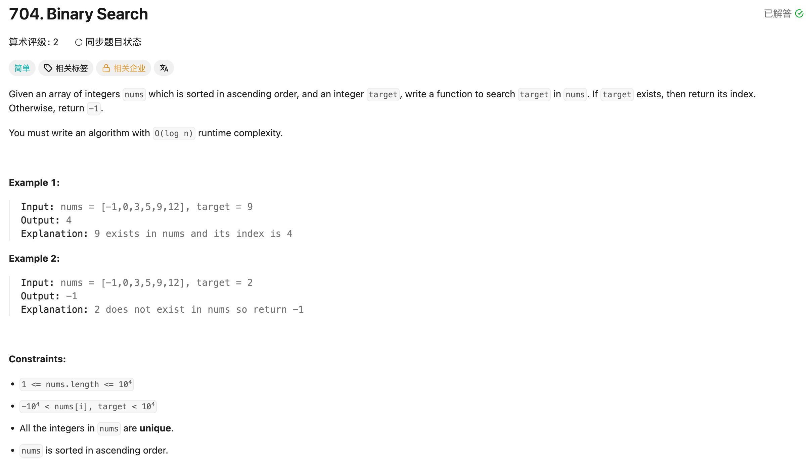

## 704. Binary Search

Date: 5/1/2026, 7/21/2026
Difficulty: Simple  
Tags: binary search



### 二刷 (7/21/2026) ❌

我的代码：

```java
class Solution {
    public int search(int[] nums, int target) {
        int left = 0, right = nums.length - 1;

        while (left <= right) {
            int mid = (right + left) / 2;
            if (nums[mid] > target) {
                right = right - 1; // 应该 right = mid - 1。写成 right-1 每次只缩 1，退化成 O(n)，不再是 binary search
            } else if (nums[mid] < target) {
                left = left + 1; // 同理，应该 left = mid + 1。有序数组可以一次性排除 mid 及一侧
            } else if (nums[mid] == target) {
                return mid;
            } else {
                return -1; // dead code：>/</==已覆盖所有整数情况，这个分支永远走不到
            }
        }
        // ❌ 缺 return：循环正常退出(没找到)时没有返回值，方法签名是 int → 编译报 "missing return statement"
    }
}
```

<!-- ↓↓↓ 复习时先自己想一遍，再往下翻看答案 ↓↓↓ -->

### 正确写法

```java
class Solution {
    public int search(int[] nums, int target) {
        int left = 0, right = nums.length - 1;   // closed interval [left, right]

        while (left <= right) {
            int mid = left + (right - left) / 2; // avoid overflow
            if (nums[mid] > target) {
                right = mid - 1;
            } else if (nums[mid] < target) {
                left = mid + 1;
            } else {
                return mid;
            }
        }
        return -1;   // not found
    }
}
```
