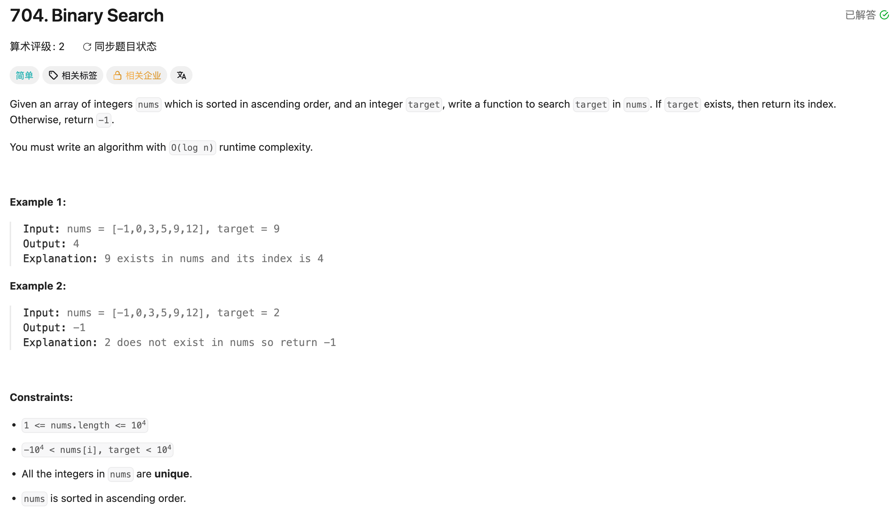

## 704. Binary Search

Date: 5/1/2026, 7/21/2026, 7/30/2026, 8/3/2026, 8/15/2026
Difficulty: Easy
Tags: binary search
Status: 已毕业 (8/15/2026)



### 二刷 (7/21/2026) ❌ 边界更新不带 mid + 缺循环外 return

```java
class Solution {
    public int search(int[] nums, int target) {
        int left = 0, right = nums.length - 1;
        while (left <= right) {
            int mid = (right + left) / 2;              // ❌③ overflow 风险，应 left + (right-left)/2
            if (nums[mid] > target) {
                right = right - 1;                     // ❌① 应 mid - 1；每轮只缩 1 → 退化成 O(n)
            } else if (nums[mid] < target) {
                left = left + 1;                       // ❌① 同上，应 mid + 1
            } else if (nums[mid] == target) {
                return mid;
            } else {
                return -1;                             // ❌④ dead code：>/</== 已覆盖全部情况
            }
        }
        // ❌② 缺 return：循环正常退出（没找到）时无返回值 → 编译报 missing return statement
    }
}
```

**①的根因**：有序数组的价值就在于 `nums[mid]` 一次比较能排除 mid 及其一侧。写 `right - 1` 等于只用了「mid 这一格不是答案」这一条信息，把 binary search 降级成线性扫描。**边界更新那一行必须落在 mid 上，这是 O(log n) 的唯一来源。**

### 三刷 (7/30/2026) ⚠️卡推导 代码一次 AC，退出语义口答说反

二刷四个错全避。**但口答两次把 left 说成「第一个 >」**（套用了 34 的 U 版），纠正后再问又反回去。写的时候是模式匹配，说的时候才需要这条规则。

> **自检信号（通用）**：**推 left 的条件取反，就是 left 停在哪。**
> `< target` 推 left → 取反 `>= target` → 停在第一个 **≥**（704）
> `<= target` 推 left → 取反 `> target` → 停在第一个 **>**（34 的 U 版）
> 直觉：`=` 写进推进条件 = 「等于的也要跨过去」，所以 left **停不在**等于的位置。
> 拿不准就跑 `nums=[1,3,5], target=3`：两版 left 分别停在 1 和 2。

### 四刷 (8/3/2026) ✅ 5min，未翻笔记

注释里写出了带前提的版本：`cuz I return equal early, so left is on the first element larger than target`。补上「提前 return 截走等号」这个前提后说法成立——命中即返回，走到循环外说明 target 不存在，此时「第一个 ≥」与「第一个 >」同格。

**但这是 704 的特例，不是通用规则。** 34 的 L 版没有提前 return，target 存在时 left 恰好停在 target 身上；若记成「`<` 推 left → 第一个 >」，34 的左边界直接差一格。**这条的真正检验点在 34，不在本题。**

### 五刷 (8/15/2026) ✅ 毕业（+12）——纯手误：`nums[left]` 应为 `left`

本轮改用两分支 lower bound 写法（`nums[mid] < target` 推 left，其余 `right = mid - 1`），loop 完全正确，错在循环外那行存在性检查：

```java
if (nums[left] < nums.length && nums[left] == target) {   // ❌ 左半应为 left < nums.length
```

**根因**：`left` 和「`left` 上面那个值」在写 condition 那一刻被压成了一个词。两条后果都发作——① **guard 自己引爆了它要防的 exception**：写这一行的全部目的是拦 `left == nums.length`，却在拦住之前先解引用了一次，`&&` 短路救不了（出事的就是左操作数本身）。反例 `[-1,0,3,5,9,12]`, target=13 → AIOOBE ② 不崩时是**静默错误**：`[5]`, target=5 → `5 < 1` 为 false → return -1（应为 0）。value 和 length 是不相干的量，比出来的真假纯属偶然。

**归族**：与 8/12 LC367 的 `left == num`（应为 `(long) left * left == num`）是**镜像**——367 是该取值却写了裸 index，本轮是该用 index 却取了值。同属「变量角色抓错名字」。

> **自检信号**：guard 里出现被 guard 的东西 = bug。`&&` 左操作数只能是范围检查，解引用一律放右边；写完横着读一遍，问「左边这一半自己安全吗」。

**自测点**：不看下文说出 ① 推 left 的条件如何决定 left 停在 ≥ 还是 > ② 退出时 left 与 right 的关系、各自语义与值域 ③ 704 能写 `== target` 提前返回、bound 类为什么不行

---

<!-- ↓↓↓ 复习时先自己想一遍，再往下翻看答案 ↓↓↓ -->

### 正确写法

```java
class Solution {
    public int search(int[] nums, int target) {
        int left = 0, right = nums.length - 1;   // closed interval [left, right]
        while (left <= right) {
            int mid = left + (right - left) / 2; // avoid overflow
            if (nums[mid] > target) {
                right = mid - 1;
            } else if (nums[mid] < target) {
                left = mid + 1;
            } else {
                return mid;                      // 找到即终止，本题合法
            }
        }
        return -1;   // not found —— 三分支版的代价：别忘了这一行（二刷 ❌②）
    }
}
```

### 沉淀

**一、退出时的 left / right**

`while (left <= right)` 退出即 `left > right`，每轮只挪一格 → **必然 `left = right + 1`**，两个 pointer 交错在分界线两侧。704 这套写法（`<` 推 left）下：

- `left` = 第一个 **≥** target 的位置，值域 `[0, n]`
- `right` = 最后一个 **<** target 的位置，值域 `[-1, n-1]`

**同一退出状态，各题取不同的一半**：704 两半都不要（命中已在循环内返回，走到外面就是没找到）；34 取 `left`；69 取 `right`。

`left` 可以是 `n`、`right` 可以是 `-1`，**都不是合法下标——拿它访问数组前必须先查范围**（34 四刷、704 五刷都栽在这里）。**left / right 是下标，不是 element。**

**二、什么时候可以写 `== target` 提前返回**

判据是**题目要的是「某个 target 在哪」还是「一条边界在哪」**：

- 要位置 / 存在性（704）：命中即拿到答案，continue 下去无收益 → 三分支 + 循环外 `return -1` 最直观。代价是别忘那行兜底
- 要边界（34 的 first/last、35 的插入点）：`== target` 那一格**不是答案，是还要继续收缩的信号**，早返回直接毁掉 lower bound 语义

同一套模板能覆盖三题，差别只在循环外那一行；**换写法改的是这道题的形，改不掉「先查范围再取值」这个动作**。

### 关联

- 34（`=` 归哪侧决定 left 停 ≥ 还是 >；三刷 `return mid` 是把 704 习惯带过去，bound 类里是核心错误）
- 35（插入位置 = 退出时的 `left`，无需存在性检查）
- 69（取退出时的 `right`）
- 367（`left` 与 `left * left` 压扁；与本题五刷是同一道缝的镜像）
