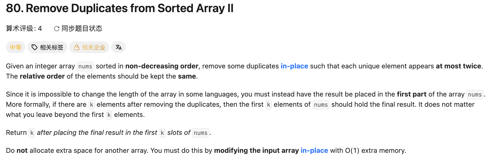

## 80. Remove Duplicates from Sorted Array II

Date: 7/23/2026
Difficulty: Medium
Tags: two pointers



### 一刷 (7/23/2026) ❌ 没思路：多重 else if 和数 count 两条路都没收敛

先写多重 else if 枚举重复情况（分支爆炸，dry run 不对），退回数 count 也没理顺。最后一版代码：

```java
class Solution {
    public int removeDuplicates(int[] nums) {
        int slow = 0;
        for(int fast = 1; fast < nums.length; fast++){
            int count = 1;                  // ❌① 声明在 loop 体内 → 每轮重置为 1，
                                            //    最多到 2 → count >= 3 成 dead code
            if(nums[slow] != nums[fast]){
                slow++;                     // ❌③ 保留分支缺 nums[slow] = nums[fast]
                                            //    → 新值永远搬不进结果区
            }else if(nums[slow] == nums[fast]){
                count++;
                slow++;                     // ❌❌② 核心错误：重复时也推进 slow
                                            //    → slow 恒等于 fast，过滤机制不存在
                if(count >= 3){
                    nums[slow] = nums[fast];  // ①的直接后果：一次都不会执行
                }
            }
        }
        return slow;                        // ❌④ slow 停在 last index → 该 return slow+1
                                            //    （26 的「index vs count」同款）
    }
}
```

**卡在哪**：想枚举「第几个重复」→ 分支爆炸；退回数 count → count 的生命周期、比较对象、写入时机三件事同时失控。

**真正的坎**：脑子里没有「一个数组、两个世界」的画面——**nums[0..slow-1] 是结果区，fast 扫的是原材料区，slow 指结果区下一个空位**。有了这个画面，loop 体就只有一种写法：合格（count ≤ 2）→ 搬运+登记成对（`nums[slow] = nums[fast]; slow++`）；不合格 → 什么都不做，「不搬 = 删除」。

**①的根因**：**跨 iteration 存活的 state 必须声明在 loop 外**。声明在体内 = 每轮重生，依赖它累积的 condition 全部变 dead code。

**②③④的根因**：没定 slow 的 invariant，slow 变成 fast 的影子；且拿语义是「空位」的 nums[slow] 当计数参照物，判断依据本身不可信。return 差 1 是 26 的「index vs count」同款，同日两犯。

反例 dry run：`[1,1,1,2,2,3]`——slow 全程跟着 fast 走，数组零写入，return 5，恰好等于期望答案 5；但前 5 个 element 是 `[1,1,1,2,2]` ≠ `[1,1,2,2,3]`。静默错误：return 碰巧对不代表数组内容对。

**同日二稿的两处誊写层错误**（机制已对，抄/写滑了）：

- ❌⑤ `if(nums[fast]==nums[fast-1]){count++;} else if(nums[fast]==nums[fast-1]){count=1;}`——else if 条件和 if 一模一样 → `count=1` 成 dead code → 旧值的计数泄漏到新值头上，新值全被跳过。**一稿也有同款影子**（`if(a!=b){...}else if(a==b){...}`），同一习惯两次露头 → **互补分支用裸 else，不给第二个条件出错的机会**
- ❌⑥ `if(count<=2){...}` 整块复制了两遍 → 每轮写两次、slow +2，越界崩（纯手误，好发现）

> **自检信号**：two pointers 写完查三处——count 在 loop 外吗？比较参照物是原数组邻居还是待覆盖的空位？「写入」和「slow++」成对且只出现一次吗？另：看到 else if 先问一句「这个条件是不是上一个的互补」，是就删成裸 else。

**自测点**：不看答案说出 ① slow 的 invariant 一句话 ② count 的精确语义 + 为什么和 nums[fast-1] 比而不是 nums[slow] ③ 裂缝什么时候打开、打开前后 `nums[slow]=nums[fast]` 分别在干什么 ④ 「最多保留 k 个」条件怎么写

---

<!-- ↓↓↓ 复习时先自己想一遍，再往下翻看答案 ↓↓↓ -->

### 核心思路（一句话）

**count 记「nums[fast] 这个值连续出现到第几个（含自己）」：和 nums[fast-1] 比来维护，count <= 2 就搬进结果区（写入+推进成对），否则什么都不做——不搬即删除。**

### 代码

```java
class Solution {
    public int removeDuplicates(int[] nums) {
        int slow = 1;                             // nums[0] 必然保留，slow 从 1 起步
        int count = 1;                            // count 在 loop 外：全程存活
        for (int fast = 1; fast < nums.length; fast++) {
            if (nums[fast] == nums[fast - 1]) {   // 和前一个 element 比
                count++;
            } else {                              // 裸 else：互补分支不写条件
                count = 1;                        // 新值出现，计数重新开始
            }
            if (count <= 2) {                     // 质检合格 → 入库 + 账本 +1，成对
                nums[slow] = nums[fast];
                slow++;
            }
            // count >= 3 → 不合格：什么都不做，只让 fast 走
        }
        return slow;                              // 写后加 → slow 是个数，直接 return
    }
}
```

### 关键机制：自赋值 vs 真搬运（裂缝）

写入是空转还是真干活，**不由 count 决定，由「裂缝开了没」决定**（slow 和 fast 是否还指同一格）：

- 裂缝开之前（slow == fast）：写入是自我赋值，无害空转
- 第一次 count ≥ 3：slow 停、fast 走，裂缝拉开，**且永不合拢**（slow 每轮最多 +1，fast 必 +1）
- 裂缝开之后：所有 count ≤ 2 的写入都是真搬运，把后面的值往前挪

代码对两种情况一视同仁——自赋值代价为零，所以不值得为它多写一个判断。这就是前几轮「看起来什么都没干」的那行赋值存在的意义：它在等裂缝出现。

验证 `[1,1,1,2,2,3]`（slow=1, count=1）：

| fast | count | 判定   | 动作                | slow |
| ---- | ----- | ------ | ------------------- | ---- |
| 1    | 2     | 合格   | nums[1]=1（自赋值） | 2    |
| 2    | 3     | 不合格 | 无 →（裂缝打开）    | 2    |
| 3    | 1     | 合格   | nums[2]=2（真搬运） | 3    |
| 4    | 2     | 合格   | nums[3]=2           | 4    |
| 5    | 1     | 合格   | nums[4]=3           | 5    |

结果区 nums[0..4] = [1,1,2,2,3]，return 5；index 5 残留的 3 在结果区外，不看。

### 三个关键点

1. **count 的语义**：走到 fast 时该值已连续出现几次（含自己）→ 题面「至多两次」直译成 `count <= 2`；`count < 2` 会退化成 LC26
2. **为什么和 nums[fast-1] 比**：nums[slow] 是待覆盖的空位，值不可信；nums[fast-1] 永远不被写入污染（写入位置 ≤ fast，slow==fast 时是自赋值，slow<fast 时写不到 fast-1）
3. **条件写在「保留」这边**：和 `count >= 3` 丢弃逻辑等价，但让条件正面描述有动作的分支，读代码不用做心理取反

### 复杂度分析

**Time: O(n)**：fast 在 for 头每轮必进，loop 恰好 n 轮，每轮 O(1)。
**Space: O(1)**：in-place 覆盖，slow/fast/count 三个 variable。

对比 brute force O(n²)（每发现第三个重复就整体前移）：two pointers 快在每个 element 最多读一次、写一次。

### 沉淀

- **动笔前先画「一个数组、两个世界」**：结果区是谁、slow 指哪、合格/不合格各做什么——本题一稿 4 个 bug 全部源于跳过这一步
- **跨 iteration 的 state 声明在 loop 外**；放错位置的直接症状是「依赖累积的 condition 永远不触发」
- **互补分支用裸 else**：else if 里重写互补条件 = 多一个可以打错的地方，本题同一习惯两稿两次露头
- **比较/计数的参照物用原数组邻居（nums[fast-1]），不用待覆盖的空位（nums[slow]）**
- 静默错误的新形态：return 值碰巧对、数组内容错——验证要看内容，不只看返回值

### 引申：k 推广与位置比较版

- **保留 k 个**：只改 `count <= k`，count 维护和搬运逻辑一字不动（k=1 就是 LC26——26 和 80 是同一模板的两个取值）
- **不用 count 的写法**：有序 → 「个数」信息已编码在「位置」里，`slow < 2 || nums[fast] != nums[slow-2]` 一次比较替代整个计数机制（推广：slow-k）。少一个 state 少一类 bug，count 版写熟后回头对照
- **前提是 sorted**（重复必相邻）；无序时这套失效，换 HashMap 计数——面试追问 "what if not sorted" 的标准方向

### 关联

- 26（同模板 k=1；一稿④的 return 差 1 是 26 同日同款「index vs count」错，重点盯）
- 27（slow/fast 推进纪律一族两向：27 是 fast 该进没进，本题是 slow 不该进乱进）
- 647（loop 内变量纪律近亲：647 是内层偷用外层 i/j，本题是该外置的 count 内置）

### Interview pitch (练口述)

> "Since the array is sorted, duplicates are adjacent, so I keep a running count by comparing nums[fast] with nums[fast-1] — count tells me this value's occurrence number including itself. If count is at most 2, the element qualifies: I write it to nums[slow] and advance slow together, so nums[0..slow-1] is always the confirmed result. Otherwise I do nothing — skipping is deleting. Early on the writes are self-assignments, but once the first element gets rejected, a gap opens between the pointers and every write becomes a real move. Slow is a count since I write before incrementing, so I return it directly. One pass, O(n) time, O(1) space, and it generalizes to 'at most k' by changing the threshold."
