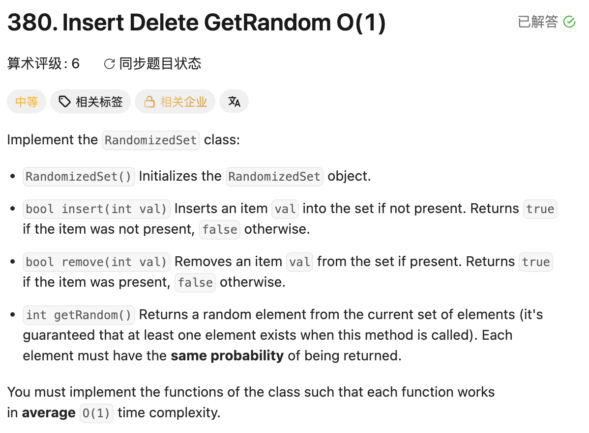

## 380. Insert Delete GetRandom O(1)

Date: 8/10/2026, 8/11/2026, 8/13/2026, 8/17/2026
Difficulty: Medium
Tags: Design, Hash Table, Array



### 一刷 (8/10/2026) ❌ 没概念（两容器模型没建立）+ field 声明进了 constructor

**卡在哪**：知道三个操作都要 O(1)，但想不出 remove 怎么绕开「ArrayList 删中间要整体左移」这一步。

**真正的坎**：三个操作要的能力互斥——getRandom 要「按下标随机取」（只有 array/list 有），containsKey 要「按值查」（只有 map 有）。**必须同时维护两个容器，map 存 value → 它在 list 里的下标。** 这一层没建立，remove 那套操作就无从谈起。

另有一个 compile error：

```java
public RandomizedSet() {
    Map<Integer, Integer> map = new HashMap<>();   // ❌① 带类型前缀 = 声明；写在
    List<Integer> list = new ArrayList<>();        //    constructor 里就是 local
    Random random = new Random();                  //    variable，出花括号即销毁
}
```

**①的根因**：`Map<Integer,Integer> map = new HashMap<>()` 一行干了两件事——声明 + 赋值。想要的是「field 声明 + constructor 里赋值」，整行搬进 constructor 就变成「local variable 声明 + 赋值」→ 其他方法里的 `map` 找不到任何声明。**带类型前缀的那行就是声明；声明写在哪个花括号里，variable 就活在哪个花括号里。**

---

### 二刷 (8/11/2026) ❌❌ swap-and-pop 只写了一半

一刷的 compile error 未再犯（改用了字段初始化器）；两容器模型、insert 三行、getRandom 全对，`map.put(last, idx)` 排在 `map.remove(val)` 之前那个坑也写对了。错在 remove 的 list 那一半：

```java
list.set(list.size() - 1, val);   // ❌❌ 应为 list.set(idx, last)
list.remove(list.size() - 1);     //    把 val 写到末尾再删掉，等于什么都没删
```

**根因**：心智模型是对的（注释写着 copy the target val to the last），错在**以为这是一次需要两步的 swap**，于是写了「把 val 搬到末尾」这一步，漏掉了真正干活的那一步。实际只需一次赋值——**末尾那格马上就要被删，往里写什么都是白写**。漏的不是两次里的一次，是唯一那次。

**后果（静默）**：`[10,20,30]` remove(10) → list 变成 `[10,20]`，该删的还在、不该删的 30 没了；map 那边说 30→0，而 `list[0]` 是 10，两容器彻底失同步。

> **自检信号**：两容器结构，任何一次搬运必须两边都改。写完 map 的更新，回头问一句「map 说的位置，list 上真的是那个值吗」。

---

### 三刷 (8/13/2026) ⚠️卡推导 代码全对，等概率那一问答反了

remove 六行一次写对，含 `val == last` 时 `map.put` 必须排在 `map.remove` 之前那个坑。

**自测点口答**：问 getRandom 的等概率靠什么保证、不填坑直接 `list.remove(idx)` 是否还成立。第一问抓到了「list 连续无空洞」这个正确性质；**第二问答成「等概率不成立」，并说 `list.remove(idx)` 会让 list「空了一个」——反了**。

**根因**：把「连续性」当成了需要保护的东西。ArrayList 的 `remove(idx)` 会把后面的 element **整体左移**，size 减一，**永远连续、永远无空洞**，所以等概率照旧成立。真正被它破坏的是 **map 那本账**——idx 之后每个 element 的真实下标都前移一位，map 里存的全部过期，违反「任意时刻 `map.get(element)` 等于它在 list 里的真实下标」这条不变量。

由此填坑技巧换来的是两样东西：**O(1) 的删除**，以及**只有一个 element 的下标发生变动**（被搬到 idx 的那个 `last`，一句 `map.put(last, idx)` 就修完）。移位版要修的是「后面所有 element」——不可接受的是这个，不是随机性。

**自测点**：map 的 value 存的为什么是「下标」而不是 element 本身？若把方向反过来存成「下标 → element」，insert / remove / getRandom 三个方法各会卡在哪一步？

---

### 四刷 (8/17/2026) ❌ 模型层稳定，落地卡在 API 层

**这一轮失败的位置和前三轮都不同**：两容器模型和填坑技巧全程在线，思路没卡，卡在不知道该调哪个方法、方法调完手上剩什么。前三轮的错（field scope、swap 只写一半、找错保护对象）均未再犯。

**自测点**：沿用三刷那条（本轮未口答，仍完好）。

---

<!-- ↓↓↓ 复习时先自己想一遍，再往下翻看答案 ↓↓↓ -->

### 核心思路（一句话）

**list 管「按下标取」、map 管「按值找下标」；删除时用末尾 element 填坑，保证 list 永远紧凑无空洞。**

### 正确写法

```java
class RandomizedSet {
    private final Map<Integer, Integer> map = new HashMap<>();  // value → index
    private final List<Integer> list = new ArrayList<>();
    private final Random random = new Random();                 // 造一次，反复用

    public boolean insert(int val) {
        if (map.containsKey(val)) return false;
        list.add(val);
        map.put(val, list.size() - 1);   // 必须在 add 之后：此刻 size-1 才是它的下标
        return true;
    }

    public boolean remove(int val) {
        if (!map.containsKey(val)) return false;
        int idx = map.get(val);               // 要删的值在哪一格
        int last = list.get(list.size() - 1); // 末尾元素
        list.set(idx, last);                  // 末尾值盖到坑位（只需这一次赋值）
        list.remove(list.size() - 1);         // 删末尾 O(1)，无 element 需要左移
        map.put(last, idx);                   // 先更新幸存者
        map.remove(val);                      // 再删死者（val == last 时两行撞同一 key）
        return true;
    }

    public int getRandom() {
        return list.get(random.nextInt(list.size()));  // nextInt(n) 取 [0, n)
    }
}
```

### 复杂度分析

**Time: 三个方法均 O(1)**：insert = list 末尾 add（摊还 O(1)，偶尔扩容）+ map put；remove = map 查 + list set + 删末尾；getRandom = 一次下标访问。
**Space: O(n)**：list 和 map 各存一份。

对比只用 List 的做法 O(n)（remove 要先线性查找、再整体左移）：map 把「找位置」压成 O(1)，填坑把「左移」整个消掉。

### ArrayList 的代价表（三刷补，本题所有设计决定都从这里长出来）

| 操作                   | 复杂度    | 为什么                                                                                  |
| ---------------------- | --------- | --------------------------------------------------------------------------------------- |
| `get(i)` / `set(i, v)` | O(1)      | 数组随机访问                                                                            |
| `add(v)`（尾部）       | 摊还 O(1) | 满了要扩容（新建 1.5 倍数组 + 复制 O(n)），摊到多次 add 上                              |
| `add(i, v)`（中间）    | O(n - i)  | 后面全部右移腾位                                                                        |
| `remove(i)`            | O(n - i)  | 后面全部左移填位；**i = size-1 时 O(1)**。Space O(1)，`System.arraycopy` 在同一数组内搬 |
| `remove(Object)`       | O(n)      | 先线性扫描找到它，再左移                                                                |
| `contains(v)`          | O(n)      | 线性扫描——这就是本题必须配一个 map 的原因                                               |

**一句话记法：ArrayList 的所有代价都来自「下标必须连续」这一条约束。** 读随便读，但凡改变长度且不在末尾，就得为维持连续性付 O(n)。LinkedList 正好反过来（不要求连续 → 增删 O(1)，读要走链表 O(n)）。

**本题的三个 O(1) 各自逼出一件事**：`contains` O(1) → 上 map；getRandom 按下标随机取 → 必须有连续数组；remove O(1) → 只能删末位。**填坑是这三者的交集**，不是凭空想出来的技巧。

### 沉淀

- **design 题第一步：先列 field，再写 constructor。** field 声明在类体，constructor 只负责赋值。同族 LC146 / LC155
- **要 O(1) 删任意位置 → 末尾填坑 + 删末尾。前提是容器不要求有序**
- **两个容器就要两笔账**：list 里有 element 挪窝，map 必须同步。不变量：任意时刻 `map.get(element)` 等于它在 list 里的真实下标。`map.put` 排在 `map.remove` 之前，因为 `val == last` 时两行撞同一 key，最终状态该是这个 key 消失
- **心智模型对 ≠ 落笔对**（二刷）：swap 在这里只需一次赋值，因为另一格马上要死。**动手前先问「这一步的结果还会被人读到吗」**，不会被读到的写入都是多余的
- **分清「哪个性质在保护正确性」**（三刷）：紧凑性是 ArrayList 自带的、不需要保护；需要保护的是 map 那本账。找错保护对象 → 会把 O(n) 的代价误判成正确性问题
- **`Random` 当 field 造一次**，别每次调用现 new：seed 取自系统时间，短时间连续 new 可能撞同一时间戳 → 连续返回相同结果
- **`list.remove(int)` vs `list.remove(Object)`**：`List<Integer>` 上这两个重载只差一层装箱，前者按下标、后者按值。本题传的是 `list.size()-1`（int，按下标），传 `Integer` 就变成按值删

### 关联

- LC146 LRU Cache（同为 design 题，同样是两个容器互相记账：HashMap + 双向链表）
- LC381（本题进阶：允许重复 element，map 的 value 要换成 Set）
