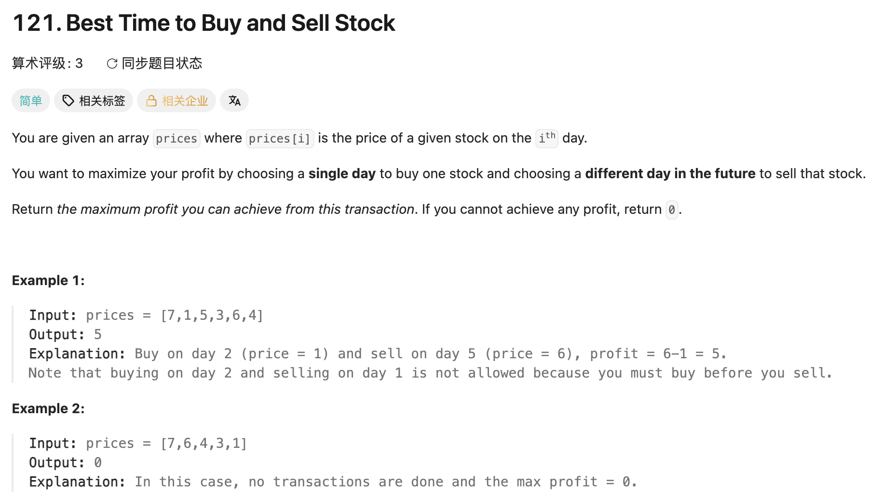

## 121. Best Time to Buy and Sell Stock

Date: 一刷（代码随想录，看解析）,7/28/2026, 8/4/2026
Difficulty: Easy
Tags: dp, greedy, array



### 三刷 (8/4/2026) ✅ greedy + DP 两版均一次 AC

- 二刷四个错全避（for 头三段 variable、`j` 起点、`profit` 初值、参数名）；二刷缺的「O(n) 思路未独立得出」本次自己推出
- 修正二刷的一句话：greedy 两行**顺序不是无所谓**，见「顺序与初值绑定」
- 自测点未口答，留到 8/18 站

---

<!-- ↓↓↓ 复习时先自己想一遍，再往下翻 ↓↓↓ -->

### 核心思路（一句话）

**最大利润必然对应某一个确定的卖出日，而每个卖出日的最优买入点就是它之前的最低价——边走边维护历史最低价，一趟扫完。**

### 解法一：暴力（口头带过，不写）

双层 loop 枚举所有 (买入日, 卖出日)，`j` 从 `i+1` 起。O(n²) / O(1)，n ≤ 1e5 直接 TLE。面试里报复杂度 + 指出不够，三十秒带过。

### 解法二：greedy

内层 loop 在算「i 之前的最低价」——这是**前缀聚合值，增量可算**，于是被一个 variable 替代：

```java
int minPrice = Integer.MAX_VALUE;
int profit = 0;                     // 不交易也合法 → 初值 0
for (int i = 0; i < prices.length; i++) {
    minPrice = Math.min(minPrice, prices[i]);
    profit = Math.max(profit, prices[i] - minPrice);
}
return profit;
```

**顺序与初值绑定**（三刷修正）：先更新 `minPrice` 相当于允许「当天买当天卖」，这一轮算出 0——**它无害只因为 `profit` 初值也是 0**。若初值写成 `MIN_VALUE`（二刷的错），这个顺序就不再安全。两行可换，但换的前提是初值站得住。

### 解法三：DP

state 定义（全系列统一：**偶数 = 不持有，奇数 = 持有**）。「持有」≠「当天买入」，可能是前几天买的一直拿着——这个区分不清 transition 必错。

```java
int n = prices.length;
int[][] dp = new int[n][2];
dp[0][0] = 0;              // 第 0 天不持有 = 没动过
dp[0][1] = -prices[0];     // 第 0 天持有 = 只能当天买
for (int i = 1; i < n; i++) {                                // dp[i] 依赖 dp[i-1] → 正序
    dp[i][0] = Math.max(dp[i-1][0], dp[i-1][1] + prices[i]);  // 保持 / 今天卖
    dp[i][1] = Math.max(dp[i-1][1], -prices[i]);              // 保持 / 今天买
}
return dp[n-1][0];   // 最后一天必须不持有，攥着股票 = 钱没落袋
```

### 解法四：滚动数组

依赖几层就留几个 variable：

```java
int sold = 0, hold = -prices[0];
for (int i = 1; i < prices.length; i++) {
    sold = Math.max(sold, hold + prices[i]);
    hold = Math.max(hold, -prices[i]);
}
return sold;
```

`hold` 维护的正是 `-minPrice`，`sold` 就是 `profit`——**greedy = DP state 塌缩后的样子**，两段代码一字不差。区别只在思维路径：推不出 greedy 时退回 DP 定义 state，122/123/188 加维度时 greedy 的直觉跟不上，DP 框架照样推得动。

---

### 关键点一：`dp[i][1]` 为什么是 `-prices[i]`

**只交易一次 ⇒ 买入在每条路径上只发生一次 ⇒ 买入时账上必然是 0。**（账上的钱只因买入减、卖出加；卖出必须先有买入，而买入就这一次 → 买入前没有任何钱进过账。）

这不等于「买入只发生在第 0 天」——`-prices[i]` 对每一天都成立，DP 在跑「假设第 i 天买入」这个分支，靠 `max` 让所有天竞争。被禁掉的是「第 i 天买入之前已经完成过一轮买卖」。

**写成 `dp[i-1][0] - prices[i]` 的反例**（`[1,5,2,8]`）：i=1 时 `dp[1][0]` 已是 4；i=2 买入变成 `4-2=2`，**带着前面赚的 4 块去买**；最终返回 10 = 4 + 6，两次交易的结果，正确答案是 7。错得**静默**，不崩不越界。

**`-prices[i]` 里隐含的那个 0，就是「不许带着前面的盈利来买」在公式里的写法。**

### 关键点二：为什么不留白（`new int[n][2]`）

**判据：下标 i 的语义是「第 i 个」还是「前 i 个」。**「第 i 个」→ 不留白，`dp[0]` 手工赋值（股票、打家劫舍）；「前 i 个 / 已处理 i 个」→ 留白，i=0 是空集起点（背包、LCS 1143/718/115、编辑距离）。

坑各有一个：留白版漏 `-1`（`text1.charAt(i-1)`）是 LCS 族最高频 bug；不留白版忘了赋 `dp[0][1]` 就拿 Java 默认 0 → 意思变成「第 0 天白捡一支股票」，答案偏大且静默。

### 复杂度对比

| 解法    | Time  | Space |
| ------- | ----- | ----- |
| 暴力    | O(n²) | O(1)  |
| greedy  | O(n)  | O(1)  |
| DP 二维 | O(n)  | O(n)  |
| DP 滚动 | O(n)  | O(1)  |

只有滚动是白赚的（压缩冗余存储，不牺牲任何东西）；**前提是「只要最终值不要过程」**，需回溯哪天买卖就不能滚。

### 沉淀

- **股票系列 state 编号统一：偶数 = 不持有，奇数 = 持有**。`dp[i][2k-1]` = 第 k 次持有，`dp[i][2k]` = 第 k 次不持有，**答案永远取偶数下标的最后一个**。121/122 是 k=1 和 k=∞ 的特例。（与随想录相反，看题解时注意换算）
- **内层 loop 在算什么？** 若只是前缀聚合值（最小/最大/和/计数），多半能被一个滚动 variable 替代，判据是**增量可算**。同族：LC53、LC169 Boyer-Moore、前缀和
- **擂台初值方向**：求最大给 `MIN_VALUE`、求最小给 `MAX_VALUE`；但**答案的合法下界优先于类型边界**——本题 profit 初值是 0 不是 `MIN_VALUE`。三刷补充：初值同时决定了更新顺序能不能换
- **`for` 头三段必须指向同一个 variable**：`for(int j = 1; i < ...; j++)` 编译通过但死循环 + 越界，嵌套 loop 里最隐蔽（与 189 同族，重复性模式）
- **greedy 往往是 DP state 塌缩后的形态**——推不出 greedy 就退回 DP 定义 state

### 引申：股票系列的分叉点

差别集中在**买入的 transition 来源**：

| 题                     | 差异                                                       |
| ---------------------- | ---------------------------------------------------------- |
| 121（一次）            | `← -prices[i]`，起点固定为 0                               |
| 122（无限次）          | `← dp[i-1][0] - prices[i]`，起点浮动——与 121 唯一的差别    |
| 123 / 188（最多 k 次） | 加维度，状态数 2k+1；第二次持有 `← dp[i-1][2] - prices[i]` |
| 309（冷冻期）          | 改买入能从哪天的不持有 state 转移                          |
| 714（手续费）          | 改卖出那一行，减 fee                                       |

### 关联

- 122（同骨架，唯一差别是买入起点；**两题的 greedy 思路完全不同**：121 维护历史最低价，122 靠 telescoping 收正的日差值——次数不限才拆得动）
- 189（同属「消掉重复计算」母题：189 找恒等式消 k，本题滚动 variable 消内层 loop）
- 53（同为「以 i 结尾的最优值」滚动维护）

### Interview pitch

> "Brute force tries every buy-sell pair — O(n²), and with n up to 1e5 that won't pass. The key observation is that any maximum profit corresponds to some specific selling day, and the best buy point for that day is just the lowest price before it. So I maintain a running minimum in one pass: O(n) time, O(1) space. I can also frame it as DP with a holding and a not-holding state, where buying transitions from `-prices[i]` rather than from the previous not-holding cash — this problem allows only one transaction, so every buy starts from a zero balance. That DP collapses to exactly the same two variables as the greedy version, and letting the buy start from the previous not-holding state is precisely what turns it into the unlimited-transactions variant."
