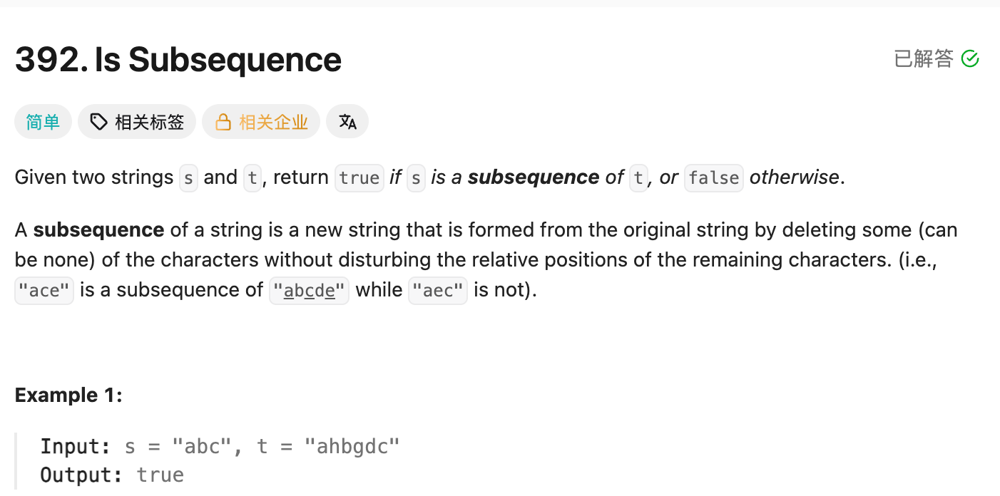

## 392. Is Subsequence

Date: 既往刷题日期待补, 9/30/2026
Difficulty: Easy
Tags: string, dynamic programming, two pointers



### 本次复习 (9/30/2026) DP 建模、prefix 长度与初始化需要重新理解

已有代码正确，本轮阅读讲解，尚未独立重写。

**卡在哪**：不知道为什么能用 DP；把「以 i-1 为结尾」与 index 混在一起，不明白第一行、第一列为什么都是 0。

**根因**：`i、j` 表示取前几个字符，`i-1、j-1` 才是这些 prefix 的末位 index。取 0 个字符就是空 String，匹配长度为 0。

> **自检信号**：写 DP 前，先用一句话解释一格的含义，再分别代入 i=0、j=0；确认存的是长度还是 boolean，不能因为代码默认是 0 就直接采用。

**定义纠正**：参考解释中的「最长子序列」不能直接理解成通用 LCS。当前代码不相等时只跳过 t 的字符，最终检查的是整个 s 能否匹配。

---

<!-- ↓↓↓ 复习时先自己想一遍，再往下翻看答案 ↓↓↓ -->

### 题意

**s 的字符必须全部保留，可以跳过 t 的字符，但顺序不能变。**

```text
s = "abc"
t = "ahbgdc"

t：a h b g d c
   ✓   ✓     ✓
```

跳过 h、g、d 后得到 s，因此返回 true。

### 为什么可以用 DP

把原问题缩成：**s 的前 i 个字符，能否在 t 的前 j 个字符中按顺序找到？**

- 末位相同：配成一对，继续看两边更短的 prefix。
- 末位不同：跳过 t 的末位，s 的要求不变。

当前问题可以借用更短 prefix 的结果，因此可以建立 DP。

### 原 int DP 的准确含义

`dp[i][j]` 表示：**s 的前 i 个字符中，能作为 t 的前 j 个字符的 subsequence 的最长 suffix 长度。**

例如 s 的 prefix 是 `"abc"`，t 的 prefix 是 `"bc"`，能匹配的最长 suffix 是 `"bc"`，长度为 2。

本题真正需要的判据是：

```java
dp[i][j] == i
```

只有长度达到 i，才说明整个 s prefix 都匹配了，而不只是它末尾的一段。

### 为什么用 i-1，以及为什么多开一行一列

```text
s = "abc"

i=0 → ""       取 0 个字符
i=1 → "a"      末位 index 为 0
i=2 → "ab"     末位 index 为 1
i=3 → "abc"    末位 index 为 2
```

因此比较 prefix 的末位时，访问：

```java
s.charAt(i - 1)
t.charAt(j - 1)
```

i=0 表示空 String，不需要访问 s[-1]。

- **`dp[0][j] = 0`**：s 取 0 个字符，没有字符可参与匹配。
- **`dp[i][0] = 0`**：t 取 0 个字符，没有字符可供匹配。

多开一行、一列后，匹配第一对字符也能直接使用：

```java
dp[1][1] = dp[0][0] + 1;
```

无须为负数 index 另外写边界分支。

**0 是匹配长度，不是 false。** 空 s 的最终判断是 `0 == s.length()`，也就是 `0 == 0`，因此返回 true。

### 递推

**末位相同：**

```java
dp[i][j] = dp[i - 1][j - 1] + 1;
```

例如 `"ab"` 与 `"ahb"`：最后两个 b 配成一对，剩下看 `"a"` 与 `"ah"`，已有匹配长度再加 1。

**末位不同：**

```java
dp[i][j] = dp[i][j - 1];
```

例如 `"ab"` 与 `"ahbg"`：g 配不上需要的 b，忽略 g，沿用 `"ab"` 与 `"ahb"` 的结果。不能删掉 s 的 b 来凑匹配，因为要求是找到完整 s。

### 代码

```java
class Solution {
    public boolean isSubsequence(String s, String t) {
        int m = s.length();
        int n = t.length();

        int[][] dp = new int[m + 1][n + 1];

        for (int i = 1; i <= m; i++) {
            for (int j = 1; j <= n; j++) {
                if (s.charAt(i - 1) == t.charAt(j - 1)) {
                    dp[i][j] = dp[i - 1][j - 1] + 1;
                } else {
                    dp[i][j] = dp[i][j - 1];
                }
            }
        }

        return dp[m][n] == m;
    }
}
```

### 与 LCS 的区别

例如 s=`"ab"`、t=`"a"`：

- LCS 是 `"a"`，长度为 1。
- 当前代码的 `dp[2][1] = 0`：s 的非空 suffix `"b"`、`"ab"` 都无法在 t 中匹配。

所以这份代码能判断 LC392，但不能用最后一格求通用 LCS 长度。

LCS 在末位不同时，可以从两边分别尝试跳过字符：

```java
dp[i][j] = Math.max(dp[i - 1][j], dp[i][j - 1]);
```

### 复杂度分析

**Time: O(mn)**：填写 m × n 个 state。
**Space: O(mn)**：保存 DP table。

本题也可以用 two pointers 达到 Time O(m+n)、Space O(1)。学习 DP 版本，重点是练习两个 prefix 的建模与递推。

### 沉淀

- **先确定 state 的含义，再决定初始化。** 长度为 0 与 boolean false 不是一回事。
- **长度与末位 index 差一。** 前 i 个字符的末位是 i-1，取 0 个字符则是空 String。
- **定义必须与 transition 对应。** 不能把只允许跳过 t 的递推，直接解释成通用 LCS。
- **能用 DP，不代表必须优先用 DP。** 本题 two pointers 更直接，DP 写法用于练习 prefix 建模。

### 关联

- LC1143 Longest Common Subsequence：两个 String 都允许跳过字符。
- LC72 Edit Distance：同样比较两个 prefix 的末位，但需要考虑 insert、delete、replace，并求最少操作次数。
