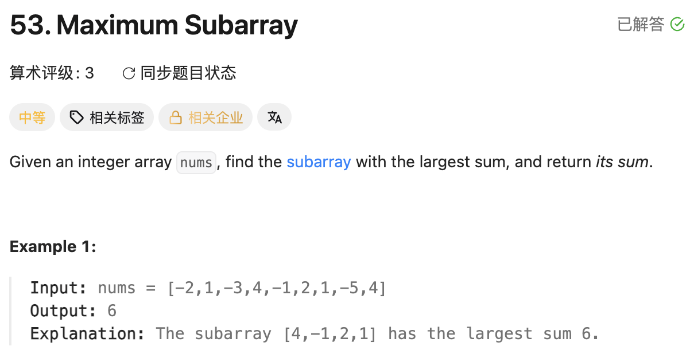

## 53. Maximum Subarray

Date: 9/18/2026
Difficulty: Medium
Tags: Array, DP



### 一刷 (9/18/2026) ❌ 当前 state 读了默认值，答案初值忽略非空要求

我的代码：

```java
dp[0] = nums[0];
int res = 0; // ❌① 非空 subarray 的 sum 可能为负，且漏掉 dp[0]

for (int i = 1; i < nums.length; i++) {
    dp[i] = Math.max(dp[i], dp[i-1] + nums[i]);
    // ❌② dp[i] 尚未计算，默认 0；重新开始应选 nums[i]

    res = Math.max(res, dp[i]);
}
```

**①的根因**：本题要求非空 subarray，不能默认答案为 0；loop 从 1 开始，`res` 也必须先纳入 `dp[0]`。例如 `[-2,-1]`，正确答案是 -1，原代码返回 0。

**②的根因**：以当前 element 结尾，要么从 `nums[i]` 开始，要么接上前面的 subarray，没有「选默认 0」这一项。和当天 LC121 一样，读到了尚未计算的当前 state。

**自测点**：前面的最大 sum 为负时，为什么可以直接舍弃？为什么当前 element 为负时，不一定要舍弃？

---

<!-- ↓↓↓ 复习时先自己想一遍，再往下翻 ↓↓↓ -->

### 核心思路（一句话）

**每走到一个 element，比较「从自己开始」与「接上前面」；再更新全局最大 sum。**

### 正确写法①：DP array

`dp[i]`：**必须以 nums[i] 结尾的非空 subarray 的最大 sum**。

```java
class Solution {
    public int maxSubArray(int[] nums) {
        int[] dp = new int[nums.length];
        dp[0] = nums[0];
        int result = dp[0];

        for (int i = 1; i < nums.length; i++) {
            dp[i] = Math.max(nums[i], dp[i - 1] + nums[i]);
            result = Math.max(result, dp[i]);
        }

        return result;
    }
}
```

长度为 1 时，loop 不执行，直接返回 `nums[0]`，不需要单独处理。

### 正确写法②：Kadane’s algorithm

只依赖前一个 state，用 `current` 代替 DP array：

```java
class Solution {
    public int maxSubArray(int[] nums) {
        int current = nums[0];
        int result = nums[0];

        for (int i = 1; i < nums.length; i++) {
            current = Math.max(nums[i], current + nums[i]);
            result = Math.max(result, current);
        }

        return result;
    }
}
```

- `current`：必须以当前 element 结尾的最大 sum。
- `result`：截至目前，所有结尾中的最大 sum。

**前面的 current 为负，接上它只会拖累当前 sum，所以从 nums[i] 重新开始。** 判断的是前面累积的 sum，不是当前 element 的正负。

例如 `[-2,3,-1,4]`：

| 当前 element | current | result |
| ------------ | ------: | -----: |
| -2           |      -2 |     -2 |
| 3            |       3 |      3 |
| -1           |       2 |      3 |
| 4            |       6 |      6 |

`-1` 虽然为负，仍在最大 subarray `[3,-1,4]` 中。

### 复杂度分析

| 做法               | Time | Space |
| ------------------ | ---- | ----- |
| DP array           | O(n) | O(n)  |
| Kadane’s algorithm | O(n) | O(1)  |

只扫描一次，每次 `Math.max` 是 O(1) time、O(1) space。压缩后省掉 DP table，state transition 不变。

### 沉淀

- **先明确 state 必须包含谁。** 本题 `dp[i]` 必须包含 `nums[i]`，所以重新开始的值是 `nums[i]`。
- **初值先看能否什么都不选。** LC121 允许不交易，答案从 0 开始；本题要求非空，答案从 `nums[0]` 开始。
- **当前最佳不等于全局最佳。** `current` 必须以当前位置结尾；`result` 保留之前出现过的更好答案。
- **只依赖前一个 state，就可以考虑压缩存储。**

### 关联

- LC121：同样可将 DP table 压缩为固定数量的 variable；但答案初始化不同。
