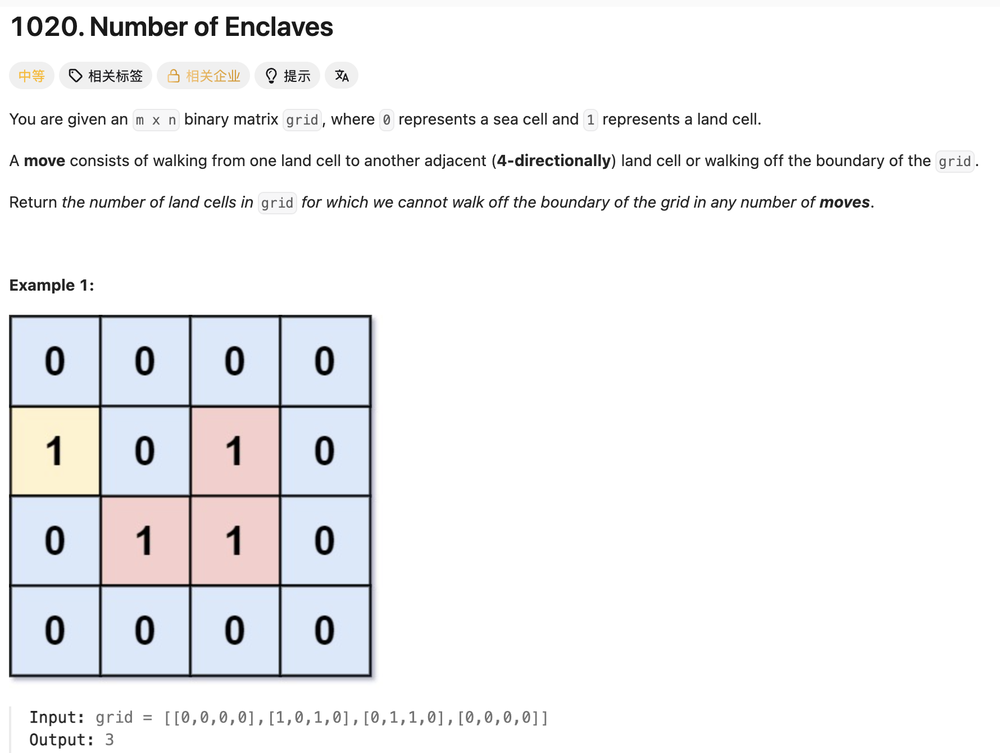

## 1020. Number of Enclaves

Date: 10/2/2026
Difficulty: Medium
Tags: Graph, DFS, Matrix



### 一刷 (10/2/2026) ❌ 用 return 0 排除边界，没有排除整座 island

能从 LC200 迁移出面积统计：当前陆地贡献 `1`，再累加四个方向的 DFS。也意识到了「触及边界就不能算」，但没有把这个信息单独记录下来。

```java
if (grid[row][col] == 1) {
    int count = dfs(grid, row, col);
    ans = Math.max(ans, count); // ❌① 求成最大面积；题目要所有孤岛的总面积
}

// DFS 内
if (row <= 0 || row >= grid.length
        || col <= 0 || col >= grid[0].length) {
    return 0; // ❌② 核心错误：只让这次 call 贡献 0，没有让整座 island 失效
}
```

**①的根因**：两座孤岛面积分别为 2、3 时，答案应为 5。主函数应在确认 island 不触及边界后，累加 `count`。

**②的根因**：`count` 只能表示面积；`return 0` 表示「这个方向贡献 0」，不能表达「整座 island 不合格」。另外，原 condition 跳过了第一行、第一列，却仍允许最后一行、最后一列进入搜索。

```text
0 1 0  ← A：边界陆地
0 1 0  ← B：内部陆地
0 0 0
```

原代码扫描 A 时直接返回 `0`。扫描 B 时先有 `count = 1`，向上搜索 A 又返回 `0`，最终仍是 `1 + 0 = 1`。但 B 与边界连通，正确答案应为 `0`。

讨论后理解：每座 island 开始时默认「还没发现边界陆地」；DFS 中只要发现一格触及边界，boolean 就变成 `true`。等整座搜索完，主函数再决定是否累加面积。尚未独立重写验证。

> **自检信号**：遇到边界就想 return 时，先确认要表达的是「当前方向贡献多少」，还是「整座 island 是否合格」；后者需要单独记录。

**自测点**：如果把主函数的扫描顺序改为从右下角到左上角，答案应不应该变化？为什么？

---

### 核心思路

**一次 DFS 搜完整座 island，同时得到面积 count 和是否触及边界 touchesBoundary；只有不触及边界的 island，面积才加入 ans。**

题目中的 _land cells for which we cannot walk off the boundary of the grid_，指从这些陆地格子出发，只沿上下左右的陆地走，无法走出 grid。统计的是这些格子的总数。

### 正确写法

```java
class Solution {
    private boolean touchesBoundary;

    public int numEnclaves(int[][] grid) {
        int ans = 0;

        for (int row = 0; row < grid.length; row++) {
            for (int col = 0; col < grid[0].length; col++) {
                if (grid[row][col] == 1) {
                    touchesBoundary = false; // 每座新 island 开始前重置
                    int count = dfs(grid, row, col);

                    if (!touchesBoundary) {
                        ans += count;
                    }
                }
            }
        }

        return ans;
    }

    private int dfs(int[][] grid, int row, int col) {
        if (row < 0 || row >= grid.length
                || col < 0 || col >= grid[0].length) {
            return 0;
        }

        if (grid[row][col] == 0) {
            return 0;
        }

        // 先确认是陆地，再判断是否触及任意一条边界
        if (row == 0 || row == grid.length - 1
                || col == 0 || col == grid[0].length - 1) {
            touchesBoundary = true;
        }

        grid[row][col] = 0; // 先标记当前格，再搜索 neighbors

        int count = 1;
        count += dfs(grid, row - 1, col);
        count += dfs(grid, row + 1, col);
        count += dfs(grid, row, col - 1);
        count += dfs(grid, row, col + 1);

        return count;
    }
}
```

### 两种标记各管什么

- **`touchesBoundary = true`**：记录整座 island 不合格。它是 field，同一次 DFS 的所有 recursive calls 共用这份信息。
- **`grid[row][col] = 0`**：记录当前这一格已访问，防止重复搜索。

boolean 变成 `true` 后，仍要把整座 island 搜完并标记。否则可能只消掉边界那格，留下内部陆地，被主 loop 当成另一座 island。

`false` 表示「目前还没发现边界陆地」。DFS 遇到内部陆地时不修改它；只有主函数开始搜索下一座 island，才重新设为 `false`。

### 复杂度分析

**Time: O(rows × cols)**：主 loop 扫描全部格子，每格陆地最多标记一次，每次检查四个方向。

**Space: O(rows × cols)**：最坏情况下 recursion stack 的深度与陆地格子数同阶。in-place 标记不代表总 Space 为 O(1)。

### 沉淀

- **面积与资格是两份信息**：`count` 回答「多大」，`touchesBoundary` 回答「算不算」，不能让 `return 0` 同时承担两种含义。
- **越界与位于边界不同**：`row < 0` 已没有合法格子；`row == 0` 仍是合法格子，要先确认是不是陆地。
- **搜索完整，再决定是否计入**：不合格的 island 也要全部标记，避免剩余部分被重新发现。
- **按输入 type 写比较**：本题是 `int[][]`，用 `1`、`0`；LC200 是 `char[][]`，用 `'1'`、`'0'`。

### 关联

- LC200：同样由主 loop 发现新 island、DFS 标记整座；LC200 每座计数一次，本题统计面积，并增加是否触及边界的判断。

### Interview pitch (练口述)

> "I scan the grid and run DFS whenever I find unvisited land. Each DFS returns the island's area and records whether any of its cells touches the boundary. I mark every cell in the island as visited, even after finding a boundary cell, so the island cannot be processed again. I add its area only if it never touches the boundary. The time complexity is O(rows × cols), and the recursion stack uses O(rows × cols) space in the worst case."
