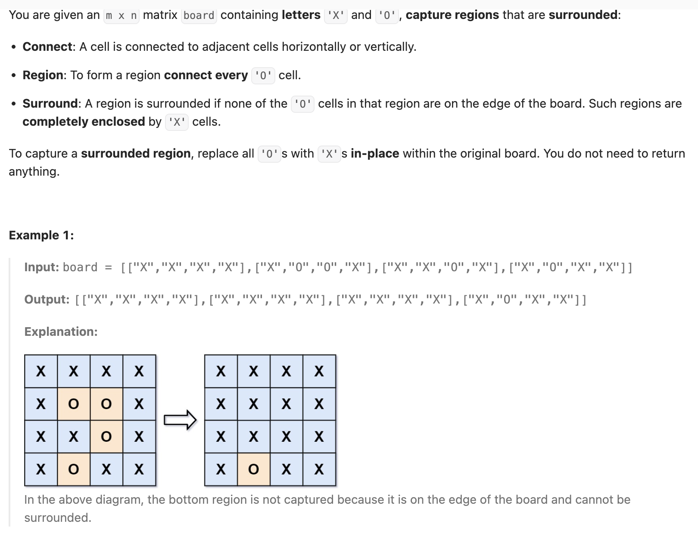

## 130. Surrounded Regions

Date: 10/3/2026, 10/4/2026
Difficulty: Medium
Tags: Graph, DFS, Matrix



### 一刷 (10/3/2026) ❌ 提前翻转 board；换标记后未同步修改停止条件

#### 最初尝试：沿用 LC1020，搜完再判断整块是否触及边界

```java
dfs(board, row, col);
if (!touchBoundary) {
    // 卡住：不知道这里还应该做什么
}

// DFS 内
board[row][col] = 'X'; // ❌ 已经翻转；若整块触及边界，不知道该恢复哪些位置
```

**根因**：LC1020 的答案由 `count` 和 `touchBoundary` 保存，访问过的 land 可以全部清零；本题 **board 本身就是答案**，不能把「访问过」直接当成「应该翻转」。DFS return 不会自动恢复修改。

原思路可以成立，但需要用 `visited` 标记访问、用 list 保存当前 island 的位置，搜完整块后再决定是否翻转。

草稿另有几处 mechanical errors：

```java
if (board[row][col] == 'o') { ... } // ❌ 应为大写字母 'O'
dfs(grid, row, col);               // ❌ 当前 parameter 名为 board
public void dfs(char[][] board, row, col) // ❌ row、col 缺 int

col < 0 || row >= board[0].length       // ❌ 右边界应检查 col
col == 0 || row == board[0].length - 1  // ❌ 同上
```

#### 学习边界 DFS 后重写：停止条件没有拦住新标记

能写出「搜索四条边界 → 扫描整个 board 做替换」的流程，但 DFS 仍只排除 `'X'`：

```java
if (board[row][col] == 'X') {
    return; // ❌ 核心错误：没有排除已经访问过的 '#'
}

board[row][col] = '#';
```

**根因**：两个相邻的 `'O'` 被标成 `'#'` 后，仍能通过这个 check，导致 A → B → A 不断互相调用，最终 `StackOverflowError`。**写入 visited 标记后，入口必须能识别它。**

本次重写还重复了右边界检查的 `row/col` 笔误，以及最后替换时的大小写错误：

```java
if (board[row][col] == 'o') { // ❌ 匹配不到输入中的 'O'
    board[row][col] = 'X';
} else if (board[row][col] == '#') {
    board[row][col] = 'o';   // ❌ 应恢复成 'O'
}
```

讨论后理解 `!= 'O'`：只搜索尚未访问的 `'O'`；`'X'` 不可穿过，`'#'` 已经访问过。本轮属于学习后的重写，当日未提供最终 AC 结果。

> **自检信号**：写完 visited 标记，回头检查 DFS 入口能否拦住它；检查 coordinate 时横着读一遍：row 对行数，col 对列数，字符统一用 `'O'`。

**自测点（10/4 已通过）**：如果只从四个角启动 DFS，而不扫描整条边界，会漏掉什么情况？

---

### 二刷 (10/4/2026) ✅ 代码一次 AC，口答通过

四条边界的 DFS、`!= 'O'` 的停止条件、coordinate 和字符大小写均正确，一刷错误未再犯。

**口答通过**：只从四个角出发，只能搜到与角上的 `'O'` 连通的区域；接触边界中间、却不与四角连通的区域可能被漏掉，所以必须扫描整条边界。

本次先将 `'#'` 恢复成 `'O'`，再用 `else if` 将原有的 `'O'` 翻成 `'X'`，同样正确：每格只执行一个分支，不会刚恢复就被翻转。

---

### 核心思路

**先从边界出发，把必须保留的 `'O'` 标成 `'#'`；剩下的 `'O'` 全部翻转，`'#'` 恢复成 `'O'`。**

只要某个 `'O'` 能沿上下左右的 `'O'` 走到边界，它就不能被翻转。从所有边界 `'O'` 出发，恰好能找到这些位置。

### 正确写法

```java
class Solution {
    public void solve(char[][] board) {
        int rows = board.length;
        int cols = board[0].length;

        // 从左右边界出发
        for (int row = 0; row < rows; row++) {
            dfs(board, row, 0);
            dfs(board, row, cols - 1);
        }

        // 从上下边界出发
        for (int col = 0; col < cols; col++) {
            dfs(board, 0, col);
            dfs(board, rows - 1, col);
        }

        // 搜索已结束，这里只逐格替换
        for (int row = 0; row < rows; row++) {
            for (int col = 0; col < cols; col++) {
                if (board[row][col] == '#') {
                    board[row][col] = 'O';
                } else if (board[row][col] == 'O') {
                    board[row][col] = 'X';
                }
            }
        }
    }

    private void dfs(char[][] board, int row, int col) {
        if (row < 0 || row >= board.length
                || col < 0 || col >= board[0].length) {
            return;
        }

        if (board[row][col] != 'O') {
            return; // 'X' 不可穿过，'#' 已经访问过
        }

        board[row][col] = '#';

        dfs(board, row - 1, col);
        dfs(board, row + 1, col);
        dfs(board, row, col - 1);
        dfs(board, row, col + 1);
    }
}
```

### `!= 'O'` 在检查什么

只允许「尚未访问的 `'O'`」继续进入 DFS，等价于：

```java
if (board[row][col] == '#' || board[row][col] == 'X') {
    return;
}
```

- **`'X'` → return**：不属于要搜索的区域，不能穿过去连接另一块 `'O'`。
- **`'#'` → return**：已经访问过，避免相邻格子反复互相调用。
- **`'O'` → 继续**：标成 `'#'`，再搜索上下左右。

`'#'` 同时表示「已经访问」和「与边界连通、必须保留」。第二层含义成立，是因为 DFS 只从边界启动。

### 复杂度分析

**Time: O(rows × cols)**：每个 `'O'` 最多被 DFS 标记一次，最后再扫描整个 board。

**Space: O(rows × cols)**：最坏情况下来自 recursion stack。使用 in-place 标记，不代表总 Space 为 O(1)。

### 沉淀

- **visited 标记与停止条件必须配套**：以前标成 `0`、检查 `0`；现在标成 `'#'`，入口也必须拦住 `'#'`。
- **临时标记不等于最终答案**：DFS return 不会自动撤销对 board 的修改；需要保留的信息不能提前抹掉。
- **先找必须保留的部分**：从边界出发，搜到的整块都确定安全，不再需要逐块维护 `touchBoundary`。

### 关联

- LC200 / LC695：DFS 仍是「先标记，再搜上下左右」；本题改变了搜索起点和标记含义。
- LC1020：同样判断是否与边界连通；LC1020 返回面积，本题要保留并修改 board。

### Interview pitch (练口述)

> "I start DFS from every boundary cell and mark all connected O cells with a temporary marker. These cells must be preserved because they are connected to the boundary. I then scan the board, restore the marked cells to O, and flip the remaining O cells to X. The time complexity is O(rows × cols), and the recursion stack takes O(rows × cols) space in the worst case."
