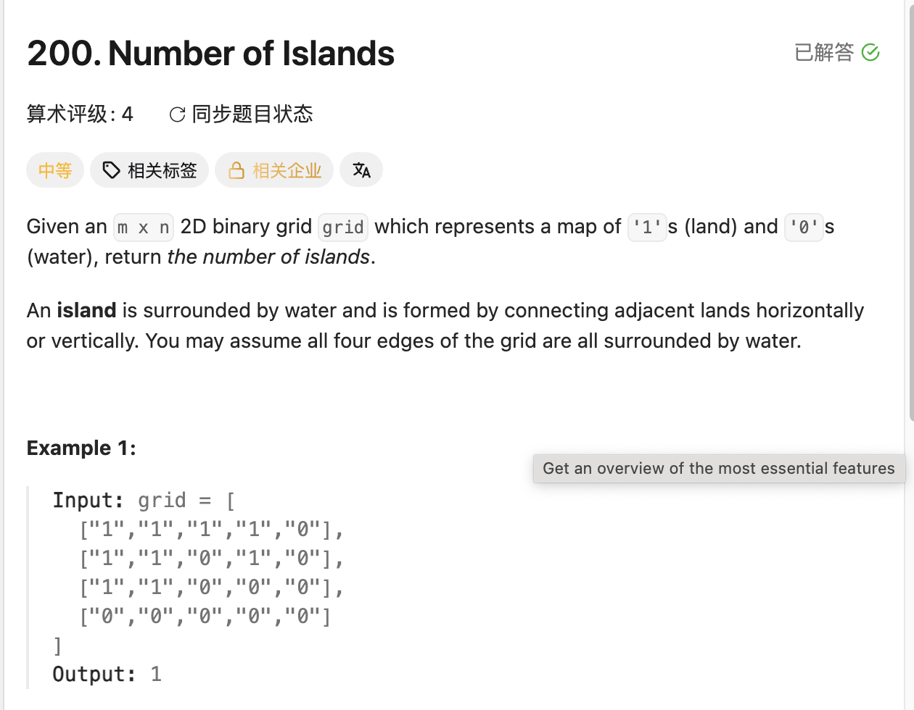

## 200. Number of Islands

Date: 9/20/2026, 10/1/2026, 10/2/2026
Difficulty: Medium
Tags: Graph, DFS, BFS, Matrix



### 一刷 (9/20/2026) ❌ 首次接触 graph，学习 DFS 后重写

**卡在哪**：起初不清楚 island 的定义，也不知道如何把「一整片陆地只数一次」写成代码。

**真正的坎**：主函数负责发现新 island 并计数；DFS 负责把整座 island 标记掉。一次 DFS 完成后，主函数才继续扫描。

看解后重写，只有一处边界错误：

```java
if (row < 0 || row >= grid[0].length // ❌ row 应与 grid.length 比较
        || col < 0 || col >= grid[0].length) {
    return;
}
```

**根因**：row 上界误用了列数。2 行 3 列时，row = 2 没被拦住，随后访问 grid[2][col] 越界；方形 grid 会掩盖这个错误。

**自测点**：面试官问：每轮 DFS 后都修改了 grid，为什么最终的 island 数量仍然和原图一致？

---

### 二刷 (10/1/2026) ❌ 上界漏拦 + char 比较与 assignment 写错

复习讲解后合上笔记重写，能还原扫描、计数、标记及四个方向的 DFS。一刷的 row/col 长度混淆没有重犯，但出现以下错误；提示后修正完成，本次不算无提示一次写对。

```java
if (grid[row][col] == 1) { ... } // ❌① 应比较 '1'，否则无法识别陆地

if (row < 0 || row > grid.length
        || col < 0 || col > grid[0].length) { // ❌② 应用 >=，漏拦 index == length
    return;
}

if (grid[row][col] == 0) { // ❌① 应比较 '0'
    return               // ❌③ 漏分号，无法编译
}

grid[row][col] == 0; // ❌④ 比较不能代替 assignment，应为 = '0'；此行无法编译
```

**根因**：`char[][]` 中存的是字符 `'1'`、`'0'`，不是整数 1、0；修改内容要用 `=`。length 已是第一个不合法的 index：有 4 行时，`row = 4` 不满足 `row > 4`，随后访问就会越界。

> **自检信号**：访问 array 前，把 index == length 代入边界 condition，检查能否被挡住；操作 grid 时，确认比较的是字符、标记用的是 assignment。

**自测点**：如果把标记 `'0'` 移到四个方向的 DFS 之后，两个相邻的陆地会发生什么，为什么？

#### 同日学习 BFS：for 提前关闭 + 方法名笔误

起初不清楚 Queue 存什么，以及 direction 如何计算 neighbor 的坐标。讲解后能口述流程，自己写时把 `for` 提前关闭：

```java
for (int[] direction : directions) {
    int nextRow = cur[0] + direction[0];
    int nextCol = cur[1] + direction[1];
} // ❌ 过早关闭，检查、标记和加入 Queue 都应该放在里面

// ❌ 此处访问不到 nextRow / nextCol；continue 也会作用于外层 while
if (nextRow < 0 || nextRow >= grid.length ||
    nextCol < 0 || nextCol >= grid[0].length) {
    continue;
}

// ...
queue.off(new int[]{nextRow, nextCol}); // ❌ 方法名应为 offer
```

**根因**：每个 direction 都要完成「算坐标 → 检查 → 标记 → 加入 Queue」，不能只把计算坐标放进 for。`continue` 作用于最近一层 loop，位置不同，跳过的对象也不同。

提示后修正上述错误。另遇到 `reached end of file while parsing`；聊天中最后贴出的版本括号完整，实际提交版本的未闭合位置未核实。

> **自检信号**：关闭 for 前，确认一个 direction 的处理已完成；写 continue 时，确认最近一层 loop 是遍历 directions 的 for。

**自测点**：一座 island 搜索到一半时，Queue 为空和「当前格子没有新 neighbor」有什么区别？

---

### 三刷 (10/2/2026) ✅ DFS 一次 AC，取长度时短暂犹豫

DFS 一次 AC，前两刷的边界、char 比较及 assignment 错误均未重犯。本次只复刷了 DFS。

写 `grid.length` 时，犹豫 `char` 的长度是否要加 `()`，最终没加，写对了。**判断依据是点号前的 type，与 element 是否为 char 无关**：`grid` 是 `char[][]`，`grid[0]` 是 `char[]`，都是 array，用 field `.length`；String 才用 method `.length()`。

> **自检信号**：取长度时，先确认点号前的 type，再决定用 `.length` 还是 `.length()`。

---

### 核心思路

**扫描到尚未访问的陆地就计数一次，再用 DFS 或 BFS 把与它连通的整片陆地标记为已访问。**

一座 island 是通过上下左右连接的一片陆地，斜向接触不算。题目数的是 connected component，不是 `'1'` 的个数。

```text
原 grid：       搜索整座 island 后：
1 1 0           0 0 0
0 1 0     →     0 0 0
0 0 1           0 0 1

左上三格是一座；右下单独一座，答案为 2。
```

### 正确写法：DFS（主解法）

```java
class Solution {
    public int numIslands(char[][] grid) {
        int count = 0;

        for (int row = 0; row < grid.length; row++) {
            for (int col = 0; col < grid[0].length; col++) {
                if (grid[row][col] == '1') {
                    dfs(grid, row, col);
                    count++;
                }
            }
        }

        return count;
    }

    private void dfs(char[][] grid, int row, int col) {
        if (row < 0 || row >= grid.length
                || col < 0 || col >= grid[0].length) {
            return;
        }

        if (grid[row][col] == '0') return;

        grid[row][col] = '0'; // 先标记，再访问 neighbors

        dfs(grid, row - 1, col);
        dfs(grid, row + 1, col);
        dfs(grid, row, col - 1);
        dfs(grid, row, col + 1);
    }
}
```

### DFS 到底在做什么

- **越界或遇到 `'0'` → 当前 call return**，调用它的那一层继续执行。必须先检查边界，再访问 grid。
- **遇到 `'1'` → 标记，再搜索四个方向**；neighbors 也会继续搜索自己的 neighbors，不只检查起点周围四格。
- **主函数里的那次 DFS 返回 → 整座 island 已标记完**，之后扫描到其中任何一格都不会重复计数。

### 正确写法：BFS

```java
import java.util.ArrayDeque;
import java.util.Queue;

class Solution {
    public int numIslands(char[][] grid) {
        int count = 0;

        for (int row = 0; row < grid.length; row++) {
            for (int col = 0; col < grid[0].length; col++) {
                if (grid[row][col] == '1') {
                    count++;
                    bfs(grid, row, col);
                }
            }
        }

        return count;
    }

    private void bfs(char[][] grid, int row, int col) {
        Queue<int[]> queue = new ArrayDeque<>();

        grid[row][col] = '0';
        queue.offer(new int[]{row, col});

        int[][] directions = {
            {-1, 0},
            {1, 0},
            {0, -1},
            {0, 1}
        };

        while (!queue.isEmpty()) {
            int[] cur = queue.poll();

            for (int[] direction : directions) {
                int nextRow = cur[0] + direction[0];
                int nextCol = cur[1] + direction[1];

                if (nextRow < 0 || nextRow >= grid.length
                        || nextCol < 0 || nextCol >= grid[0].length) {
                    continue;
                }

                if (grid[nextRow][nextCol] == '0') {
                    continue;
                }

                // 加入 Queue 时就标记，避免重复加入
                grid[nextRow][nextCol] = '0';
                queue.offer(new int[]{nextRow, nextCol});
            }
        }
    }
}
```

### BFS：Queue 存什么，怎么变化

**Queue 保存已经发现、等待检查四周的陆地坐标。**

```java
Queue<int[]> queue = new ArrayDeque<>();
queue.offer(new int[]{2, 3}); // 加入一个 array，表示坐标 (2,3)

int[] cur = queue.poll();    // 取出整个 array [2,3]
// cur[0] 是 row，cur[1] 是 col
```

`direction` 存的是坐标变化量；`nextRow` 和 `nextCol` 各是一个 int，合起来才表示 neighbor 的坐标：

```text
cur = [0,0]，direction = [-1,0]

nextRow = 0 + (-1) = -1
nextCol = 0 + 0    = 0

neighbor 为 (-1,0)，越界 → continue，换下一个 direction。
cur 仍然是 [0,0]。
```

四个方向都检查完，才回到 while，取出下一个格子。

以这个 grid 为例，按上、下、左、右搜索，Queue 左侧为 front：

```text
1 1
1 1

起点标记并加入：        [(0,0)]
取出 (0,0)，发现两格：  [(1,0), (0,1)]
取出 (1,0)，发现 (1,1)：[(0,1), (1,1)]
取出 (0,1)，无新陆地：  [(1,1)]
取出 (1,1)，无新陆地：  []
```

**标记为 `'0'` 表示已经发现，不代表已经检查完四周。** `(1,1)` 加入 Queue 时就已标记，所以从 `(0,1)` 再遇到它，不会重复加入。等轮到它，才检查它的四周。

### DFS 与 BFS 的区别

- **DFS**：通过 recursion stack 记住未完成的 calls，沿一条路深入，返回后继续其他方向。
- **BFS**：通过 Queue 保存待处理的坐标，先发现的先处理，一层层向外搜索。
- 本题两种写法都可以。目前 DFS 作为主解法；BFS 重点理解 Queue 的变化。

### 复杂度分析

**Time: O(rows × cols)**：两种写法都扫描所有格子，每格陆地最多标记一次，每次检查四个方向。

**Space: O(rows × cols)**：DFS 的 recursion stack、BFS 的 Queue 最坏空间上界均为 O(rows × cols)。in-place 标记不代表总 Space 为 O(1)。

### 沉淀

- **发现时就标记**：DFS 在继续调用前标记，避免来回搜索；BFS 在加入 Queue 时标记，避免重复加入。
- **计数与搜索分工**：主函数数 connected component，DFS / BFS 不对每格陆地 count++。
- **row 对 grid.length，col 对 grid[0].length**：用非方形 grid 检查边界。
- **本写法会修改输入 grid**：用 `'0'` 同时表示水与已访问的陆地；若需保留输入，另用 visited array。

### 关联

- LC98：DFS 携带 ancestor 的范围；本题 DFS 标记 visited，避免走回头路。
- LC102：同样用 Queue 做 BFS；本题只需搜索完整座 island，不需要按层统计，因此不用额外记录每层的 size。
