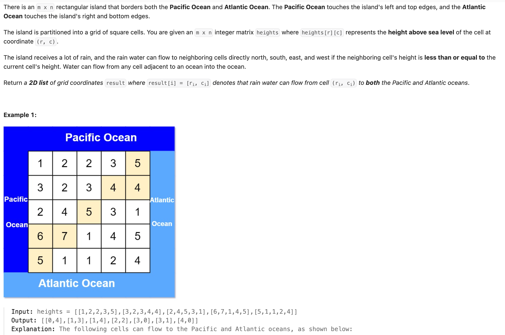

## 417. Pacific Atlantic Water Flow

Date: 10/4/2026
Difficulty: Medium
Tags: Graph, DFS, Matrix



### 一刷 (10/4/2026) ❌ 卡在高度比较与搜索状态，学习反向 DFS 后理解

#### 最初尝试：从每个格子出发，顺着水流搜索

```java
List<List<Integer>> ans = new ArrayList<>();
List<Integer> path = new ArrayList<>(); // 不需要记录整条路径，答案只收集起点

// 主函数内
for (int row = 0; row < heights.length; row++) {
    for (int col = 0; col < heights[0].length; col++) {
        dfs(heights, row, col);
    }
}
// ❌ 尚缺每个起点的访问记录、两片 ocean 的到达状态，以及 return ans

public List<Integer> dfs(int[][] heights, int row, int col) {
    if (row < 0 || col < 0) {
        return; // ❌ return type 与空 return 不匹配
    }
    // 卡住：知道要比较高度，但没有写出 neighbor 的检查与搜索
}
```

**卡在哪**：知道应该检查周围格子的高度，但还没把「当前格子 → neighbor → 能否继续走」接进 DFS，也不清楚搜索结果应该保存什么。

**真正的坎**：本题判断的是 reachability，不是收集 path。`heights` 存的是地形高度，不是水量；水流过去不需要 `-1`，高度保持不变。

能列出上＋右、上＋下、左＋右、左＋下四种组合。它们可以合并成两个判断：能到上或左边界，且能到下或右边界。

#### 学习优化：从 ocean 反向找哪些格子的水能流过来

最初难以理解高度比较为什么反过来，以及 `visited`、`continue` 和 recursive call 分别控制什么。讨论后能说清：

- 从四条边界启动 DFS；边界是实际水流的终点、反向搜索的起点。
- `continue` 跳过当前方向，进入同一个 for 的下一次 iteration。
- `visited` 为 true 就结束当前 call，避免同一片 ocean 的搜索重复展开一个格子。
- `pacific` 和 `atlantic` 分别记录能到两片 ocean 的位置，同一位置都为 true 才加入答案。

本轮看过完整代码并逐段理解，尚未独立重写或提供 AC 结果。

> **自检信号**：写高度比较前，先说清当前搜索是在模拟水流，还是反向寻找来源；写 visited 时，明确它记录的是「能到哪片 ocean」，两片 ocean 不能混用一份记录。

**自测点**：如果反向 DFS 只允许走向严格更高的 neighbor，会漏掉什么情况？用一条具体的高度路径说明。

---

### 核心思路

**分别从两片 ocean 的边界反向 DFS，沿更高或等高的格子搜索；两次搜索结果的交集就是答案。**

- Pacific：上边界、左边界。
- Atlantic：下边界、右边界。
- 同一个起点可以沿不同路径分别流到两片 ocean，不要求一条路径经过两片 ocean。

### 为什么反向搜索要往高处走

假设当前格子已经能流到 Pacific。如果 neighbor 更高或等高，它的水就能流到当前格子，接着流到 Pacific。

只看一条局部路径：

```text
Pacific | 1 — 3 — 5 — 2
```

实际水流可以沿 `5 → 3 → 1 → Pacific`，反向搜索就沿 `1 → 3 → 5`。

不能继续从 `5` 反向搜到 `2`，因为 `2` 的水不能爬到 `5`，无法通过这条路径流到 Pacific；它是否有其他路径，需要另外搜索。

**反向 DFS 不是让水往高处流，而是在找「谁的水能流到当前格子」。**

### 正确写法

```java
import java.util.*;

class Solution {
    private final int[][] directions = {
        {-1, 0}, {1, 0}, {0, -1}, {0, 1}
    };

    public List<List<Integer>> pacificAtlantic(int[][] heights) {
        int rows = heights.length;
        int cols = heights[0].length;

        boolean[][] pacific = new boolean[rows][cols];
        boolean[][] atlantic = new boolean[rows][cols];

        // 左边界 → Pacific；右边界 → Atlantic
        for (int row = 0; row < rows; row++) {
            dfs(heights, row, 0, pacific);
            dfs(heights, row, cols - 1, atlantic);
        }

        // 上边界 → Pacific；下边界 → Atlantic
        for (int col = 0; col < cols; col++) {
            dfs(heights, 0, col, pacific);
            dfs(heights, rows - 1, col, atlantic);
        }

        List<List<Integer>> ans = new ArrayList<>();

        for (int row = 0; row < rows; row++) {
            for (int col = 0; col < cols; col++) {
                if (pacific[row][col] && atlantic[row][col]) {
                    ans.add(Arrays.asList(row, col));
                }
            }
        }

        return ans;
    }

    private void dfs(int[][] heights, int row, int col,
                     boolean[][] visited) {
        if (visited[row][col]) {
            return;
        }

        visited[row][col] = true;

        for (int[] direction : directions) {
            int nextRow = row + direction[0];
            int nextCol = col + direction[1];

            if (nextRow < 0 || nextRow >= heights.length
                    || nextCol < 0 || nextCol >= heights[0].length) {
                continue;
            }

            // 反向搜索：neighbor 的水必须能流回当前格子
            if (heights[nextRow][nextCol] < heights[row][col]) {
                continue;
            }

            dfs(heights, nextRow, nextCol, visited);
        }
    }
}
```

### 一次 DFS call 在做什么

**标记当前格子 → 检查四个 neighbors → 对符合条件的 neighbor 继续 DFS。**

- 入口的 `visited` check：已经为当前 ocean 搜过，就 return。等高格子能互相走，必须避免重复访问。
- `visited[row][col] = true`：记录当前格子能到这片 ocean。传入 `pacific` 就修改 `pacific`，传入 `atlantic` 就修改 `atlantic`。
- `continue`：只跳过当前方向，不结束整个 DFS。
- recursive call：先搜 neighbor 那边；返回后，当前 call 的 for 再继续检查下一个方向。
- 四个方向全部处理完，当前 call 自然结束，返回上一层。

同一片 ocean 的所有边界起点共用一份 visited，不重置；两片 ocean 各有一份，互不影响。

### 复杂度分析

**Time: O(rows × cols)**：每个格子对每片 ocean 最多展开一次，每次检查四个方向，最后扫描整个 matrix 取交集。

**Space: O(rows × cols)**：两份 boolean matrix、recursion stack 和答案。

对比 brute force **O((rows × cols)²)**：从每个格子独立出发，每次重置 visited，一次搜索最坏遍历整个 matrix。visited 只能消除单次搜索内部的重复，不能消除不同起点之间的重复；反向搜索把这些工作合并了。

### 沉淀

- **先确定搜索方向，再写高度比较**：实际水流要求 `next <= current`；反向搜索要求 `next >= current`。
- **visited 的含义由搜索任务决定**：这里不仅表示访问过，也表示能到当前这片 ocean；不同 ocean 的结果要分别保存。
- **输入还要参与判断，就不能随意覆盖**：高度要用于 neighbor 比较，因此访问状态单独存进 boolean matrix。

### 关联

- LC130：同样从边界出发搜索；LC130 只检查是否为未访问的 `'O'`，本题增加高度限制，并分别记录两组边界的 reachability。
- LC200 / LC695 / LC1020：仍沿用「先标记，再搜上下左右」的 DFS 结构；本题不能把高度直接清零当作 visited。

### Interview pitch (练口述)

> "Instead of searching from every cell toward both oceans, I run reverse DFS from each ocean's boundary. I move only to neighbors of equal or greater height, because water from those neighbors can flow back to the current cell. I keep a separate visited matrix for each ocean and return cells marked in both. The time and space complexity are O(rows × cols)."
