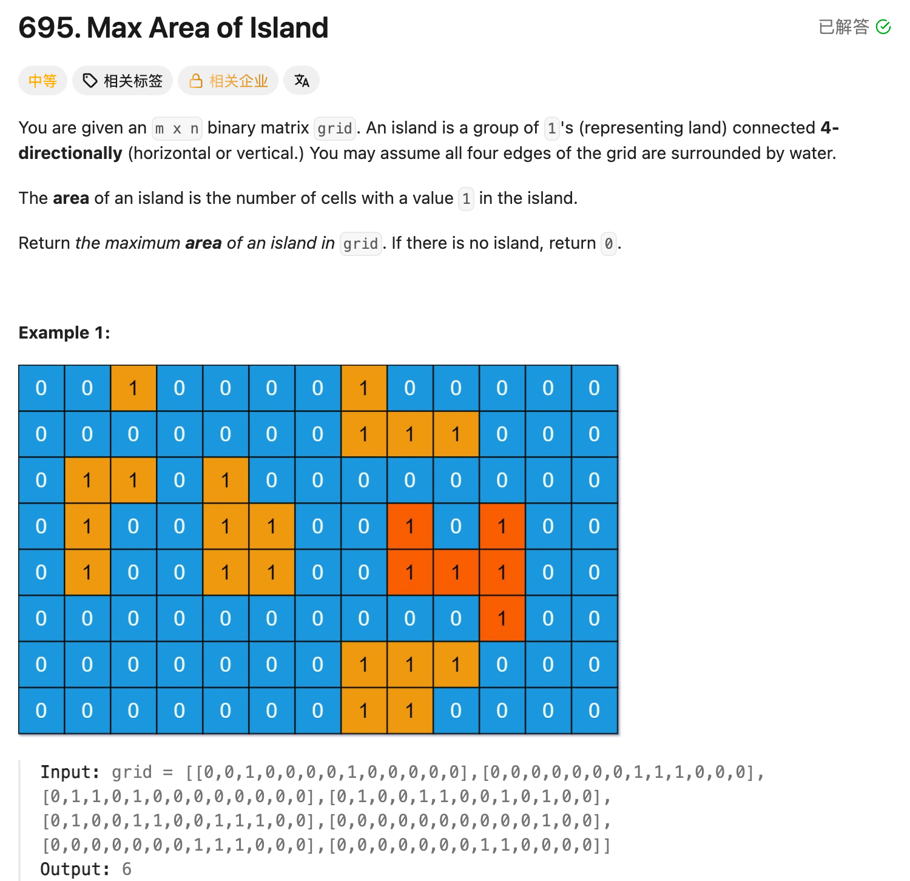

## 695. Max Area of Island

Date: 10/1/2026
Difficulty: Medium
Tags: Graph, DFS, BFS, Matrix



### 一刷 (10/1/2026) 学习整理：从 LC200 的计数改成面积统计

能识别它与 LC200 的关系：搜索整座 island 的方式相同，但 LC200 数 island 数量，本题统计每座 island 的面积，再取最大值。已学习 DFS，尚未提交独立代码验证。

> **自检信号**：先明确统计单位——count 是在发现一座 island 时加一，还是在发现一格陆地时加一；再检查每座 island 的 area 是否重新开始计算。

**自测点**：如果两条搜索路线都能走到同一格陆地，代码如何保证这格面积只计算一次？

---

### 核心思路

**扫描到未访问的陆地，就搜索整座 island、计算面积，再更新 maxArea。**

- 一格陆地贡献面积 `1`，上下左右连通的陆地属于同一座 island。
- 搜索时把 `1` 改成 `0`，避免重复访问和计数。
- 本题输入是 `int[][]`，使用整数 `1`、`0`；LC200 是 `char[][]`，使用字符 `'1'`、`'0'`。
- 没有陆地时，`maxArea` 保持 `0`。

```text
1 1 0
1 0 0
0 0 1

第一座面积为 3，第二座面积为 1，答案为 3。
```

### 正确写法：DFS（主解法）

**dfs 返回从当前格子出发，本次搜索新访问到的陆地数量。**

```java
class Solution {
    public int maxAreaOfIsland(int[][] grid) {
        int maxArea = 0;

        for (int row = 0; row < grid.length; row++) {
            for (int col = 0; col < grid[0].length; col++) {
                if (grid[row][col] == 1) {
                    int area = dfs(grid, row, col);
                    maxArea = Math.max(maxArea, area);
                }
            }
        }

        return maxArea;
    }

    private int dfs(int[][] grid, int row, int col) {
        if (row < 0 || row >= grid.length ||
            col < 0 || col >= grid[0].length) {
            return 0;
        }

        if (grid[row][col] == 0) {
            return 0;
        }

        grid[row][col] = 0;

        int area = 1; // 当前这格陆地贡献 1
        area += dfs(grid, row - 1, col);
        area += dfs(grid, row + 1, col);
        area += dfs(grid, row, col - 1);
        area += dfs(grid, row, col + 1);

        return area;
    }
}
```

### DFS 如何累计面积

- 越界、水或已访问的陆地：`return 0`，没有新的面积贡献。
- 未访问的陆地：先标记，当前格子贡献 `1`，再加上四个方向搜索返回的数量。
- **每次调用都有自己的 local variable area**，通过 return 把结果交给上一层。

四个方向依次执行，共享修改后的 grid。前一个方向访问过的陆地，后一个方向再遇到时只返回 `0`，不会重复累计。

### 正确写法：BFS

**Queue 保存待处理的陆地坐标；每发现一格新陆地，就标记、加入 Queue，并把 area 加一。**

```java
import java.util.ArrayDeque;
import java.util.Queue;

class Solution {
    public int maxAreaOfIsland(int[][] grid) {
        int maxArea = 0;

        for (int row = 0; row < grid.length; row++) {
            for (int col = 0; col < grid[0].length; col++) {
                if (grid[row][col] == 1) {
                    int area = bfs(grid, row, col);
                    maxArea = Math.max(maxArea, area);
                }
            }
        }

        return maxArea;
    }

    private int bfs(int[][] grid, int row, int col) {
        Queue<int[]> queue = new ArrayDeque<>();

        grid[row][col] = 0;
        queue.offer(new int[]{row, col});
        int area = 1; // 起点也是一格陆地

        int[][] directions = {
            {-1, 0},
            {1, 0},
            {0, -1},
            {0, 1}
        };

        while (!queue.isEmpty()) {
            int[] cur = queue.poll();

            for (int[] direction : directions) {
                int nextRow = cur[0] + direction[0];
                int nextCol = cur[1] + direction[1];

                if (nextRow < 0 || nextRow >= grid.length ||
                    nextCol < 0 || nextCol >= grid[0].length) {
                    continue;
                }

                if (grid[nextRow][nextCol] == 0) {
                    continue;
                }

                grid[nextRow][nextCol] = 0;
                queue.offer(new int[]{nextRow, nextCol});
                area++; // 新发现的一格陆地，只计数一次
            }
        }

        return area;
    }
}
```

### BFS 如何累计面积

- 起点标记并加入 Queue，`area = 1`。
- 每次取出一个坐标，检查四个方向。
- 遇到新的陆地，先标记再加入 Queue，同时 `area++`。
- Queue 为空，整座 island 搜索完成，返回 area。

**area 数的是陆地总数，不是 Queue 当前的 size。** Queue 中的格子会不断被取出，已经处理过的陆地仍然属于这座 island。

### 复杂度分析

**Time: O(rows × cols)**：两种写法都扫描整个 grid，每格陆地最多标记一次，每次检查四个方向。

**Space: O(rows × cols)**：DFS 的 recursion stack 和 BFS 的 Queue 最坏空间上界均为 O(rows × cols)。

### 沉淀

- **先明确统计单位**：LC200 每发现一座 island 加一；LC695 每发现一格陆地贡献面积一。
- **每座 island 单独计算 area**：搜索完成后更新 maxArea，不能把不同 island 的面积相加。
- **先标记，避免重复计算**：DFS 在继续调用前标记；BFS 在加入 Queue 时标记。
- **本写法会修改输入 grid**：若需保留输入，另用 visited array。

### 关联

- LC200：同样搜索 connected component；把「发现一座就 count++」改成「计算整座面积，再更新最大值」。
