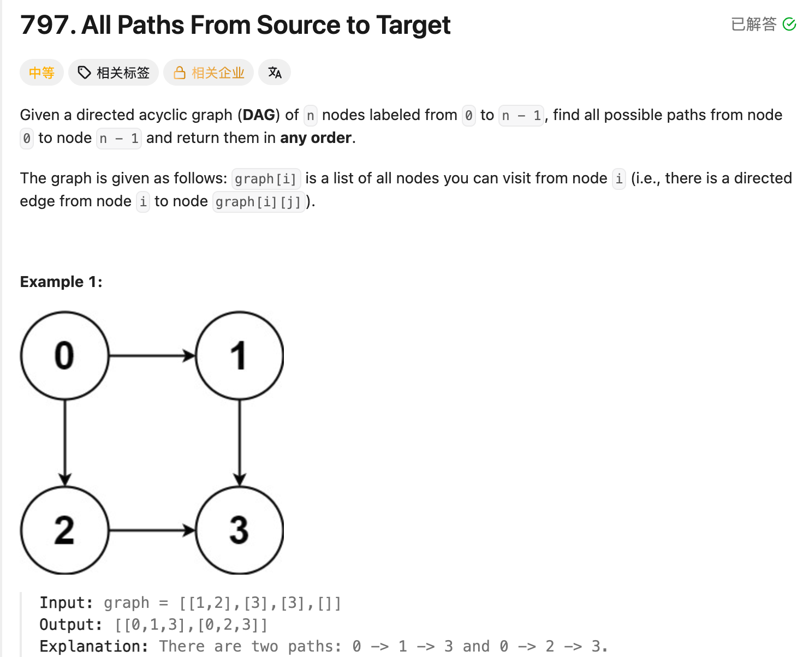

## 797. All Paths From Source to Target

Date: 9/30/2026, 10/1/2026
Difficulty: Medium
Tags: Graph, DFS, Backtracking



### 一刷 (9/30/2026) ❌ 终点重复加入 + backtracking 删除位置错误

理解思路后，合上笔记独立写，错了两处：

```java
if (node == graph.length - 1) {
    path.add(node); // ❌① 调用 dfs 前已经加入，导致 target 重复
    ans.add(new ArrayList<>(path));
    return;
}

// ...

path.remove(graph.length - 1); // ❌② 用了 graph 的 node 数量，可能越界或删错位置
```

**①的根因**：调用 `dfs(graph, next)` 前已经执行 `path.add(next)`，所以进入 DFS 时，当前 node 已经在 path 中。到 target 直接复制保存，否则 `[0, 4]` 会变成 `[0, 4, 4]`。

**②的根因**：backtracking 要删除 path 的最后一个 element，应使用 `path.size() - 1`。`graph.length` 是整个 graph 的 node 数量，和当前 path 的长度不是一回事。

> **自检信号**：进入 DFS 时检查当前 node 是否已经加入；检查每次 add 后，是否有对应的 remove 撤销这次加入。

**自测点**：到 target 时，path 已经包含哪些 nodes？这次 DFS 返回后，应该删除哪个 node，为什么？

---

### 二刷 (10/1/2026) ❌ 从 enhanced for 换成普通 for 后卡住

一刷的两处错误没有重犯，但换成普通 for 后，neighbor 遍历没有写完整：

```java
for (int i = 0; i <= graph[node]; i++) { // ❌ graph[node] 是 int[]，不能和 i 比较
    int next =                        // ❌ 没接上通过 index 取 neighbor
    dfs();
    path.remove(path.size() - 1);
}
```

**根因**：enhanced for 直接拿到 element；普通 for 先拿到 index，再用 `graph[node][i]` 取 element。`graph[node]` 是 array，loop condition 应为 `i < graph[node].length`。

> **自检信号**：换成普通 for 时，先分清 index 和 element，再检查 DFS 传入的是不是取出的 neighbor。

**自测点**：如果把某个 node 的 neighbors 从 `[1, 2]` 改成 `[2, 1]`，找到的 paths 会有什么变化，为什么？

---

### 核心思路

**从 0 开始 DFS，遇到 target 就复制保存 path；对当前 node 的每个 neighbor，依次执行「加入 → 搜索 → 撤销」。**

- `graph[node]`：存放当前 node 能一步到达的 neighbor 编号的 array。
- `path`：当前搜索的这一条 path。
- `ans`：已经找到的所有完整 paths。
- 题目规定 source 是 `0`，target 是 `graph.length - 1`，这不是 DAG 的定义。
- DAG 保证无环，不需要 visited 防止绕圈；不同 paths 可以经过同一个 node。

### 正确写法

```java
class Solution {
    List<List<Integer>> ans = new ArrayList<>();
    List<Integer> path = new ArrayList<>();

    public List<List<Integer>> allPathsSourceTarget(int[][] graph) {
        path.add(0);
        dfs(graph, 0);
        return ans;
    }

    private void dfs(int[][] graph, int node) {
        // 进入 DFS 时，node 已经在 path 中
        if (node == graph.length - 1) {
            ans.add(new ArrayList<>(path));
            return;
        }

        for (int i = 0; i < graph[node].length; i++) {
            int next = graph[node][i]; // i 是 index，next 才是 neighbor 编号
            path.add(next);
            dfs(graph, next);
            path.remove(path.size() - 1);
        }
    }
}
```

对应的 enhanced for：

```java
for (int next : graph[node]) {
    path.add(next);
    dfs(graph, next);
    path.remove(path.size() - 1);
}
```

### 复杂度分析

设 node 数量为 n。

**Time: O(n × 2ⁿ)**：最坏情况下 path 数量为指数级，每次保存还需复制最多 n 个 nodes。

**Space: O(n)**：不计答案，path 和 recursion stack 最多占 O(n)；计入答案则最坏为 O(n × 2ⁿ)。

### 沉淀

- **加入和撤销要对应**：每次加入一个 node，搜索结束后删除这次加入的 node。
- **保存 path 要复制**：`new ArrayList<>(path)` 创建独立 list，后续修改 path 不会改变已保存的答案。
- **return 只结束当前调用**：回到调用它的那一行之后，继续执行 remove，再尝试下一个 neighbor。
