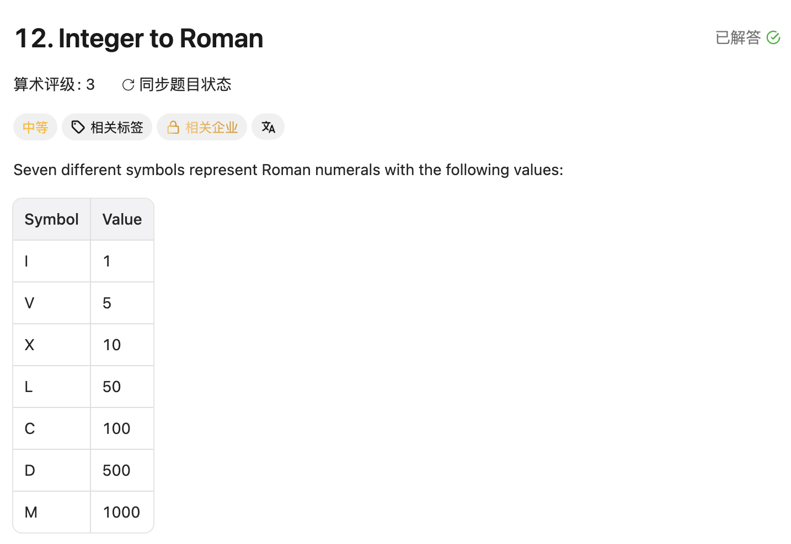

## 12. Integer to Roman

Date: 一刷 8/31/2026, 二刷 9/1/2026, 三刷 9/4/2026
Difficulty: Medium
Tags: Greedy, Array, Math



### 一刷 (8/31/2026) ❌ 没思路：把 13 的解法搬了过来，两题不是镜像

**卡在哪**：先把 `3749` 拆成 `[3,7,4,9]`，然后不知道拿这个数组干什么。

**真正的坎**：**digits 一拆开就丢了位权，查不了表**——那个 3 代表 3000，而罗马数字里没有「3」这个符号。13 里每个字符的值固定（`X` 在哪儿都是 10），拆开逐位成立；12 里每一位的值取决于它站在哪一位。

**与 13 的共同卡点（同一天两道）**：胜负都在「表里放什么」，不在循环怎么写。13 是表建对了没用上（key 类型不匹配），12 是表根本没建对。

**其余的错**：

```java
ans = map.get(i+1) - cur;   // ❌① String 减 int，编译不过
ans = map.get(i);           // ❌② 拿循环下标 i 当 key 查 → 恒 null
ans = ...                   // ❌③ 赋值覆盖，应为 ans += —— 今天第二次（另一次在 LC13）
i = i + 2;                  // ❌④ for 头已有 i++，再手动加 → 每轮前进 3
return s;                   // ❌⑤ 返回了输入不是 ans
```

**③④比单个 bug 值钱**：和 LC13 那次「三套方案各写一半」是同一个动作——**两套写法拼在一起，每一半单独看都对**。

---

### 二刷 (9/1/2026) ❌ 表建反了，循环只开一层，最后看了题解

**一刷那个坎过了**：没再去拆 digits，直接建表。卡的位置往后挪了一格。

**错一：表从小到大建。** 数组里没有「建表顺序」和「取用顺序」两套东西——**写下的顺序就是取用顺序**。从小到大意味着每步先拿最小面额，`num = 1000` 会吐出一千个 I。降序不是排版，是贪心本身。

**错二：只开了一层循环。**

```java
while (num >= 0) {   // ❌ 条件也错：num 减到 0 时 0 >= 0 仍为 true，死循环
    // 然后就懵了：减哪个面额？
}
```

「里面怎么减」写不出来不是想不出来，是**结构里没有那个信息**：循环里只有 `num` 一个状态变量，它答不了「我现在站在表的哪一格」。

**和当天上午 LC135 同一形态**：一个 for 同时要「遍历」+「挑该处理的位置」，if 没写出来；这次是一个 while 同时要「换面额」+「连用同一面额」，减法写不出来。

**笔记也有责任**：上一版只注释了「while 不是 if」，**从没说过外层 for 是干嘛的**，留下的印象就成了「内层用 while」。现已把两层分工写进注释。

**「按顺序遍历就别用 Map」这条 8/31 讲过、今天又滑了**，算真实信号不算笔误。

---

### 三刷 (9/4/2026) ❌ 内层写成 if，表达不了「同一面额连用几次」

表全对（降序 + 六个减法形式）、外层 for 也有了——二刷两个错一个没再犯。我的代码：

```java
for (int i = 0; i < values.length; i++) {
    if (num >= values[i]) {        // ❌ 应为 while：if 只给这一格一次机会
        sb.append(symbols[i]);     //    → 一个数字最多输出 13 个 symbol
        num -= values[i];
    }
}
```

**根因**：**表里有多少种面额，和一个数字要用多少个 symbol 是两回事。** 面额只有 13 种，3999 要写 15 个 symbol；「重复次数」这一维表里根本不存在，只能由 loop 造出来。**`if` 问「这一格要不要用」，`while` 问「用到用不动为止」。**

`num = 8`：走到 5 → append "V"，num = 3 → `i++` 直接跳过 4 → 走到 1 → append "I"，num = 2，i 到头退出，返回 `"VI"`（应为 `"VIII"`）。

> **自检信号**：贪心减面额这类循环，退出时状态变量必须归零。`num` 有残值 = 有一格没榨干。

**二刷那条自检信号答对了一半**：数出了两样东西在独立变化，但给第二样配的不是结构——`if` 不是结构，它只能表达零次或一次。

**同题第三次踩 loop 的节奏**：8/31 是 `i = i + 2` 多推一格，今天是少了一层重复。**两次都是 for 的固定节奏和算法真实的节奏对不上。**

**自测点**：在排期备注页，复习时问。

---

<!-- ↓↓↓ 复习时先自己想一遍，再往下翻看答案 ↓↓↓ -->

### 核心思路（一句话）

**那十三个值就是罗马数字的全部合法零件，从大到小每次减到不能再减，减一次追加一个符号。**

### 正确写法

```java
int[] values     = {1000, 900, 500, 400, 100, 90, 50, 40, 10, 9, 5, 4, 1};  // 必须降序
String[] symbols = {"M", "CM", "D", "CD", "C", "XC", "L", "XL", "X", "IX", "V", "IV", "I"};

StringBuilder sb = new StringBuilder();
for (int i = 0; i < values.length; i++) {   // 外层：换面额，只往下走、不回头
    while (num >= values[i]) {              // 内层：这一格用几次，榨干为止（MMM、CC）
        sb.append(symbols[i]);
        num -= values[i];
    }
}
return sb.toString();                       // sb 不是 String，别忘了转
```

**两层各管一件事**：外层决定「站在哪一格」，内层决定「这一格用几次」。少哪一层都写不下去。

**用两个数组不用 Map**：这题要按降序遍历，HashMap 不保证顺序；数组下标顺序天然就是贪心顺序，两个数组靠同一个 `i` 对齐。

### 为什么贪心是对的（这一层要能讲出来）

贪心通常有翻车风险——面额 `{1,3,4}` 凑 6，贪心得 4+1+1，最优是 3+3。

12 不会翻车，因为**六个减法形式（900/400/90/40/9/4）已经被当成独立面额放进表里了**。若表里只有 M/D/C/L/X/V/I 七个，凑 9 会得到 `VIIII`——贪心走进死胡同，因为它不知道 `IX` 这条路。

**贪心之所以成立，不是它聪明，是表被设计成让它不会犯错。**

### 复杂度分析

**Time O(1)**：num ≤ 3999，外层 13 档、内层最多减 3 次，与输入规模无关。
**Space O(1)**：两张表是常数大小。

### 沉淀

- **写循环之前先数一下：这段逻辑里有几样东西在独立变化？** 有几样就得有几层结构。本题两样：换面额（外层 for）、同一面额连用几次（内层 while）。**并且要配对结构——`if` 只能表达零次或一次，表达不了「几次」。**（9/1 数出了两样，9/4 配错了结构）
- **for 的节奏是写死的**：步长不固定、或推进时机由「减不动了」决定，就不能只靠 for。手动改 `i` 会和 update statement 叠加（8/31）；把重复交给 `if` 则整层丢失（9/4）。
- **要按顺序遍历就别用 Map**，「这个容器给不给我顺序」是选容器的第一问。**8/31 写过、9/1 又滑，说明还没接到手上。**
- **表的顺序就是取用顺序**，降序建表不是排版是算法本身。
- **拆数位之前先问一句：拆完之后每一位还认得出自己是多少吗？**（9/1 这条过了）
- **`ans =` 和 `ans +=` 是两件事**：覆盖不是修正（8/31 两次，另一次在 LC13）。
- **贪心正确性的通用问法**：什么情况下「拿最大的」会让后面无解？答不上就是没想清楚，不是「感觉对」。

### 引申：什么时候用 StringBuilder

**判据只有一条：拼接动作在不在循环体里。** 在 → StringBuilder；不在 → 直接 `+`。

**为什么**：String 不可变，`s += c` 不是「往里加」，是新建一个 String + 复制全部已有字符，单次 O(当前长度)，放进循环就是 **O(n²)**。StringBuilder 内部是可变 `char[]`，append 往末尾写一格、满了扩容，**与 ArrayList 同构**，摊还 O(1)。

> **一句话记法**：ArrayList 的代价来自「下标必须连续」，**String 的代价来自「不可变」**——任何修改都得复制全体。

编译器会把 `"Hello, " + name` 自动优化成 StringBuilder，但**这个优化不跨循环边界**。所以分界不是「拼几次」，是「在不在循环里」。

| 调用                 | 返回                   | 备注                                   |
| -------------------- | ---------------------- | -------------------------------------- |
| `sb.append(x)`       | **StringBuilder 自己** | 所以能链式 `sb.append(a).append(b)`    |
| `sb.toString()`      | String                 | 最后调一次，这才产生不可变对象         |
| `sb.reverse()`       | 自己                   | 原地                                   |
| `sb.deleteCharAt(i)` | 自己                   | 回溯标配 `deleteCharAt(sb.length()-1)` |
| `sb.length()`        | int                    | **不是 `.size()`**                     |
| `sb.setCharAt(i, c)` | void                   | String 没有的能力                      |

`append` 返回自己、`list.add` 返回 boolean、`map.put` 返回旧 value——三个不同的答案，都是「它还给我什么」那一轴。`StringBuffer` 是线程安全版，单线程一律用 StringBuilder。

### 关联

- LC13 Roman to Integer（同一张表的反向查；12 的输出喂给 13 应还原成原数，可互验）
- LC135（**同一形态**：一个循环结构被指望承担两个独立职责）
- LC45 / LC55 / LC134（同为 greedy，复习时对照「为什么这个 greedy 是对的」这一层）
