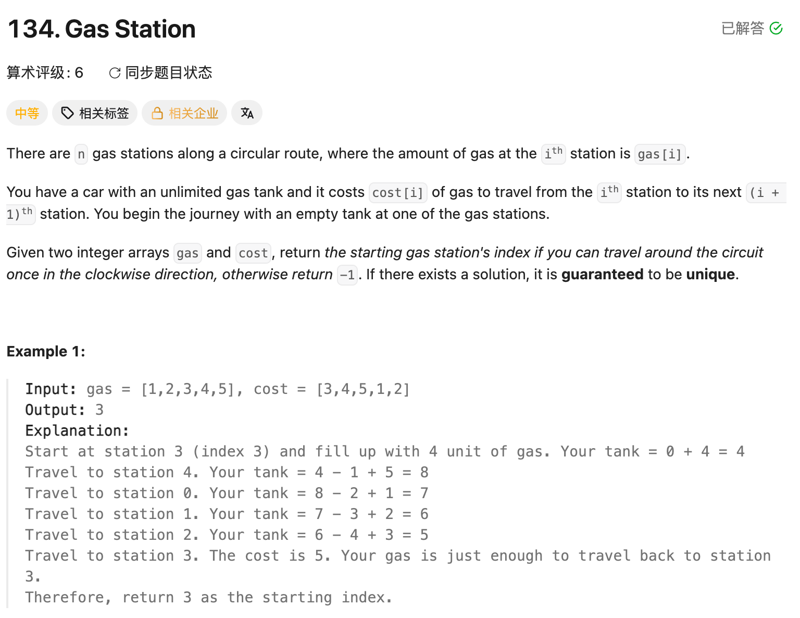

## 134. Gas Station

Date: 一刷 4/3/2026（随想录）, 二刷 8/17/2026
Difficulty: Medium
Tags: greedy, array



### 二刷 (8/17/2026) ❌ 没思路 + 读完题解的复述有两处偏差

**卡在哪**：重读题目只记得「能用 greedy」，具体过程完全不记得，没有独立写出代码，直接看了随想录题解。

**真正的坎**：缺的不是「想到 greedy」，是 greedy 的两条正确性依据（有解的判据 + 为什么整段候选可以一次跳过）。**看题解觉得容易理解 = recognition，和能不能重建出来是两回事**——证据就是读完后的自述里有两处和代码对不上：

❌① 自述「cur 和 total 都重置为 0 重新计算」——代码里只重置 `curSum`，`totalSum` **绝不能重置**。两个 variable 角色不同：`curSum` 是「从 `start` 到 `i` 这一段」的净油量，换起点了这段就作废；`totalSum` 是「全程」净油量，只用来判断有没有解。清零 `totalSum` = 把前面的亏空抹掉 → 它最后必然 ≥ 0 → 无解的 case 也会返回一个 start，静默错误。

❌② 自述两次说「`totalSum > 0` 就 return start」——代码是 `if(totalSum < 0) return -1`，**`totalSum == 0` 归有解那边**。总 gas 恰好等于总 cost，意味着刚好开完一圈、回到起点时油箱归零，是合法解。

**①和②是一对**：都是「这个量此刻代表什么 / 边界落在哪一格」。①是 variable 角色混淆，②是 boundary 差一格——和同日 189 的 `n-k` vs `n-k-1` 是同一族（八月第八次：274、45、367、704、238、189、134）。

**自测点**：为什么 `start = i + 1`，而不是 `start + 1`？也就是——为什么 `[start, i]` 中间的每一个位置都可以直接跳过、不用挨个试？不许举例验证。

---

<!-- ↓↓↓ 复习时先自己想一遍，再往下翻看答案 ↓↓↓ -->

### 核心思路（一句话）

**`totalSum >= 0` 决定「有没有解」，`curSum` 转负的位置决定「解在哪」——一次 scan 同时算这两件事。**

### 代码

```java
class Solution {
    public int canCompleteCircuit(int[] gas, int[] cost) {
        int curSum = 0;      // 从 start 到 i 这一段的净油量
        int totalSum = 0;    // 全程净油量，判可行性，全程不清零
        int start = 0;
        for (int i = 0; i < gas.length; i++) {
            curSum += gas[i] - cost[i];
            totalSum += gas[i] - cost[i];
            if (curSum < 0) {
                start = i + 1;   // i+1 尚未检验，从它重新起算
                curSum = 0;      // 只清 curSum
            }
        }
        if (totalSum < 0) return -1;   // == 0 有解，不能写 <= 0
        return start;
    }
}
```

### 推导：为什么整段 `[start, i]` 可以一次跳过（自测点答案）

设 `curSum` 在 `i` 处首次转负。取段内任意 `j`（`start <= j <= i`）：

1. `[start, j-1]` 的 `curSum >= 0`——否则 `start` 在 `j-1` 之前就已经被更新过了，与「`i` 是首次转负」矛盾
2. 那么 `[j, i]` 的净油量 = `[start, i]` − `[start, j-1]` ≤ `[start, i]` < 0
3. 所以从 `j` 出发同样走不到 `i+1`

**段内每个点都不比左端点更好 → 整段一次性排除。** 这就是为什么 `start` 直接跳到 `i+1`，而不是 `start+1` 逐个退让——后者会退化成 O(n²)。

> **直觉**：如果从一个更靠后的位置出发能撑过去，那它前面那截「垫了油」的路只会让情况更好不会更差，所以左端点撑不过去 = 段内谁都撑不过去。

### 复杂度分析

**Time: O(n)**：单次 scan，`start` 单调右移不回退。
**Space: O(1)**：三个 int。

对比 brute force O(n²)（枚举每个起点各模拟一圈）：省在「一整段候选一次排除」，而不是逐个起点重试。

### 沉淀

- **两个累加量角色不同就不能同命运**：`totalSum` 答「有没有」、`curSum` 答「在哪」，只有后者随起点重置。**判据是问自己「这个量的统计范围是全局还是当前窗口」**，全局量出现在重置语句里就是坏味道。
- **可行性判据的等号方向要单独想一遍**：`totalSum == 0` 是「恰好开完」不是「差一点」。凡是「总量够不够」型的判断，先问 0 属于哪边。
- **greedy 跳跃型的通用形态**：证明「区间内每个点都不优于端点」→ 整段跳过 → O(n²) 压成 O(n)。这是本题、LC45 共用的骨架，不是本题特有技巧。

### 关联

- LC45 Jump Game II（同为一次 scan 的 greedy 跳跃，都靠「整段可排除」压复杂度）
- LC55 Jump Game（问「能不能到」，本题问「从哪出发能到」——存在性判据和构造起点是两件事）
- LC238 Product of Array Except Self（同族错误：两个 variable 角色混淆）

### Interview pitch (练口述)

> "Brute force would be trying every station as a start and simulating a full loop, which is O(n²). The key insight is that two separate questions can be answered in one pass. First, feasibility: if total gas minus total cost is negative, no start works, because any full loop consumes that same total — and note that exactly zero is still feasible. Second, locating the start: I track a running sum from the current candidate start. The moment it goes negative at index i, I know no station in that whole segment can be the answer — any later station j in it would start with a non-negative prefix removed, so it'd reach i with even less gas. So I jump start to i plus one and reset only the running sum, never the total. One pass, O(n) time, O(1) space."
