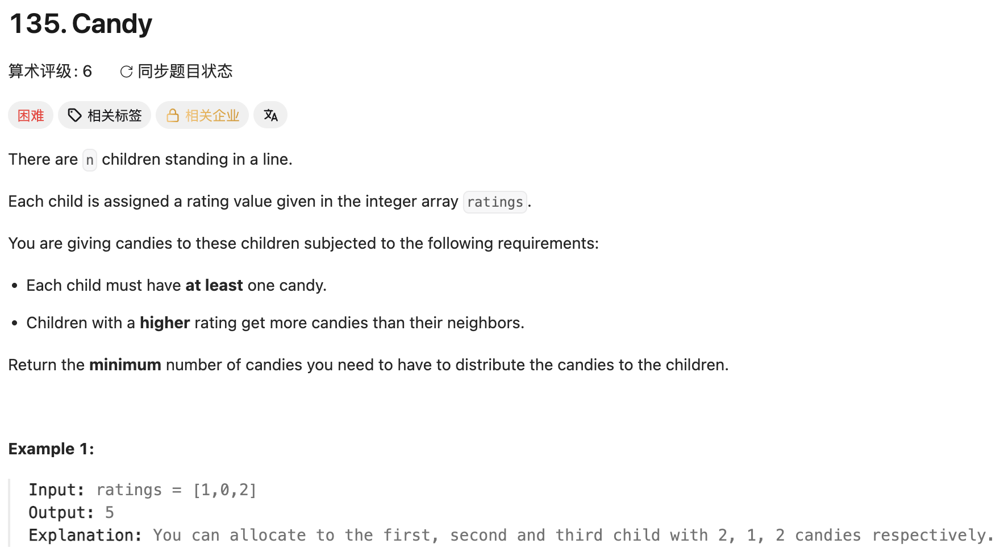

## 135. Candy

Date: 一刷 4/2026（随想录，日期待补）, 二刷 8/24/2026, 三刷 8/25/2026
Difficulty: Hard
Tags: greedy, array, two-pass



### 二刷 (8/24/2026) ❌ 看出要扫两趟，代码没写出来，直接看的答案

**卡在哪**：看出要遍历两次，但从「扫两趟」到「每趟各干什么、怎么合并」写不出来，去看了答案，看懂很快。

**真正的坎**：不在「扫几趟」，在于**左右两条规则互相冲突**。每个 element 要同时满足「比左邻分高就比左邻糖多」和「比右邻分高就比右邻糖多」，两条约束方向相反，一趟扫描只能兑现一条。

第二趟的关键不是「反着再来一遍」，而是 `ans[i] = Math.max(ans[i], ans[i+1] + 1)` 里的 **`Math.max`**——直接赋值会推翻第一趟已经建立的左邻关系，取 max 才能让两条约束同时成立。

**代码里那处错（抄写手误）**：

```java
for(int i = n - 2; n >= 0; i--){   // ❌ 条件写的是 n，应为 i
```

`n` 是长度、恒不变 → condition 永真 → loop 停不下来，`i` 减到 -1 时 `ratings[-1]` 当场 AIOOBE。

> **自检信号**：for 头写完横着读一遍，三段主语必须是同一个 variable。**有没有 break，决定同一个手误是静默还是显性**——本次无 break 所以直接崩；若 loop 体里有 break，它会替错误的 condition 兜底，部分 case 蒙对，反而更难发现。所以有 break 的 loop 尤其要查这一行。

---

### 三刷 (8/25/2026) ✅ 首次独立写出；唯一的错是赋值左边抓错数组名（手误）

结构全对：左扫三元表达式、右扫 `Math.max`、`ans[0] = 1`、求和分离。二刷那处 for 头手误未再犯（写的是 `j >= 0`）。

```java
for(int j = ratings.length - 2; j >= 0; j--){
    if(ratings[j] > ratings[j+1]){
        ratings[j] = Math.max(ans[j], ans[j+1]+1);   // ❌ 左边应为 ans[j]
    }
}
```

**根因**：右边三个量全对，只有**赋值目标**抓错数组名。两层后果——① `ans` 全程没被右扫改过 → 第二个 loop 等于没跑，返回的是左扫的和（`[1,0,2]` 得 4，应为 5），静默；② **原地改写了后面还要读的输入数组** → 下一轮 condition 读到的是糖果数不是 rating（`[3,2,1,0]`：j=2 写完后，j=1 处 `2 > 2` 为 false，该处理的格子被整个跳过）。第二层在本题不改变输出（`ans` 反正没更新），换个写法就会咬人。

**一处措辞已拧紧**：`ans[j]` 不是「比左邻大多少」，是「**只满足左侧约束时它需要的最少糖果数**」——差值 vs 绝对量。本题两者在 `ans[i-1]+1` 那一步同步增长，说串了不出错；同族的 LC42 里把绝对高度和相对高度塞进同一个 `Math.min` 就直接错。

**自测点（已讲穿作废）**：右扫为什么取 `Math.max`、直接赋值会怎样。口答一遍答出、无提示。

---

<!-- ↓↓↓ 复习时先自己想一遍，再往下翻看答案 ↓↓↓ -->

### 核心思路（一句话）

**两条方向相反的约束，各扫一趟分别兑现；第二趟用 `Math.max` 合并，保证后一趟不推翻前一趟。**

### 正确写法

```java
public int candy(int[] ratings) {
    int n = ratings.length;
    int[] ans = new int[n];

    // 第一趟：左 → 右，只管「比左邻分高就比左邻多」
    ans[0] = 1;
    for (int i = 1; i < n; i++) {
        ans[i] = (ratings[i] > ratings[i - 1]) ? ans[i - 1] + 1 : 1;  // 不满足就回落到 1
    }

    // 第二趟：右 → 左，兑现「比右邻分高就比右邻多」
    for (int i = n - 2; i >= 0; i--) {                                 // condition 是 i 不是 n
        if (ratings[i] > ratings[i + 1]) {
            ans[i] = Math.max(ans[i], ans[i + 1] + 1);                 // 写 ans 不写 ratings；取 max 不直接赋值
        }
    }

    int answer = 0;
    for (int num : ans) answer += num;
    return answer;
}
```

三处要点：`ans[0] = 1` 与三元里的 `: 1` 共同保证每人至少一颗；第二趟从 `n - 2` 起手（最后一个没有右邻）；`Math.max` 是两条约束能共存的唯一原因。

### 复杂度分析

**Time: O(n)**：三趟线性扫描。
**Space: O(n)**：`ans` 数组。

对比 brute force（反复扫描直到没有 element 需要调整）：省在「把两条约束按方向拆开，各扫一趟就都满足」，不需要迭代到收敛。

### 沉淀

- **一行赋值里同时出现两个数组、共用一个下标时，写完把左边那个格子单独指一遍**，问「我要算的量存在这儿吗」。右边一眼能看出来，左边不会——三刷这次和 LC238 二刷（`temp *= ans[j+1]` 该写 `nums[j+1]`）是同一族，那次错在读、这次错在写，**写侧更隐蔽：读错算出来的数是错的，写错是整个 loop 静默失效**。
- **别原地改写还要继续读的输入数组**。`ratings` 是 condition 的依据，一旦被写入，后面每一轮的判断都建立在污染过的数据上。
- **两个量共用一个下标位置时，先确认它们是不是同类量**：绝对量与相对量、糖果数与 rating，长得一样但不可比。

### 关联

- LC238（同为「位置 i 需要两侧信息 → 双向扫描」，但 238 第二趟是**合并**可累积的聚合量，135 第二趟是**取更严的那条约束**，机制不同）
- LC134、LC45（同一摞 greedy：真正的难点都不在实现，在「为什么这个 greedy 是对的」）
