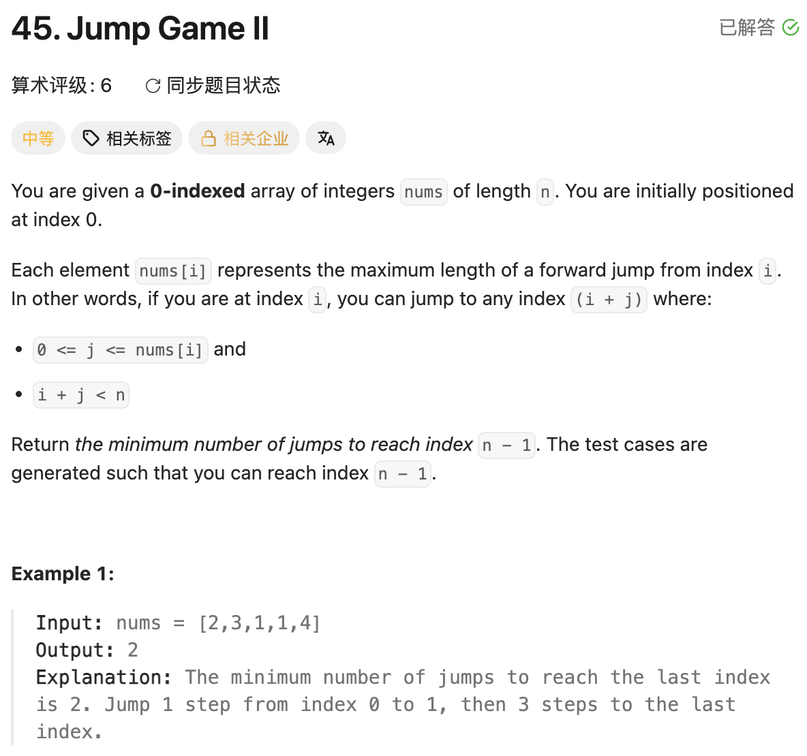

## 45. Jump Game II

Date: 一刷（代码随想录，日期待补）, 二刷 8/5/2026
Difficulty: Medium
Tags: greedy, array



### 二刷 (8/5/2026) ❌ 没思路

**卡在哪**：知道"到达某个节点就要起跳"，但一直卡在怎么落成代码——具体说是分不清 `curDistance` 和 `nextDistance` 该怎么配合、什么时候该用哪个。一度以为 `curDistance >= n-1` 才是对的 break 条件，觉得用 `nextDistance` 判断像是提前用了一个还没生效的值。

**真正的坎**：没有建立「分层」的模型。这题本质是 BFS：`curDistance` 是当前层的右边界，`nextDistance` 是扫描当前层时顺手算出的下一层右边界。`i == curDistance` 触发的不是"起跳"这个动作本身，而是"这一层扫完了，可以决定跳"——`count++` 是"决定要跳"，不是"正在跳"。想清楚这点之后，`curDistance = nextDistance` 这行执行完，两个变量已经相等，`break` 判断哪个都对，只是 `nextDistance` 更贴合"下一跳已经能到终点，不用再扫了"这句话的思考顺序。

> **自测点**：①不看笔记说出 `curDistance = nextDistance` 之后为什么 break 判断用哪个变量都一样 ②说出 `count++` 语义上代表"正在跳"还是"已经决定跳"，以及这个区别为什么重要
> **自检信号**：纠结"这一步到底该维护几个变量"时，先问自己"这是第几层"——分层想清楚了，变量该放哪就明确了

---

<!-- ↓↓↓ 复习时先自己想一遍，再往下翻看答案 ↓↓↓ -->

### 核心思路（一句话）

**把数组按"跳几次能到"分层：`curDistance` 是当前层右边界，`i` 扫到边界说明这层扫完了，用扫描过程中攒下的 `nextDistance` 决定要不要再跳一次。**

### 代码

```java
class Solution {
    public int jump(int[] nums) {
        int curDistance = 0;       // 当前跳数能覆盖到的最远下标（这一层的右边界）
        int nextDistance = 0;      // 扫描这一层时，顺手算出的下一层最远右边界
        int count = 0;
        for (int i = 0; i < nums.length - 1; i++) {   // 最后一个点不用再算起跳
            nextDistance = Math.max(nextDistance, i + nums[i]);
            if (i == curDistance) {         // 这一层扫完了 → 决定跳
                count++;
                curDistance = nextDistance;  // 跳完之后能覆盖到哪
                if (curDistance >= nums.length - 1) break;  // 下一跳已经能到终点，不用再扫
            }
        }
        return count;
    }
}
```

### 复杂度分析

**Time: O(n)**：每个下标只参与一次 `nextDistance` 更新，一次遍历。
**Space: O(1)**：只用三个变量。

对比 brute force O(n²)（从每个可达位置出发枚举/DFS 试跳，取最小跳数）：贪心把"选最优跳点"压缩成扫描时顺手维护的一个 max，不需要真的枚举每种跳法。

### 沉淀

- **`count++` 是「决定跳」，不是「正在跳」**：不需要知道具体从这一层哪个点起跳，只要这一层扫完、知道下一层能到哪，答案就已经确定了——代码里从不真正记录"从哪跳"。
- **`curDistance` 和 `nextDistance` 赋值之后是同一个值**：`curDistance = nextDistance` 之后两者相等，break 条件写哪个都对，写 `nextDistance` 只是更贴合"决定跳之前先看下一层够不够"的思考顺序。
- **BFS 分层视角**：`curDistance` = 当前层右边界，`nextDistance` = 扫描中顺手求出的下一层右边界，`count` = 层数（不是具体某一步的下标）。想不清楚 for 循环在干嘛时，回到"这是第几层"就清楚了。

### 引申：跟 LC55 的对照

- LC55 只答"能不能到终点"，一个 `coverRange` 就够，覆盖到终点直接 `return true`。
- LC45 要答"最少几步"，必须多一个 `nextDistance` 把"当前层"和"下一层"分开，否则不知道该在哪个时间点给 `count` 加一。
- 两题共享同一个坑——「循环变量的推进 ≠ 状态的可达」：55 是 `i <= coverRange` 忘记写；45 如果 `i == curDistance` 的判断丢了，会在同一层里重复 `count++`。

### 关联

- 55（同一坐标关系的单变量版本：55 判断"能不能到"，45 判断"最少几步"）

### Interview pitch (练口述)

> "I treat this as layered BFS: curDistance is the rightmost index reachable with the current number of jumps, and while scanning that layer I track nextDistance, the farthest reachable index with one more jump. When i reaches curDistance, that layer is fully scanned, so I commit to another jump — count++ — and move the boundary to nextDistance. If that boundary already covers the last index, I stop immediately, since I've proven a jump count that reaches the end. O(n) time, O(1) space, versus brute-force DFS trying every jump sequence."
