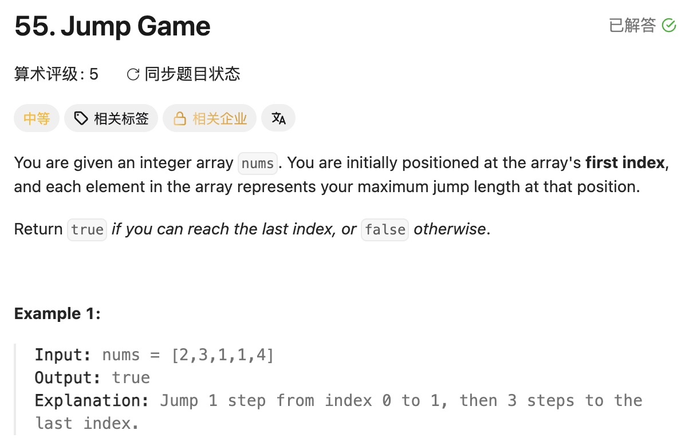

## 55. Jump Game

Date: 一刷（代码随想录）, 二刷 8/3/2026, 三刷 8/5/2026, 四刷 8/10/2026, 五刷 9/29/2026
Difficulty: Medium
Tags: greedy, array



### 二刷 (8/3/2026) ❌ 用 nums.length 作 loop condition，丢掉可达性检查

```java
for (int i = 0; i < nums.length; i++) {
    //         ❌❌ 应为 i <= coverRange：能访问 nums[i] 不代表能跳到 i
    coverRange = Math.max(coverRange, i + nums[i]);
    if (coverRange >= nums.length - 1) return true;
}
```

**根因**：不可达的 index 不能参与扩大覆盖范围。`[3,2,1,0,4]` 中，扫描完 index 3 后 `coverRange` 仍是 3；继续访问 index 4，会用 `4 + 4` 误判 true。

> **自检信号**：用某个位置更新 state 前，先确认这个位置本身可达。

---

### 三刷 (8/5/2026) ❌ 直接赋值让 coverRange 缩水，同时漏掉可达边界

178 个 test case 过了 124 个。这次已用 `coverRange` 限制扫描，但还有三处错误：

```java
class Solution {
    public boolean canJump(int[] nums) {
        int coverRange = nums[0];
        for (int i = 1; i < coverRange; i++) {
            //           ❌② 应为 <=：coverRange 本身也可达
            coverRange = i + nums[i];
            // ❌❌① 丢掉历史最远位置，coverRange 可能缩水
            if (coverRange >= nums.length - 1) return true;
        }
        return false;
        // ❌③ 初始范围已覆盖终点时，没有在进入 loop 前检查
    }
}
```

**① 根因**：`coverRange` 保存所有已扫描可达位置能到达的最远 index，不能被当前位置的结果覆盖。`[3,0,0,0]` 中，i=1 时它从 3 降到 1，最终误判 false。

**②**：`i < coverRange` 漏掉最远的可达位置；那里也可能把范围继续扩大。

**③**：`[1,0]` 和长度为 1 的 array 都不会进入 loop，直接返回 false，但实际已能到终点。

`coverRange = nums[0], i = 1` 的初值是匹配的：表示 index 0 已处理。问题在于**初始 state 没有经过成功判断**。统一从 `coverRange = 0, i = 0` 开始，便可在同一处处理 update 和判断，无须另补初始检查。

> **自检信号**：检查历史最优是否被覆盖、可达边界是否被漏掉，以及 loop 一次不执行时结果是否正确。

---

### 四刷 (8/10/2026) ⚠️手生 代码一次写对，口答收窄后才说清原因

```java
class Solution {
    public boolean canJump(int[] nums) {
        if (nums.length == 1) return true; // 多余，主逻辑已覆盖
        int cur = nums[0];
        for (int i = 0; i <= cur; i++) {
            cur = Math.max(cur, i + nums[i]);
            if (cur >= nums.length - 1) return true;
        }
        return false;
    }
}
```

二刷、三刷的错误均未再犯。另有 `return 0` 的 mechanical error，被编译器拦下后改正，不单独进排期。

**实现上的两点**：

- 长度为 1 时，i=0 那轮就会返回 true，不需要特判。
- `nums[i]` 的访问安全依赖提前 return：第一轮 i=0 合法；能进入下一轮，说明上一轮 `cur < nums.length - 1`，再由 `i <= cur` 保证 index 合法。

**口答**：最初用「没进入 return true」解释失败，没有说明为什么后面也不可能到达。收窄后能说明：所有可达位置都已扫描，仍无法扩大范围，后面的 index 本身不可达。

但把退出时的位置说成了 `i == cur`；实际是 **`i == cur + 1`**。

> **自检信号**：解释 loop 结束时，先写出 condition 为 false 的关系，区分最后一次进入 loop 与退出后的 state。

---

### 五刷 (9/29/2026) ⚠️手生 代码一次写对，口答再次混淆进入与退出时的位置

代码一次写对，跑了几个 test case 后提交；Time O(n)、Space O(1) 判断正确。本轮代码与下方正确写法一致。

**口答**：最初仍答「退出时 `i == coverRange`」。提醒 `i == coverRange` 时还会执行 loop body，随后才 `i++`，才区分清楚退出时是 `i == coverRange + 1`。

追问「扫描完 index 3，最远仍只能到 3，为什么 nums[4] 再大也没用」时，独立答出：前面所有可达位置都到不了 index 4，所以不能利用它继续跳。

> **自检信号**：判断退出 state 时，按「最后一次 loop body → update statement → 下一次 condition」走一遍，不停在最后一次进入 loop 的位置。

**自测点**：为什么可以在尚未扫描完所有可达 index 时返回 true，而返回 false 必须等 loop 结束？

---

<!-- ↓↓↓ 复习时先自己想一遍，再往下翻看答案 ↓↓↓ -->

### 正确写法

```java
class Solution {
    public boolean canJump(int[] nums) {
        int coverRange = 0; // 当前能到达的最远 index
        for (int i = 0; i <= coverRange; i++) {
            coverRange = Math.max(coverRange, i + nums[i]);
            if (coverRange >= nums.length - 1) return true;
        }
        return false;
    }
}
```

`i <= coverRange` 保证只扫描可达位置，`Math.max` 保留这些位置能到达的最远 index。

若 loop 结束，`i == coverRange + 1`：所有可达位置已扫描，范围仍未覆盖终点。后面的 index 本身不可达，无法再扩大范围。

### 复杂度分析

**Time: O(n)**：每个 index 最多扫描一次；覆盖终点后立即返回。
**Space: O(1)**：只维护固定数量的 variable。

### 沉淀

- **能访问某个 index，不代表它在题目中可达。** 使用它更新 state 前，必须守住可达性约束。
- **历史最优不能被当前结果覆盖。** `coverRange` 只能保持或扩大，不能缩水。
- **进入 loop 与退出 loop 是两个时刻。** 最后一次满足 condition 的位置，不是执行 update statement 后的位置。
- **初值、扫描起点和判断位置要配套。** 特别检查 loop 一次不执行，以及提前 return 被移动或删除后的行为。

### 关联

- LC80：初值与扫描起点必须表达一致的处理进度。
- LC45 Jump Game II：同样维护最远可达位置，另外记录当前一跳的边界；两题的访问安全都需结合 break / return 检查。
- LC704 / LC34：口答时都混淆过最后一次进入 loop 与退出后的 pointer 位置。
