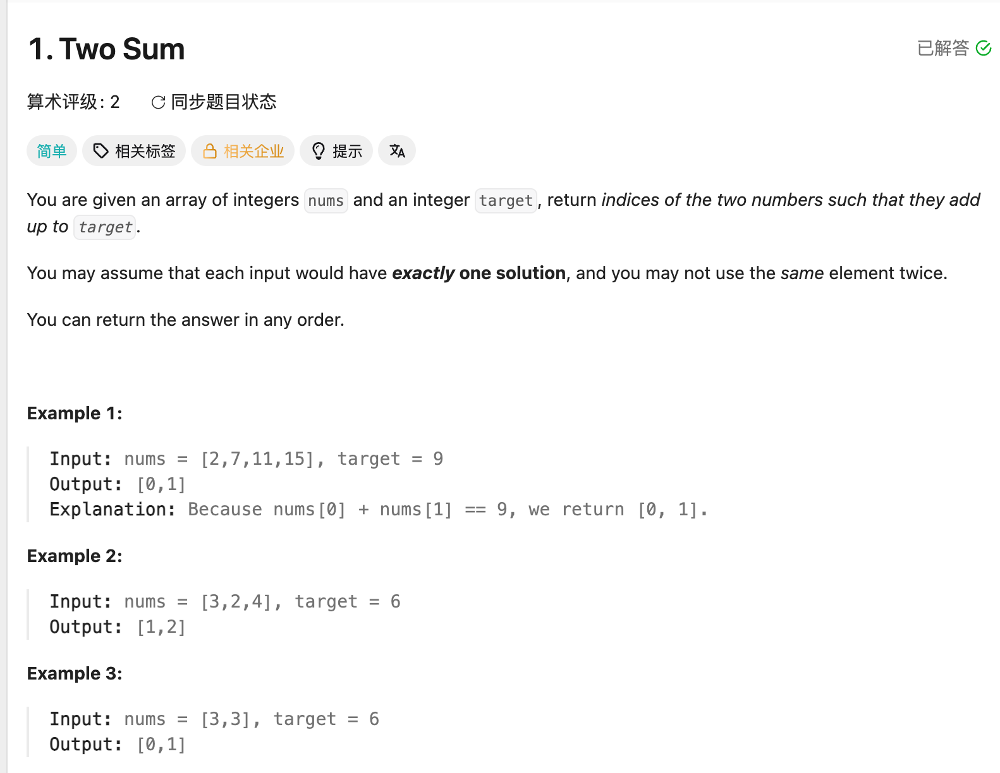

## 1. Two Sum

Date: 9/15/2026, 9/16/2026  
Difficulty: Easy  
Tags: Array, Hash Table



### 一刷 (9/15/2026)

先建完整 map，再查 `need`：two-pass 可行，但要检查 `leftIndex != i`，避免重复使用自己。

---

### 二刷 (9/16/2026) ❌ null 处理不清楚 + array syntax 记混

```java
int leftIndex = map.get(need); // ❌ 找不到时返回 null，auto-unboxing 会报 NPE
```

**根因**：`int` 接不了 `null`；`Integer` 可以。先用 `Integer` 接，再检查 `null`。

另一个 mechanical error：`[]` 和 `{}` 写反，正确是 `new int[]{leftIndex, i}`。

**自测点**：`map.get(need)` 返回 `0` 和 `null`，分别说明什么？

---

### 正确写法

```java
class Solution {
    public int[] twoSum(int[] nums, int target) {
        Map<Integer, Integer> map = new HashMap<>();
        for (int i = 0; i < nums.length; i++) {
            int need = target - nums[i];
            Integer leftIndex = map.get(need);
            if (leftIndex != null) {
                return new int[]{leftIndex, i};
            }
            map.put(nums[i], i);
        }
        return new int[]{-1, -1};
    }
}
```

### 复杂度分析

**Time: O(n)**：一次 traversal，HashMap lookup / insertion 平均 O(1)。  
**Space: O(n)**：map 最多存 n 个 entry。

### 沉淀

- **先查再存**：map 只含 `[0, i-1]` 的 index，不会重复使用自己。
- **`null` ≠ `0`**：前者是没找到，后者是找到 index 0。
