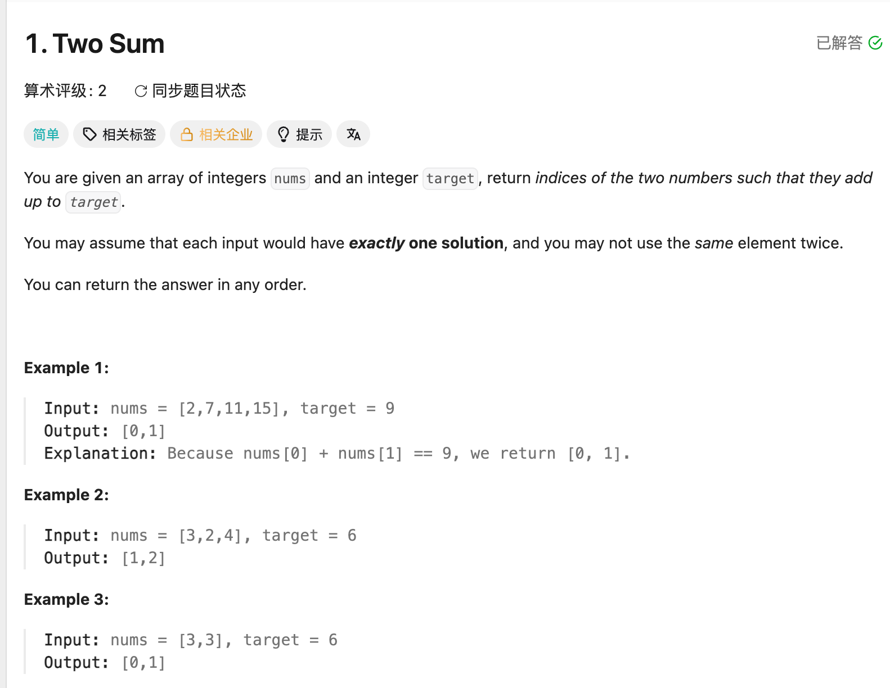

## 1. Two Sum

Date: 9/15/2026, 9/16/2026, 10/8/2026  
Difficulty: Easy  
Tags: Array, Hash Table



### 一刷 (9/15/2026)

先建完整 map，再查 `need`：two-pass 可行，但要检查 `leftIndex != i`，避免重复使用自己。

---

### 二刷 (9/16/2026) ❌ null 处理不清楚 + array syntax 记混

```java
int leftIndex = map.get(need); // ❌ 找不到时返回 null，auto-unboxing 会报 NPE
```

**根因**：`int` 接不了 `null`；`Integer` 可以。先用 `Integer` 接，再检查 `null`。

另一个 mechanical error：`[]` 和 `{}` 写反，正确是 `new int[]{leftIndex, i}`。

**自测点**：`map.get(need)` 返回 `0` 和 `null`，分别说明什么？

---

### 三刷 (10/8/2026) ❌ 存了 need，和 lookup 的含义不一致（已自行修正）

```java
map.put(need, i); // ❌ 存了需要的 value，而不是当前已经见过的 value
```

**根因**：这套解法的 map 保存「已遍历的 value → index」。查找 `need`，没找到就应存 `nums[i]`，不能把需要的 value 当成已经见过的 value。

> **自检信号**：写 `put` 前，确认 key 是 `nums[i]`；执行 lookup 时，map 只能含之前的 index。

本轮代码已自行修正。口述时「防止重复」不够精确，需要说成：**避免重复使用同一个 index，让当前 element 和自己配对。**

例如 `[3, 2, 4]`、target 为 `6`：如果先存 `3 → 0`，再查 `need = 3`，就会错误返回 `[0, 0]`。array 中不需要真的有两个 `3`。

相同 value 可以配对：`[3, 3]` 返回 `[0, 1]` 合法；同一个 index 不能用两次。

**自测点（下次）**：如果当前 iteration 没找到答案，而 `nums[i]` 已经是 map 的 key，可以用当前 index 覆盖旧 index 吗？为什么？

---

### 正确写法

```java
class Solution {
    public int[] twoSum(int[] nums, int target) {
        Map<Integer, Integer> map = new HashMap<>();

        for (int i = 0; i < nums.length; i++) {
            int need = target - nums[i];
            Integer leftIndex = map.get(need);

            if (leftIndex != null) {
                return new int[]{leftIndex, i};
            }

            map.put(nums[i], i);
        }

        return new int[]{-1, -1};
    }
}
```

### 复杂度分析

**Time: expected O(n)**：一次 traversal，HashMap lookup / insertion 平均 O(1)。  
**Space: O(n)**：map 最多存 n 个 entry。

对比 brute force：固定 `i`，内层从 `j = i + 1` 开始寻找 complement。

- **Time: O(n²)**：worst case 检查 `n(n−1)/2` 对。
- **Extra space: O(1)**：只使用固定数量的 variable。
- HashMap 把每次寻找 complement 的成本，从 O(n) 降到 average O(1)。

### 沉淀

- **先查再存**：lookup 时，map 只含 `[0, i−1]` 的 index，因此找到的 index 一定不同于当前 `i`。
- **存当前 value，查 complement**：map 表示已经见过什么，不是当前需要什么。
- **`null` ≠ `0`**：前者是没找到，后者是找到 index 0。

### English terms

- **complement**：为了凑到 target，还需要的配对数，即 `target - nums[i]`。
- **lookup**：查找操作。
- **distinct indices**：不同的 index。
- **nested loops**：嵌套 loop。

> “I check whether the map contains the complement.”

> “I check before inserting so that I don’t match the current element with itself.”
