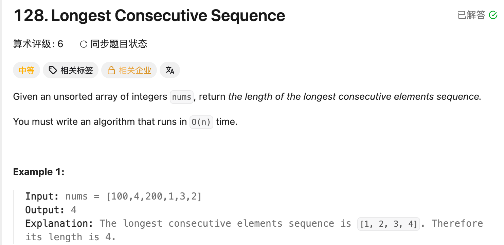

## 128. Longest Consecutive Sequence

Date: 9/18/2026
Difficulty: Medium
Tags: Array, Hash Table



### 一刷 (9/18/2026) ❌ 起点判断混淆 index 与数值，重复展开导致 TLE

**卡在哪**：能建立 HashSet，但不知道找到起点后怎么继续；看解后重写，修正遍历对象后通过。

```java
if (!set.contains(nums[i - 1])) {
    // ❌① 查的是前一个 index 的值；i = 0 时还会越界
}
```

**①的根因**：连续指的是数值相邻，不是原 array 中的位置相邻。应查 `nums[i] - 1`，判断当前数值有没有前驱。

修正后仍有问题：

```java
for (int i = 0; i < nums.length; i++) { // ❌② 仍在遍历含 duplicates 的 nums
    if (!set.contains(nums[i] - 1)) {
        int cur = nums[i];
        int length = 1;

        while (set.contains(cur + 1)) {
            cur++;
            length++;
        }

        ans = Math.max(ans, length);
    }
}
```

**②的根因**：set 去重了，但遍历对象 nums 没去重。重复的起点会反复展开同一段序列，time 最坏退化为 O(n²)。

例如 `[1,1,1,2,3,4]`，每遇到一个 1，都会重新数到 4。第二个 loop 应遍历 set。

**自测点**：为什么只从没有前驱的数开始，就不会漏掉最长序列？为什么外层 for 加内层 while，平均 time 仍是 O(n)？

---

<!-- ↓↓↓ 复习时先自己想一遍，再往下翻 ↓↓↓ -->

### 核心思路（一句话）

**用 HashSet 去重；只有 num - 1 不存在时，才从 num 开始向上数，最后取最大长度。**

### 正确写法

```java
class Solution {
    public int longestConsecutive(int[] nums) {
        Set<Integer> set = new HashSet<>();

        for (int num : nums) {
            set.add(num);
        }

        int ans = 0;

        for (int num : set) {
            if (!set.contains(num - 1)) {
                int cur = num;
                int length = 1;

                while (set.contains(cur + 1)) {
                    cur++;
                    length++;
                }

                ans = Math.max(ans, length);
            }
        }

        return ans;
    }
}
```

### 为什么只从起点开始

每段连续序列都有一个最小值，它没有前驱。从它开始不断查 `cur + 1`，就能找到整段；其他数不必重复展开。

**起点是这一段的最小值，不一定是整个 array 的最小值。**

例如 `[100,4,200,1,3,2]`：

- 100 没有前驱 99，是起点；101 不存在，长度为 1。
- 200 同理，长度为 1。
- 1 没有前驱 0，向上找到 `1 → 2 → 3 → 4`，长度为 4。
- 2、3、4 都有前驱，不展开。

HashSet 不保证遍历顺序，但不影响结果。`[100,99,98,97]` 也会从 97 找到整段，返回 4。

### HashSet API 与 enhanced for

```java
Set<Integer> set = new HashSet<>();

set.add(3);       // 新增返回 true；已存在返回 false
set.contains(3);  // 存在返回 true，否则 false
set.remove(3);    // 删除成功返回 true；不存在返回 false
set.size();       // 返回不同 element 的数量
set.isEmpty();    // 为空返回 true
```

HashSet 没有 index，也没有 `get(i)`。enhanced for 直接取出 element：

```java
for (int num : set) {
    // num 是本轮取出的数值，不是 index
}
```

**去重来自 HashSet，不来自 enhanced for。**

- `for (int num : nums)`：遍历原 array，仍会遇到 duplicates。
- `for (int num : set)`：每个不同数值只遍历一次。

### 复杂度分析

**Time: 平均 O(n)**：建 set 扫描一次；外层检查每个不同数值，while 只从各段起点展开，每段只数一次。HashSet 的 add / contains 按平均 O(1) 计。

**Space: O(n)**：HashSet 最多存 n 个不同数值。

不能只看到嵌套 loop 就判 O(n²)，要看内层的总执行次数。

### 沉淀

- **数值相邻 ≠ index 相邻。** `nums[i] - 1` 查前驱，`nums[i - 1]` 取前一个位置。
- **去重后，要检查实际遍历的是谁。** 建了 set，不代表后续遍历 nums 就自动去重。
- **没有前驱才展开。** 避免从同一段的每个数重新数到结尾。
- **单个数也是长度为 1 的序列。** `length` 先设为 1；没有后继时，while 不执行。
- **if 是 condition 判断，while 才是 loop。** 前者判断是否为起点，后者统计这一段的长度。

### 关联

- LC1：HashMap 保存 value → index；本题只查数值是否存在，用 HashSet。
- LC242：需要 frequency；本题 duplicates 不影响序列长度，只需保留不同数值。

### Interview pitch

> "I put the numbers into a HashSet to remove duplicates and support fast lookups. I only expand from numbers whose predecessor is absent, so each consecutive sequence is counted once. Iterating over the set also avoids expanding duplicate starting values. The expected time is O(n), and the space is O(n)."
