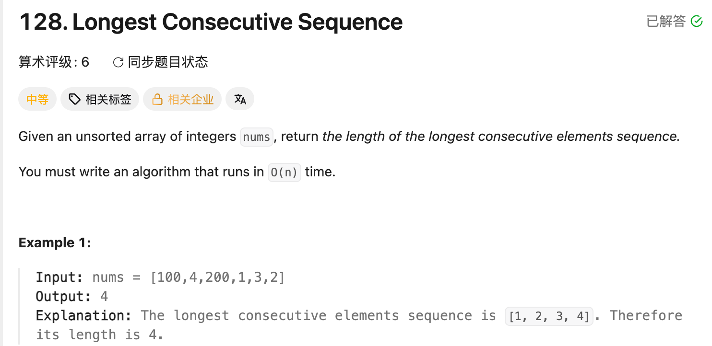

## 128. Longest Consecutive Sequence

Date: 9/18/2026, 10/9/2026  
Difficulty: Medium  
Tags: Array, Hash Table



### 一刷 (9/18/2026) ❌ 起点判断混淆 index 与数值，重复展开导致 TLE

**卡在哪**：能建立 HashSet，但不知道找到起点后怎么继续；看解后重写，修正遍历对象后通过。

```java
if (!set.contains(nums[i - 1])) {
    // ❌① 查的是前一个 index 的值；i = 0 时还会越界
}
```

**①的根因**：连续指的是数值相邻，不是原 array 中的位置相邻。应查 `nums[i] - 1`，判断当前数值有没有 predecessor。

修正后仍有问题：

```java
for (int i = 0; i < nums.length; i++) { // ❌② nums 中仍有 duplicates
    if (!set.contains(nums[i] - 1)) {
        int cur = nums[i];
        int length = 1;

        while (set.contains(cur + 1)) {
            cur++;
            length++;
        }

        ans = Math.max(ans, length);
    }
}
```

**②的根因**：set 去重了，但遍历对象 nums 没去重。重复的起点会反复扫描同一段，time 最坏退化为 O(n²)。

例如 `[1,1,1,2,3,4]`，每遇到一个 1，都会重新数到 4。第二个 loop 应遍历 set。

**自测点（当时）**：为什么只从没有 predecessor 的数开始，就不会漏掉最长序列？为什么外层 for 加内层 while，expected time 仍是 O(n)？

---

### 二刷 (10/9/2026) ❌ 起点判断未建立，两个 while 无法衔接

能建立 HashSet；确认 `contains()` API 后尝试实现，但未独立完成。

```java
int cur = nums[i];

while (set.contains(cur)) {
    cur--;
}

while (set.contains(cur)) { // ❌① 上一个 while 退出时，此 condition 已为 false
    cur++;
    ans++;                 // ❌② 累加总数，没有区分当前 length 与最大 ans
}
```

**根因**：想先向左找到起点，再向右计数，但第一个 while 停在起点前面不存在的数。比如从 2 向左走过 2、1，停在 0，第二个 while 无法进入；即使修正衔接，也不能从每个数反复扫描或直接累加 ans。

改写时仍卡住：

```java
int cur = nums[i];

if (set.contains(cur)) { // ❌③ cur 来自 nums，已经加入 set，condition 永远为 true
    cur--;
} else {
    cur++;
}
```

**核心卡点**：查当前数是否存在，不能判断它是不是起点；需要查的是 `cur - 1`。外层负责挑起点，内层负责统计当前 sequence 的 length。

**讲解后**：能复述「遍历 set → 判断 predecessor 是否存在 → 从起点向右计数 → 更新最大 length」。进一步讨论了遍历 array 与 set 的差别：两者都能得到正确答案，但 array 中重复的起点可能导致重复扫描。尚未独立重写验收。

> **自检信号**：衔接两个 loop 前，检查前一个退出时 condition 是什么；写起点判断时，确认查的是 predecessor；计数时分清当前 length 和全局 ans。

**自测点**：对于 `[1,2,4,5]`，为什么只判断 predecessor 不存在，就能分别找到两段的起点，而不需要先 sorting？

---

<!-- ↓↓↓ 复习时先自己想一遍，再往下翻 ↓↓↓ -->

### 核心思路（一句话）

**用 HashSet 去重；只有 num - 1 不存在时，才从 num 开始向右计数，最后取最大 length。**

### 正确写法

```java
class Solution {
    public int longestConsecutive(int[] nums) {
        Set<Integer> set = new HashSet<>();

        for (int num : nums) {
            set.add(num);
        }

        int ans = 0;

        for (int num : set) {
            if (!set.contains(num - 1)) {
                int cur = num;
                int length = 1; // 起点自己也算一个

                while (set.contains(cur + 1)) {
                    cur++;
                    length++;
                }

                ans = Math.max(ans, length);
            }
        }

        return ans;
    }
}
```

空 array 会自然返回 0，不需要单独处理。

### 为什么只从起点开始

每段 consecutive sequence 都有一个最小值，它没有 predecessor。从它开始不断查 `cur + 1`，就能找到整段；其他数不必重复扫描。

**起点是这一段的最小值，不一定是整个 array 的最小值。**

例如 `[100,4,200,1,3,2]`：

- 100 没有 predecessor 99，是起点；101 不存在，length 为 1。
- 200 同理，length 为 1。
- 1 没有 predecessor 0，向右找到 `1 → 2 → 3 → 4`，length 为 4。
- 2、3、4 都有 predecessor，不启动扫描。

HashSet 不保证遍历顺序，但不影响结果。即使先遇到 4，也只是跳过；之后遇到 1，仍能找到整段。

### HashSet API 与 enhanced for

```java
Set<Integer> set = new HashSet<>();

set.add(3);       // 新增返回 true；已存在返回 false
set.contains(3);  // 存在返回 true，否则 false
set.remove(3);    // 删除成功返回 true；不存在返回 false
set.size();       // 返回 distinct elements 的数量
set.isEmpty();    // 为空返回 true
```

**Set 查 value 用 `contains(value)`；Map 查 key 用 `containsKey(key)`。**

HashSet 没有 index，也没有 `get(i)`。enhanced for 直接取出 element：

```java
for (int num : set) {
    // num 是本轮取出的数值，不是 index
}
```

**去重来自 HashSet，不来自 enhanced for。**

- `for (int num : nums)`：遍历原 array，仍会遇到 duplicates。
- `for (int num : set)`：每个 distinct value 只遍历一次。

### 复杂度分析

设 n = nums.length，m = number of distinct elements，m ≤ n。HashSet 的 add / contains 按 average O(1) 计。

| 遍历对象 | Time（包含建 set）                              | Extra space     |
| -------- | ----------------------------------------------- | --------------- |
| set      | expected O(n)                                   | O(m)，最坏 O(n) |
| array    | 最坏 O(n²)，即使 HashSet 操作按 average O(1) 计 | O(m)，最坏 O(n) |

**遍历 set：** 建 set 为 O(n)；外层检查 m 个 distinct values，内层只从起点扫描，各段互不重叠，总执行次数为 O(m)。因此总 time 为 O(n + m) = O(n)。

**遍历 array：** 重复的起点会反复扫描同一段。如果约 n/2 个 elements 都是 1，且有一段约 n/2 长的 consecutive sequence，就需要约 n/2 × n/2 次操作，退化为 O(n²)。没有 duplicates 时，expected time 也是 O(n)。

**两种写法都建立了相同的 set，所以 extra space 相同。** cur、length、ans 只占 O(1)。

不能只看到 nested loops 就判 O(n²)，要看内层的总执行次数。

### 沉淀

- **数值相邻 ≠ index 相邻。** `nums[i] - 1` 查 predecessor，`nums[i - 1]` 取前一个位置。
- **去重后，检查实际遍历的是谁。** 遍历 set 避免重复起点；检查 predecessor 避免从同一段的中间重新扫描。
- **退出 loop 后，重新确认 variable 的含义。** 向左走到“不存在”时，cur 已经不在 sequence 内。
- **当前 length 与最大 ans 分开维护。** 单个数也是 length 为 1 的 sequence；扫描结束后用 Math.max 更新 ans。
- **if 挑起点，while 数 length。** 两层结构分别承担不同职责。

### 关联

- LC1：HashMap 保存 value → index；本题只查数值是否存在，用 HashSet。
- LC242：需要 frequency；本题 duplicates 不影响 sequence length，只需保留 distinct values。

### Interview pitch

> "I put the numbers into a HashSet to remove duplicates and support fast lookups. I only expand from numbers whose predecessor is absent, so each consecutive sequence is counted once. Iterating over the set also avoids expanding duplicate starting values. The expected time is O(n), and the extra space is O(m), where m is the number of distinct elements."
