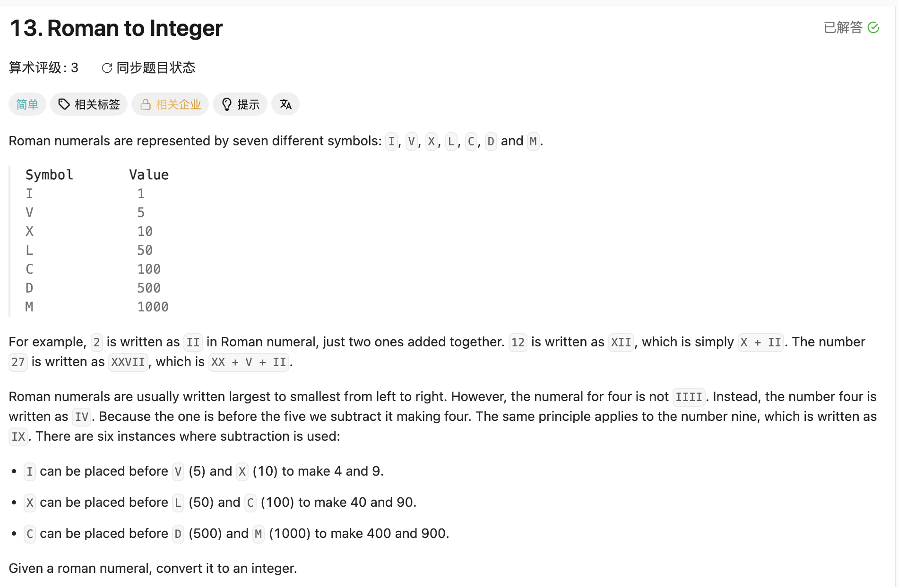

## 13. Roman to Integer

Date: 8/31/2026, 9/2/2026
Difficulty: Easy
Tags: Hash Table, String, Math



> **本题只认一种写法**：`Map<Character, Integer>` 存七个单字符 + 「比右邻小就减」。
> 双字符查表版（`Map<String, Integer>` + `substring`）已从本笔记删除——两套方案并存正是一刷二刷连着栽的原因。**再写出第三种形态就是临场发挥，当场停下。**

### 一刷 (8/31/2026) ❌ 三套方案各写一半，拼在一起互相抵消

减法规则自己识别出来了、六对列全、map 里十三个值一个没错。**错的不是推导是收敛**：手上准备了三样东西，每一样单独看都成立，拼在一起谁也没跑通。

```java
Map<String, Integer> map = new HashMap<>();      // ⓐ map 里存了 IV/IX/.../CM 六个双字符 key
map.put("I",1); ... map.put("M",1000);

int ans = -1;                                     // ❌④ 应为 0；且 i 从 1 起 → s.charAt(0) 从头到尾没被加过
for(int i = 1; i < s.length(); i++){
   if(s.charAt(i) == "V" && s.charAt(i-1) == "I"){ // ❌① char 和 String 不能比，应为 'V'（编译错误）
    ans = 4;                                       // ❌⑤ 赋值覆盖不是修正；下面还会再加一次 → "IV" 算成 4+5
   }else if( ... 手写六对减法规则 ... ){            // ⓑ 把 ⓐ 里已有的信息又抄了一遍
    ans = 1000;                                    // ❌⑥ CM 是 900。手写那份和 map 那份不一致，而 map 是对的
   }
   if(maps.containsKey(s.charAt(i))){              // ❌② maps 未定义（编译错误）
    ans = ans + map.get(s.charAt(i));              // ❌❌③ ⓒ 逐字符累加：拿 char 查 String 的 key，恒 false
   }
}
```

**③的根因（核心错，静默）**：`Map<String, Integer>` 的 key 是 String，`s.charAt(i)` 是 char → autobox 成 `Character`，`Character` 和 `String` 永远不 equals → **`containsKey` 恒为 false，累加那一行一次都没执行**。

编译器不拦，因为 **`containsKey` / `get` / `remove` 的参数类型是 `Object` 而不是 `K`**——泛型擦除的历史包袱，你传什么它都收。**类型写错在这里是运行期静默失效，不是编译错误。** 与 `list.remove(int)` vs `remove(Object)` 那个重载坑同源（LC380）。

**为什么通读代码自己查不出来**：ⓐ 和 ⓑ 是同一件事的两种实现，留一个就够；ⓒ 单独配上「比右邻小就减」也能成立。三条拼起来 → ⓑ 覆盖 ans、ⓒ 又加一次、ⓐ 因 key 类型不对压根没生效。**每一半单独看都对**——同 LC34 8/4「调用处用三刷的 L 版、condition 用四刷的 U 版」。

> **自检信号**：写完发现同一个信息在代码里存了两遍（map 里有 IV，if-chain 里又手写一遍 IV），停下——**冗余不是无害，是两份会不一致**（本题 CM 手写成 1000、map 里是 900，就是这么来的）。留一份，删另一份。

**自测点**：`map.containsKey(s.charAt(i))` 这一行，为什么编译器不报错、运行时却永远进不去？说出 `containsKey` 的参数类型，以及 char 到 map 的 key 之间发生了什么。

---

### 二刷 (9/2/2026) ❌❌ key 类型错第二次；ⓐ 的躯干套进了 for 的骨架

三套方案的问题解决了，这次只走一条路。但**一刷的核心错原样复发**，且这次是崩不是静默。

```java
Map<String,Integer> map = new HashMap<>();          // ❌❌① key 仍是 String（一刷同一个错）
...
int cur = map.get(s.charAt(i));                     //    char 查 String key → 恒 null → 拆箱 NPE
for(int i = 0; i < s.length(); i++){
    if(s.charAt(i+1) < s.length && ...){            // ❌② s.length 是方法，要写 s.length()（编译错误）
                                                    // ❌③ 该判的是 index：i + 1 < s.length()
                                                    //    且 charAt(i+1) 在判断之前就被求值了 → 末位越界
        ans += map.get(s.charAt(i+1)) - cur;
        i += 2;                                     // ❌④ for 头已有 i++，一轮实际吃三格
    }else if(... && cur > map.get(s.charAt(i+1)))   // ❌⑤ 只覆盖 >，漏了 == 和「i 是最后一格」
        ans += cur;
}                                                   // ❌⑥ 括号不配对，return ans 掉到了 class 层
```

**①的根因（同一刷③）**：这次栽在 `get` 而不是 `containsKey`——`get` 恒返回 `null`，赋给 `int` 时拆箱 **NPE**。**同一个错，一个静默一个当场崩，只取决于调的是哪个方法**。

当天补上的另一半：`put` 的签名是 `put(K key, V value)`，泛型是**真的**——`Map<Character,Integer>` 配 `map.put("I", 1)` 编译器当场拦。**同一个 map，写进去有类型检查，读出来没有**，这就是这个错能静默活到运行期的全部原因。

**③是 guard 的两件事同时错**：判断对象错（拿 `charAt` 取出的 char 去比长度，而不是比 index），位置也错（`&&` 从左往右求值，`charAt(i+1)` 必须排在 guard 之后才安全）。**guard 判的永远是「下标够不够得着」，不是「取出来的值是多少」。**

**④⑤是一对，也是本轮真正的形态**：写的是 ⓐ 的躯干（`next - cur` 一次结清、吃两格），却套在 `for` 的固定 `i++` 上——`i += 2` 与 for 自己那次叠加成三格。而 `else if (cur > next)` 一旦带了 condition，`"XX"` 这种等值相邻和字符串的最后一格全部无人认领，**静默漏加**（不崩，答案只会偏小）。

**改的时候只改了一半（当天最值钱的一处）**：给出诊断后的修订版里，if 那一支的 guard 改对了（`i + 1 < s.length()`）、`ans -= cur` 也对了，**`else if` 那一支原样没动**——还是 `s.charAt(i+1) < s.length` 加 `cur >` 的旧写法。两支本来是对称的（都要 guard + 判大小 + 加数）。**和一刷「两条分支的事项数必须相等」是同一个动作，这次发生在改代码而不是写代码上**，同 LC380 二刷「swap 只写一半」。

> **自检信号**：改动一支分支时，**把对称的另一支并排读一遍**再收工。对称结构里只改一半，剩下那半会安静地保留旧 bug。

**自测点**：如果输入是 `IC`（有人拿它表示 99），你这份代码会算出什么？为什么这题可以不管它？

---

<!-- ↓↓↓ 复习时先自己想一遍，再往下翻看答案 ↓↓↓ -->

### 核心思路（一句话）

**罗马数字正常从大到小排，一旦「小的在左、大的在右」就必是六种减法组合之一——所以「比右邻小」这一个判断等价于全部六条规则，不需要枚举。**

### 正确写法

```java
class Solution {
    public int romanToInt(String s) {
        Map<Character, Integer> map = new HashMap<>();   // 只放 I V X L C D M 七个
        map.put('I', 1);                                 // 单引号：char 字面量
        map.put('V', 5);
        map.put('X', 10);
        map.put('L', 50);
        map.put('C', 100);
        map.put('D', 500);
        map.put('M', 1000);

        int ans = 0;
        for (int i = 0; i < s.length(); i++) {           // 步长恒为 1，for 装得下
            int cur = map.get(s.charAt(i));
            if (i + 1 < s.length()                       // guard 判 index，且必须排在取值之前
                    && cur < map.get(s.charAt(i + 1))) {
                ans -= cur;                              // 比右邻小 → 它是被减的那个
            } else {
                ans += cur;                              // == 和最后一格都归这一支，不能加 condition
            }
        }
        return ans;
    }
}
```

**为什么 `ans -= cur` 就够了**：被减的那一格记负，下一轮循环照常把大的那格加上，两轮加起来正好是 `next - cur`。**不需要跳格，所以步长恒为 1**——一刷二刷的 `i += 2` 全是从「吃两格」那个思路带过来的。

### 复杂度分析

**Time O(n)**：每格一到两次 map 查询，常数。
**Space O(1)**：map 固定七个 entry，与输入无关。

### 沉淀

- **`containsKey` / `get` / `remove` 的参数是 `Object` 不是 `K`**：类型写错编译器不拦，运行期恒 false / 恒 null。**而 `put` 是 `put(K, V)`，泛型是真的**——同一个 map 写进去有检查、读出来没有。同族 LC380 的 `list.remove(int)` vs `remove(Object)`
- **兜底那一支不能带 condition**。`if / else if` 只覆盖了你想到的情况，剩下的（本题是 `==` 和最后一格）静默掉进地缝。写完问一句「有没有输入两支都不进」
- **guard 判的是下标够不够得着，不是取出来的值**；且必须排在取值动作之前，靠 `&&` 的短路兜住
- **同一个信息别在代码里存两遍**：冗余的两份迟早不一致（本题 CM 手写 1000 / map 里 900）
- **两条分支的事项数必须相等**，写的时候如此，**改的时候更要如此**（二刷只改了 if 那一支）。同 LC380 二刷「swap 只写一半」
- **步长不固定就别用 for**：for 的 update statement 写死了，手动改 `i` 会和它叠加（一刷、二刷、LC12 各一次）

### 关联

- LC380（同为集合的 API 语义坑：那题是 `add` vs `set`，本题是 `get` / `containsKey` 的参数类型）
- LC34（同形：两套各自正确的方案拼在一起）
- LC12 Integer to Roman（逆向，贪心从大到小减；`i` 与 for 叠加那个错两题都犯过）
