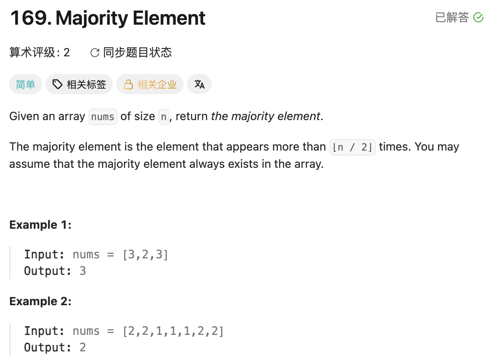

## 169. Majority Element

Date: 7/24/2026,8/1/2026
Difficulty: Easy
Tags: hash map, Boyer-Moore majority vote



### 一刷 (7/24/2026) ❌ 不是算法卡住，是 hash map API 写不出来

**卡在哪**：一眼看出该用 hash map 计数，但不记得 Java 里怎么写——`getOrDefault`
的存在想不起来，卡在「key 不存在时第一次怎么 put 进去」。

**真正的坎**（两个，都不在算法上）：

1. hash map 计数是个**固定模板**，不是每次现推：`map.put(k, map.getOrDefault(k, 0) + 1)`
2. 说不出 brute force——不是不会，是觉得「双重 loop 数数」太笨，下意识排除了。
   brute force 的作用不是解题，是**给优化提供基准**，越笨越好

Boyer-Moore 属于本题第一次接触，一刷时不知道存在 O(1) space 解。

**自测点**：不看答案写出 hash map 计数模板 + 说出 Boyer-Moore 归零重置的 invariant

---

<!-- ↓↓↓ 复习时先自己想一遍，再往下翻看答案 ↓↓↓ -->

### 核心思路（一句话）

**majority element 比其他所有 element 加起来还多 → 让不同的 element 两两抵消，
最后有净剩余的一定是它。**

### 解法梯度

| 解法          | Time       | Space    | 关键点                            |
| ------------- | ---------- | -------- | --------------------------------- |
| brute force   | O(n²)      | O(1)     | 每个 element 全数组数一遍         |
| 排序取中点    | O(n log n) | O(log n) | 长度 > n/2 的区间必覆盖下标 `n/2` |
| hash map 计数 | O(n)       | O(n)     | 用空间换时间                      |
| Boyer-Moore   | O(n)       | O(1)     | 只记净差值，不记具体票数          |

### 代码

```java
// hash map：计数模板 + 提前 return
class Solution {
    public int majorityElement(int[] nums) {
        Map<Integer, Integer> map = new HashMap<>();
        for (int num : nums) {
            int count = map.getOrDefault(num, 0) + 1;  // 不存在按 0 算
            map.put(num, count);
            if (count > nums.length / 2) return num;   // 唯一性保证可以提前退出
        }
        return -1;
    }
}
```

```java
// Boyer-Moore：candidate + counter，一趟扫描
class Solution {
    public int majorityElement(int[] nums) {
        int candidate = 0, count = 0;
        for (int num : nums) {
            if (count == 0) candidate = num;   // 擂台空了，换人
            if (num == candidate) count++;     // 注意：独立的 if，不是 else if
            else count--;
        }
        return candidate;
    }
}
```

### Boyer-Moore 的 invariant（为什么换 candidate 不会丢答案）

看 `count` 归零那一刻：走过的这段 prefix 里，candidate 和反对者**恰好一比一抵消完**，
所以这段 prefix 里**任何 element 都不超过一半**。

把这段 prefix 整个扔掉 → majority element 在 prefix 里最多损失了 prefix 的一半，
而它在全局有超过一半的富余 → **它在剩下的 suffix 里依然过半**。
问题变成一个更短的、性质完全相同的子问题。

> 直觉：归零 = 打平了 = 这一段谁也没占到便宜 = 扔掉它对答案无损。

例 `[3,2,3]`：3 上台 → 2 抵消归零（扔掉 `[3,2]`）→ 3 重新上台 → return 3 ✅
例 `[1,2,2]`：1 上台 → 2 抵消归零 → 2 上台 → return 2 ✅（majority 后来才当 candidate，正常）

### 复杂度分析

**Time: O(n)**：一趟 loop，每轮常数次比较和加减。
**Space: O(1)**：只有 candidate 和 count 两个 variable。

对比 hash map O(n) space（存下每个 element 的真实票数）：Boyer-Moore 快在
**只维护净差值**——我们不关心谁具体几票，只关心谁有剩余。
（同款思路：DP 的滚动数组压缩，也是「只留真正需要的量」）

### 沉淀

- **hash map 计数模板**：`map.put(k, map.getOrDefault(k, 0) + 1)`。
  凡是取出来要做算术/比较的，一律走 `getOrDefault`——`map.get(k)` 在 key 不存在时
  返回 `null`，直接参与比较会在 unboxing 时抛 NullPointerException，**编译期不报错**
- **majority element 最多只有一个**：两个都 > n/2 的话次数和 > n，数组装不下。
  这条既让 hash map 版可以提前 return，也是 Boyer-Moore 抵消论证成立的地基
- **brute force 不是废话**：它的价值是给优化提供对照基准，面试里一句话带过即可。
  拿到题先问「最笨的怎么做」——最笨的永远想得出来，它是保底
- **trick 型算法的正确态度**：Boyer-Moore 现场发明不了，考它就是考见没见过。
  记住 invariant（归零 = 扔掉一段谁都不过半的 prefix），不指望推导——
  推导是为了记得牢，不是为了现场重新发明

### 引申：超过 n/k 的推广

超过 n/k 的 element 最多有 **k-1** 个（k 个的话次数和 > n，矛盾）。
Boyer-Moore 对应维护 **k-1 组** candidate/counter：

- n/2 → 1 组（本题）
- n/3 → 2 组（LC229）

**且 k ≥ 3 时最后必须再扫一遍验证**——本题能省掉验证，只是因为题目保证 majority 存在。
如果不保证，存活的 candidate 只是「可能」，需要第二趟数它的真实次数。

### 关联

- 229（Majority Element II，n/3 版，未刷——可作为本题的 transfer 检验题）
- 139（同为 hash 结构提速：List 查找 O(n) → HashSet 查找 O(1)）
- 337（同为 hash map 换时间：memoization 把指数级降到 O(n)）

### Interview pitch (练口述)

> "The brute force is to count occurrences for each element, which is O(n²).
> A hash map brings it down to O(n) time but costs O(n) space. If space matters,
> there's a classic O(1)-space solution — the Boyer-Moore majority vote algorithm.
>
> The idea is cancellation. Since the majority element appears more than n over 2
> times, it outnumbers all other elements combined, so if every pair of different
> elements cancels out, whatever survives has to be the majority — and that holds
> regardless of the cancellation order.
>
> I keep a candidate and a counter. If the counter is zero, I take the current
> element as the new candidate; then I increment if it matches and decrement otherwise.
> The invariant that makes the reset safe: whenever the counter hits zero, the prefix
> consumed so far is exactly balanced, so no element occupies more than half of it.
> Dropping that prefix leaves a shorter suffix where the majority is still a majority.
>
> One assumption worth flagging: this only works because the problem guarantees a
> majority element exists. Otherwise I'd need a second pass to verify the candidate's
> actual count — still O(n) time, O(1) space."
