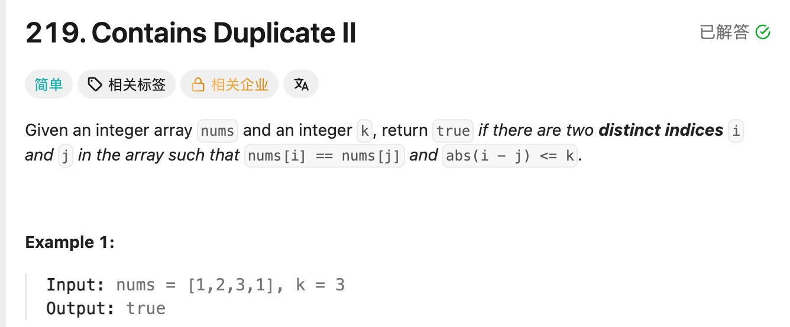

## 219. Contains Duplicate II

Date: 10/8/2026  
Difficulty: Easy  
Tags: Array, Hash Table, Sliding Window



### 本轮 (10/8/2026) ✅ 确认 API 后独立完成实现

确认 `containsKey`、`get` 和 `Math.abs` 的用法后，独立写出正确代码。

能解释：当前距离太远时，要更新 index，因为后面可能出现距离更近的配对。进一步明确：**对未来的 occurrence，最近一次出现的位置一定比更早的位置距离更小。**

原实现中的 `Math.abs` 和 loop 末尾的 `continue` 都不影响正确性，但可以省略。

---

### 核心思路（一句话）

**Map 保存每个 value 最近出现的 index；遇到相同 value 就检查距离，没有满足条件的配对就更新 index。**

```text
map 的 key   = nums 中的 value
map 的 value = 这个 value 最近出现的 index
```

例如 `5 → 2` 表示：数字 5 最近一次出现在 index 2。

### 正确写法

将原实现中重复的 `put` 合并到每轮末尾：

```java
class Solution {
    public boolean containsNearbyDuplicate(int[] nums, int k) {
        Map<Integer, Integer> map = new HashMap<>();

        for (int i = 0; i < nums.length; i++) {
            int key = nums[i];

            if (map.containsKey(key)
                    && i - map.get(key) <= k) {
                return true;
            }

            map.put(key, i);
        }

        return false;
    }
}
```

- 第一次出现：`put` 新增 entry。
- 出现过但距离太远：`put` 覆盖旧 index。
- 距离满足条件：直接返回 true。

### API：查是否存在、取 index、更新 index

```java
map.containsKey(nums[i]); // 是否出现过相同的 value，返回 boolean
map.get(nums[i]);         // 取出它最近出现的 index
map.put(nums[i], i);      // 新增或覆盖，记录当前 index
```

**Key 是 array 中的 value；map 的 value 是 index。** 不要把这两个“value”混在一起。

```java
map.put(5, 0);

map.containsKey(5); // true：数字 5 出现过
map.get(5);         // 0：它记录的 index 是 0
```

`containsKey(nums[i])` 已经完成了“有没有相同数字”的检查，不需要再取出 key 比较。

### 为什么更新最近的 index

```text
nums = [1, 2, 1, 1], k = 1

i = 0：记录 1 → 0
i = 2：2 - 0 > 1，不满足；更新为 1 → 2
i = 3：3 - 2 <= 1，返回 true
```

如果一直保留 index 0，就会漏掉 indices 2 和 3 这组答案。

**对未来的 index，最近出现的位置距离最小。** 如果最近的位置都太远，更早的位置只会更远，因此可以覆盖旧 index。

### 为什么不需要 Math.abs

Lookup 时，map 只包含之前遍历过的 index：

```text
previousIndex < i
```

所以直接写：

```java
i - map.get(key)
```

结果一定为正，不需要再取 absolute value。

同样要先查再存：如果先存当前 index，距离会变成 `i - i = 0`，错误地把自己当作配对。

### 复杂度分析

设 n 为 nums 的 length。

**Time: expected O(n)**：一次 traversal，HashMap lookup / insertion 按 average O(1) 计。  
**Extra space: O(n)**：每个 distinct value 保存一个 index，最多 n 个 entry。

### 沉淀

- **先定义 map 中 key / value 的含义**：本题是「数字 → 最近的 index」。
- **只保留最近的 index**：它对未来的 occurrence 提供最小距离。
- **先查再存**：保证比较的是两个不同的 indices。
- **`<= k` 包含边界**：距离恰好等于 k，也应返回 true。
- **`return false` 放在 loop 外**：当前没有找到，不代表后面也没有。

### English terms

- **most recent index / last seen index**：最近一次出现的 index。
- **occurrence**：一次出现。
- **absolute value**：绝对值。
- **overwrite**：覆盖已有的 value。

> “I keep the most recent index for each value because it gives the smallest distance to any future occurrence.”

### 关联

- LC1 — Two Sum：同样保存 value → index。LC1 查找 complement；本题查找当前 value，并比较 index 距离。
