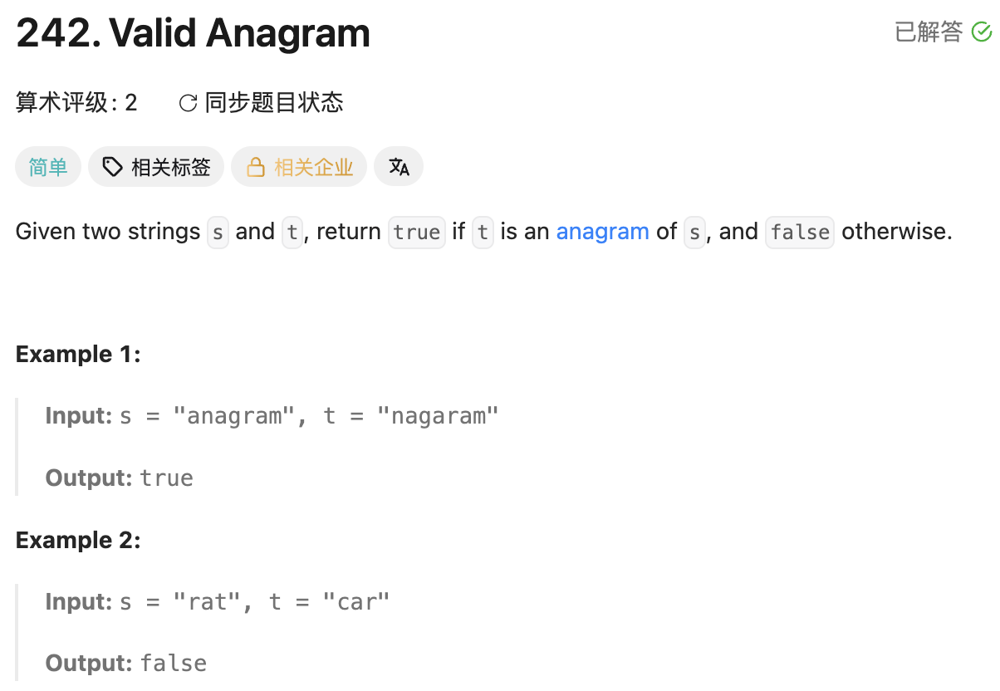

## 242. Valid Anagram

Date: 9/18/2026
Difficulty: Easy
Tags: Hash Table, String, Counting



### 一刷 (9/18/2026) ❌ 没思路，看解后理解 frequency counting

**卡在哪**：没想到如何判断「字母相同、顺序不同」，对 `s.charAt(i) - 'a'` 的映射也不熟。

**真正的坎**：anagram 不要求位置相同，要求**每种字符的出现次数相同**。把顺序丢掉，只记录 frequency。

**自测点**：`count` 每格存的是什么？为什么全部为 0 就能判断是 anagram？

---

### 核心思路（一句话）

**扫描 s 加次数，扫描 t 减次数；每种字符的次数差全部为 0，才是 anagram。**

### 正确写法①：Array counting

只有 26 个 lowercase letters，用 `int[26]` 即可。

`c - 'a'` 把字符映射成 index：`'a' → 0`、`'b' → 1`、……、`'z' → 25`。

```java
class Solution {
    public boolean isAnagram(String s, String t) {
        if (s.length() != t.length()) {
            return false;
        }

        int[] count = new int[26];

        for (int i = 0; i < s.length(); i++) {
            count[s.charAt(i) - 'a']++;
            count[t.charAt(i) - 'a']--;
        }

        for (int frequency : count) {
            if (frequency != 0) {
                return false;
            }
        }

        return true;
    }
}
```

### 正确写法②：HashMap counting

key 是字符，value 是次数差。

```java
class Solution {
    public boolean isAnagram(String s, String t) {
        if (s.length() != t.length()) {
            return false;
        }

        Map<Character, Integer> count = new HashMap<>();

        for (int i = 0; i < s.length(); i++) {
            char c = s.charAt(i);
            count.put(c, count.getOrDefault(c, 0) + 1);
        }

        for (int i = 0; i < t.length(); i++) {
            char c = t.charAt(i);
            if (!count.containsKey(c)) {
                return false;
            }
            count.put(c, count.get(c) - 1);
        }

        for (int frequency : count.values()) {
            if (frequency != 0) {
                return false;
            }
        }

        return true;
    }
}
```

**API 速记**：

- `getOrDefault(c, 0)`：有 key 就返回对应 value，否则返回 0；不会自动插入。
- `put(c, value)`：不存在就新增，存在就覆盖旧 value；返回旧 value，没有则返回 null。
- `containsKey(c)`：返回是否存在这个 key。
- `get(c)`：返回对应 value，不存在则返回 null。
- `values()`：返回所有 value 的 collection，可用 enhanced for 遍历。

### 复杂度分析

**Time: O(n)**：两个 string 各扫描一次；HashMap 操作按平均 O(1) 计。
**Space: O(1)**：本题只有 26 个 lowercase letters，两种写法最多记录 26 种字符。

### 沉淀

- **不关心顺序、关心出现次数 → frequency counting。** HashSet 只能记录有没有，分不清 `"aab"` 和 `"abb"`。
- **i 是字符在 string 中的位置；c - 'a' 是字符在 count 中的位置。** 两个 index 的职责不同。
- **一个不匹配就能判 false，全部匹配才能判 true。** `return true` 放在检查 loop 外。

### 引申：如何选择做法

- **字符范围小且连续**：用 array，直接映射到 index。
- **字符种类不适合固定映射**：考虑 HashMap，按实际出现的字符计数。
- **Sorting 也可以**：两个 string 各自转成 char array、排序后比较。顺序统一后，字符和次数相同就会得到相同结果；Time 为 O(n log n)。

### 关联

- LC1 — Two Sum：同样是映射，但 value 存 index；本题存 frequency。
- LC49 — Group Anagrams：本题判断两个 string 是否同组；LC49 要为多个 string 建立共同的 signature 再分组。
