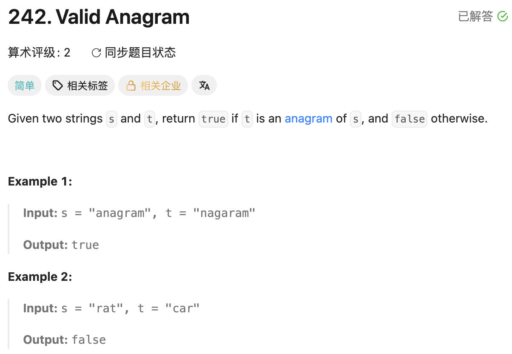

## 242. Valid Anagram

Date: 9/18/2026, 10/8/2026  
Difficulty: Easy  
Tags: Hash Table, String, Counting



### 一刷 (9/18/2026) ❌ 没思路，看解后理解 frequency counting

**卡在哪**：没想到如何判断「character 相同、顺序不同」，对 `s.charAt(i) - 'a'` 的 mapping 也不熟。

**真正的坎**：anagram 不要求位置相同，要求**每种 character 的出现次数相同**。把顺序丢掉，只记录 frequency。

**自测点**：`count` 每格存的是什么？为什么全部为 0 就能判断是 anagram？（二刷已讲解，下次使用新的自测点。）

---

### 二刷 (10/8/2026) ⚠️ 代码一次写对，抵消逻辑讲不清

**卡点**：能独立写出 `+1 / -1`，但口述时没有明确说明 `count` 保存的是 frequency difference。

**根因**：每格记录「该 character 在 s 中已出现的次数 − 在 t 中已出现的次数」。两边次数相同，加减才会 cancel out，最终归零。

> **自检信号**：解释抵消前，先定义每格存什么；再区分「遍历中暂时不为 0」和「遍历结束仍不为 0」。

本轮完成了代码与逻辑讲解，尚未重新进行独立口述验收。

**自测点（下次，未作答）**：如果只检查 `count` 所有位置的总和是否为 0，而不逐格检查，能判断 anagram 吗？说明理由并给一个例子。

---

### 核心思路（一句话）

**扫描 s 加次数，扫描 t 减次数；每种 character 的 frequency difference 全部为 0，才是 anagram。**

```text
count[c] = c 在 s 中已出现的次数
         − c 在 t 中已出现的次数
```

- 正数：目前在 s 中更多。
- 负数：目前在 t 中更多。
- 0：目前两边一样多。

同一种 character 可以在不同 iteration 中抵消，不要求位于相同 index。

例如 `s = "aab"`、`t = "aba"`：

| iteration | 操作           | count[a] | count[b] |
| --------- | -------------- | -------: | -------: |
| 初始      | —              |        0 |        0 |
| i = 0     | a 加 1，a 减 1 |        0 |        0 |
| i = 1     | a 加 1，b 减 1 |        1 |       -1 |
| i = 2     | b 加 1，a 减 1 |        0 |        0 |

中途的差值还可能被后续 character 抵消，**遍历结束后再检查是否全部为 0**。

### 正确写法①：Array counting

只有 26 个 lowercase English letters，用 `int[26]` 即可。

`c - 'a'` 把 character 映射成 index：`'a' → 0`、`'b' → 1`、……、`'z' → 25`。

```java
class Solution {
    public boolean isAnagram(String s, String t) {
        if (s.length() != t.length()) {
            return false;
        }

        int[] count = new int[26];

        for (int i = 0; i < s.length(); i++) {
            count[s.charAt(i) - 'a']++;
            count[t.charAt(i) - 'a']--;
        }

        for (int difference : count) {
            if (difference != 0) {
                return false;
            }
        }

        return true;
    }
}
```

### 正确写法②：HashMap counting

key 是 character，value 是 frequency difference。抵消逻辑与 array 相同。

```java
class Solution {
    public boolean isAnagram(String s, String t) {
        if (s.length() != t.length()) {
            return false;
        }

        Map<Character, Integer> count = new HashMap<>();

        for (int i = 0; i < s.length(); i++) {
            char c = s.charAt(i);
            count.put(c, count.getOrDefault(c, 0) + 1);
        }

        for (int i = 0; i < t.length(); i++) {
            char c = t.charAt(i);
            if (!count.containsKey(c)) {
                return false;
            }
            count.put(c, count.get(c) - 1);
        }

        for (int difference : count.values()) {
            if (difference != 0) {
                return false;
            }
        }

        return true;
    }
}
```

**API 速记**：

- `getOrDefault(c, 0)`：有 key 就返回对应 value，否则返回 0；不会自动插入。
- `put(c, value)`：不存在就新增，存在就覆盖；返回旧 value，没有则返回 null。
- `containsKey(c)`：返回是否存在这个 key。
- `get(c)`：返回对应 value，不存在则返回 null。
- `values()`：返回所有 value 的 collection，可用 enhanced for 遍历。

### 复杂度分析

设两个 string 的 length 相同，均为 n。

**Array counting**

- **Time: O(n)**：第一个 loop 执行 n 次，第二个检查固定的 26 个位置；O(n + 26) = O(n)。
- **Extra space: O(1)**：`count` 固定为 26 个位置，不随 input size 增长。

**HashMap counting**

- **Time: expected O(n)**：两个 string 各扫描一次，最后检查 map；HashMap lookup / insertion 按 average O(1) 计。
- **Extra space: O(1)**：本题限定 26 个 lowercase English letters，map 最多记录 26 个 key。若 character 种类不固定，则为 O(k)，k 是记录的 distinct characters 数量。

如果两个 string 的 length 不同，提前返回，这条路径是 O(1) time。

### 沉淀

- **不关心顺序、关心出现次数 → frequency counting。** HashSet 只能记录有没有，分不清 `"aab"` 和 `"abb"`。
- **i 是 character 在 string 中的位置；c - 'a' 是 character 在 count 中的位置。** 两个 index 的职责不同。
- **最终检查的是每种 character 的 frequency difference。** 一个不为 0 就能判 false；全部为 0 才能判 true，`return true` 放在检查 loop 外。

### 引申：如何选择做法

- **Character 范围小且连续**：用 array，直接映射到 index。
- **Character 种类不适合固定映射**：考虑 HashMap，按实际出现的 character 计数。
- **Sorting 也可以**：两个 string 各自转成 char array、sorting 后比较。顺序统一后，相同的 characters 和 frequency 会得到相同结果；Time 为 O(n log n)。

### English terms

- **anagram**：由相同的 characters 重新排列组成，每种 character 的数量一致。
- **frequency difference**：出现次数之差。
- **cancel out**：互相抵消。
- **alphabet**：字母表。
- **increment / decrement**：增加 / 减少；这里分别指加 1、减 1。
- **iterate over**：遍历。

解释抵消：

> “If a character appears the same number of times in both strings, the increments and decrements cancel out, leaving its count at zero.”

解释为什么用 26：

> “There are 26 lowercase letters in the English alphabet, so I use an array of size 26.”

解释 complexity：

> “The time complexity is O(n). The extra space is O(1), because the counting array has a fixed size of 26.”

### 关联

- LC1 — Two Sum：同样是 mapping，但 value 存 index；本题存 frequency difference。
- LC49 — Group Anagrams：本题判断两个 string 是否同组；LC49 要为多个 string 建立共同的 signature 再分组。
