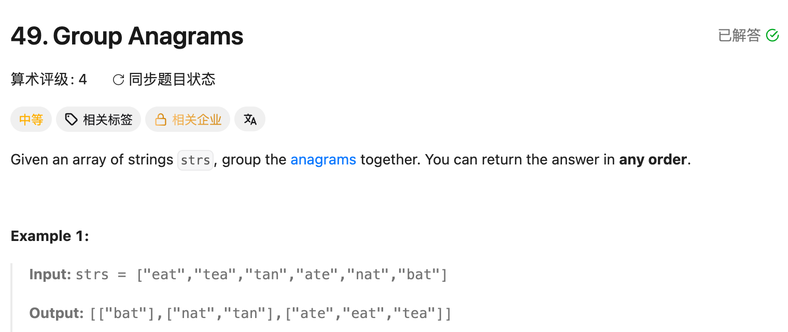

## 49. Group Anagrams

Date: 9/19/2026
Difficulty: Medium
Tags: Hash Table, String, Sorting



### 一刷 (9/19/2026) ❌ 没想到用排序后的 String 作为分组 key

**卡在哪**：不知道如何识别同组的 string；不熟悉 String 与 char[] 的转换，以及 Map 中 List 的创建和追加。

**真正的坎**：anagrams 的字符和次数相同，排序后会得到相同的 String。**用它作 key，value 保存这一组原 string。**

讨论后理解：每轮拆成 char[] → 排序 → 拼回 String 当 key；没有组就创建，无论新组旧组，都加入原 string。尚未提供独立重写代码验证。

**自测点**：为什么排序后的 String 能作为分组 key？为什么加入 List 的必须是原 string？

---

### 核心思路（一句话）

**排序后的 String 用来认组，HashMap 的 value 用来收集原词。**

```text
"eat" → "aet" ┐
"tea" → "aet" ├→ "aet": ["eat", "tea", "ate"]
"ate" → "aet" ┘

"tan" → "ant" ┐
"nat" → "ant" ┴→ "ant": ["tan", "nat"]
```

### 代码

```java
class Solution {
    public List<List<String>> groupAnagrams(String[] strs) {
        Map<String, List<String>> map = new HashMap<>();

        for (String s : strs) {
            char[] chars = s.toCharArray();
            Arrays.sort(chars);
            String key = new String(chars);

            map.putIfAbsent(key, new ArrayList<>());
            map.get(key).add(s); // 每轮都加入原词，不是排序后的 key
        }

        return new ArrayList<>(map.values());
    }
}
```

### API：拆、排、拼、建组、加原词

```java
String s = "eat";
char[] chars = s.toCharArray(); // {'e', 'a', 't'}
Arrays.sort(chars);            // {'a', 'e', 't'}
String key = new String(chars); // "aet"，原来的 s 仍是 "eat"
```

**new String(chars)** 拼成 `"aet"`；`Arrays.toString(chars)` 得到 `"[a, e, t]"`，主要用于打印查看。

```java
map.putIfAbsent(key, new ArrayList<>()); // 没有组才创建，已有组不覆盖
map.get(key).add(s);                    // 每次都执行，保证当前词被加入
```

第一次遇到 `"eat"`：建空组 → 加入后变成 `["eat"]`。
再遇到 `"tea"`：保留原组 → 追加后变成 `["eat", "tea"]`。

`map.values()` 取出所有分组，`new ArrayList<>(...)` 将它们装进外层 List；返回的是 `List<List<String>>`，不是 array。

### 复杂度分析

设 n 为 string 数量，m 为最长 string 长度。

**Time: O(n · m log(m + 1))**：每个词排序通常按 O(m log m) 分析；转换和 key 的 hash 计算是 O(m)。写 log(m + 1) 也覆盖长度为 1 的情况。
**Space: O(n · (m + 1))**：最多 n 个长度为 m 的 key，加上 n 个原词的 reference；不复制原词内容。通常简写 O(nm)，此处加 1 兼顾 empty string。

### 沉淀

- **分组先找共同 key**：把同组对象转换成同一种表示，再用 HashMap 收集。
- **key 和答案分工不同**：排序后的词负责识别，原词才放进结果。
- **建组是有条件的，加入当前词是每轮必做的**：不能把 add 只写在「组已存在」的分支里。
- **重复词也保留**：题目要分组，不是去重。

### 关联

- LC242：判断两个词是否为 anagrams；本题用相同特征把多个词分组。
- LC56：同样使用 List 收集结果；本题每组本身也是一个 List。
