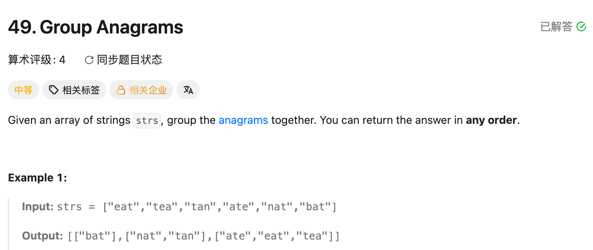

## 49. Group Anagrams

Date: 9/19/2026, 10/8/2026  
Difficulty: Medium  
Tags: Hash Table, String, Sorting



### 一刷 (9/19/2026) ❌ 没想到用排序后的 String 作为分组 key

**卡在哪**：不知道如何识别同组的 string；不熟悉 String 与 char[] 的转换，以及 Map 中 List 的创建和追加。

**真正的坎**：anagrams 的 characters 和 frequency 相同，排序后会得到相同的 String。**用它作 key，value 保存这一组原 string。**

讨论后理解：每轮拆成 char[] → sorting → 拼回 String 当 key；没有组就创建，无论新组旧组，都加入原 string。尚未提供独立重写代码验证。

**自测点**：为什么排序后的 String 能作为分组 key？为什么加入 List 的必须是原 string？（二刷已讨论，下次使用新的自测点。）

---

### 二刷 (10/8/2026) ❌ 思路正确，API 与分组实现需提示

能独立说出「sorting 生成 key → HashMap 分组 → 返回所有 groups」，但代码未独立完成：

```java
Map<String, String> map = new HashMap<>(); // ❌ value 应是 List<String>
for (int i = 0; i < strs.length(); i++) {  // ❌ array 用 length，不是 length()
```

**卡点**：忘了 String ↔ char[] 的转换，以及创建分组、追加原 string 和返回 nested List 的写法。Complexity 经讲解后理解：n 个 strings，每个最长 k，需同时考虑数量与每份大小。

> **自检信号**：coding 前先说清 map 的 key / value 类型；生成 key 后，检查「没有组先创建，加入原 string 每轮都执行」。

本轮思路保留住了，API 和实现通过提示补齐；看过完整代码，尚未独立重写验证。

**自测点（下次，未作答）**：如果所有 n 个 strings 都属于同一组，extra space 会变成 O(k) 吗？说明还需要保存什么。

---

### 核心思路（一句话）

**排序后的 String 用来认组，HashMap 的 value 用来收集原 string。**

```text
"eat" → "aet" ┐
"tea" → "aet" ├→ "aet": ["eat", "tea", "ate"]
"ate" → "aet" ┘

"tan" → "ant" ┐
"nat" → "ant" ┴→ "ant": ["tan", "nat"]
```

### 代码

```java
class Solution {
    public List<List<String>> groupAnagrams(String[] strs) {
        Map<String, List<String>> map = new HashMap<>();

        for (String s : strs) {
            char[] chars = s.toCharArray();
            Arrays.sort(chars);
            String key = new String(chars);

            if (!map.containsKey(key)) {
                map.put(key, new ArrayList<>());
            }

            map.get(key).add(s); // 每轮加入原 string，不是排序后的 key
        }

        return new ArrayList<>(map.values());
    }
}
```

### API：拆、排、拼、建组、加原 string

**String 不能直接用 Arrays.sort 排序，需要转成 char[]，不是单个 char。**

```java
String s = "cat";
char[] chars = s.toCharArray(); // {'c', 'a', 't'}
Arrays.sort(chars);            // {'a', 'c', 't'}
String key = new String(chars); // "act"，原来的 s 仍是 "cat"
```

- `"cat"` 是 String，`'c'` 是 char；`'cat'` 不是合法的 Java char。
- `new String(chars)` 按当前顺序组成新 String，不负责 sorting。
- `Arrays.toString(chars)` 得到 `"[a, c, t]"`，主要用于打印查看。

**Map 的 value 是一个分组，因此类型是 List<String>。**

```java
if (!map.containsKey(key)) {
    map.put(key, new ArrayList<>()); // 没有组才创建
}
map.get(key).add(s);                // 无论新组旧组，每轮都加入原 string
```

第一次遇到 `"eat"`：建空组 → 加入后变成 `["eat"]`。  
再遇到 `"tea"`：保留原组 → 追加后变成 `["eat", "tea"]`。

`map.get(key)` 返回该 List 的 reference；直接 `.add(s)` 就修改了分组，不需要再次 `put`。

**返回分组：**

```java
List<List<String>> ans = new ArrayList<>(map.values());
return ans;
```

等价于：

```java
return new ArrayList<>(map.values());
```

`map.values()` 中的每个 element 已经是一个 List<String>。外面再装一层 List，所以返回类型是 `List<List<String>>`。

```java
new ArrayList<>()             // 创建空 List
new ArrayList<>(map.values()) // 创建外层 List，并装入所有分组的 reference
```

### 复杂度分析

设：

- **n**：strs 中的 string 数量。
- **k**：最长 string 的 length。

**Time：通常写作 O(nk log k)**，HashMap 操作按平均情况分析。

每个 string：

| 操作                    | Time                   |
| ----------------------- | ---------------------- |
| `toCharArray()`         | O(k)，复制 characters  |
| `Arrays.sort(chars)`    | 通常按 O(k log k) 分析 |
| `new String(chars)`     | O(k)，创建 key         |
| String key 的 hash 计算 | O(k)                   |

主要成本是 sorting：

```text
n 个 strings × 每个 O(k log k)
= O(nk log k)
```

最后收集所有 groups 最多需要 O(n)，不改变通常的整体复杂度。

**Extra space：通常写作 O(nk)。**

- 最多 n 个不同的 sorted keys，每个最多 k 个 characters：O(nk)。
- 分组中的 Lists 总共保存 n 个原 string 的 reference：O(n)，不复制原 string 的内容。
- 临时 char[] 最长为 k：O(k)，不是同时保留 n 份。
- 返回的外层 List 最多保存 n 个分组的 reference：O(n)。

**n 表示有多少份，k 表示每份有多大。不能把一个任意长度的 String 当成 O(1) space。**

兼顾 empty string 和很短的 string，完整上界可写为：
Time O(n · [1 + k log(k + 1)])，Space O(n · (k + 1))。

### 沉淀

- **分组先找共同 key**：把同组对象转换成同一种表示，再用 HashMap 收集。
- **key 和答案分工不同**：排序后的 string 负责识别，原 string 才放进结果。
- **建组有条件，加入当前 string 每轮必做**：不能把 add 只写在「组已存在」的分支里。
- **重复 string 也保留**：题目要分组，不是去重。
- **思路与实现分别验收**：这轮保留了分组思路，但 API 仍需独立重写巩固。

### English terms

- **signature**：用于识别同组对象的共同特征；本题的 sorted string 就是分组 signature。
- **reference**：引用。分组中的 List 保存原 string 的 reference。
- **immutable**：不可变的。String 是 immutable，这里排序的是新建的 char[]。

Complexity 读法：

- `O(k log k)`：“Big O of k log k.”
- `O(nk log k)`：“Big O of n times k log k.”
- `O(nk)`：“Big O of n times k.”

### Interview pitch

> “I’ll sort a copy of each string’s characters and use the resulting string as the key in a hash map. Anagrams share the same key, so I’ll add each original string to its corresponding group. Let n be the number of strings and k be the maximum string length. The time complexity is O(nk log k), and the extra space is O(nk), mainly for the sorted keys and the groups.”

### 关联

- LC242：判断两个 string 是否为 anagrams；本题用相同特征把多个 string 分组。
- LC56：同样使用 List 收集结果；本题每组本身也是一个 List。
