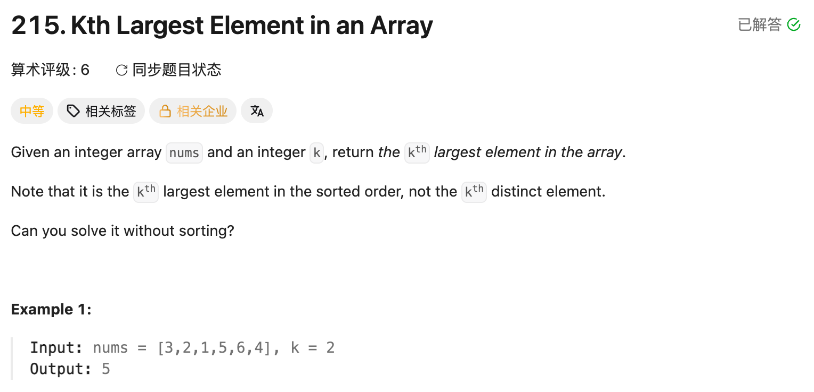

## 215. Kth Largest Element in an Array

Date: 9/19/2026
Difficulty: Medium
Tags: Array, Sorting, Heap



### 一刷 (9/19/2026) 排序版写对，新学 min-heap

排序版独立写对：升序排列后，第 k 大的 index 是 `n - k`。

**卡在哪**：没怎么接触过 heap，不理解为什么超过 k 个就 poll，以及最后为什么返回最小值。

**理解后总结**：每加入一个数就检查数量，超过 k 个便删除最小值，始终保留目前最大的 k 个；其中最小的就是第 k 大。

已能解释思路，min-heap 版尚未独立重写验证。

**自测点**：被 poll 掉的数，为什么以后也不需要再找回来？

---

### 解法一：Sorting

```java
class Solution {
    public int findKthLargest(int[] nums, int k) {
        Arrays.sort(nums);
        return nums[nums.length - k];
    }
}
```

升序排列：第 1 大在 `n - 1`，第 k 大就在 `n - k`。

### 解法二：Min-heap

**不必给全部数字排序，只保留最大的 k 个；heap 顶部是这 k 个里最小的，也就是第 k 大。**

```java
class Solution {
    public int findKthLargest(int[] nums, int k) {
        PriorityQueue<Integer> heap = new PriorityQueue<>();

        for (int num : nums) {
            heap.offer(num);

            if (heap.size() > k) {
                heap.poll(); // 淘汰最小值，保留最大的 k 个
            }
        }

        return heap.peek();
    }
}
```

### Dry run

`nums = [3,2,1,5,6,4], k = 2`

下面按大小展示保留的数，不代表 heap 内部存储顺序：

```text
读 3 → [3]
读 2 → [2,3]
读 1 → [1,2,3] → 删 1 → [2,3]
读 5 → [2,3,5] → 删 2 → [3,5]
读 6 → [3,5,6] → 删 3 → [5,6]
读 4 → [4,5,6] → 删 4 → [5,6]

peek() = 5 → 第 2 大
```

### API

```java
PriorityQueue<Integer> heap = new PriorityQueue<>(); // 默认 min-heap
heap.offer(num);  // 加入，自动调整 heap
heap.poll();      // 删除并返回最小值
heap.peek();      // 查看最小值，不删除
heap.size();      // 当前数量
```

**min-heap 不保证整体有序**，只保证每个 parent 不大于 child，所以最小值在顶部。直接遍历不保证升序，反复 poll 才会从小到大取出。

### 复杂度分析

| 做法     | Time            | Extra space                       |
| -------- | --------------- | --------------------------------- |
| Sorting  | 通常 O(n log n) | 依赖排序实现；OpenJDK 8 可达 O(n) |
| Min-heap | O(n log(k + 1)) | O(k)                              |

Heap 遍历 n 个数，每轮在最多 k + 1 个候选中调整；最后 peek 是 O(1)。

k 远小于 n 时，heap 的时间复杂度更有优势；k 接近 n 时，两者都接近 O(n log n)。Sorting 会修改原 array，heap 版不会。

### 沉淀

- **找第 k 大，用 min-heap 淘汰小的**：保留最大的 k 个，顶部就是候选的最低门槛。
- **保留的是最大的 k 个，不是任意 k 个**：每次超过容量，就淘汰最小值。
- **重复值也占排名**：不能先用 Set 去重。
- **先理解排序版，再减少不必要的工作**：只问第 k 大，就不一定需要全部排好。

### 关联

- LC56：排序后扫描合并；本题排序后直接定位，也可以改用 heap 维护候选。
