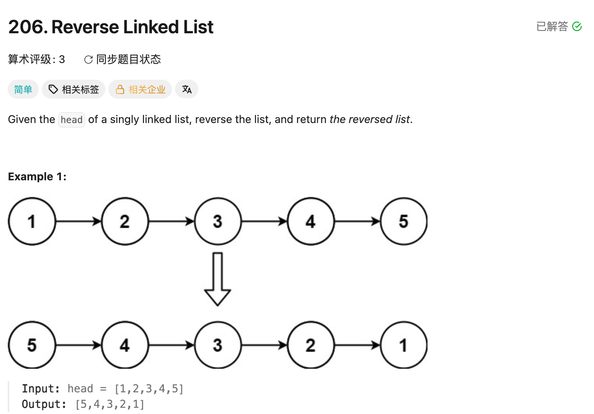

## 206. Reverse Linked List

Date: 以前做过（日期待补）, 9/19/2026
Difficulty: Easy
Tags: Linked List, Two Pointers



### 复习 (9/19/2026) ❌ 久未做，忘记 reference 操作与反转步骤

**卡在哪**：不熟悉 ListNode 定义，不确定 `cur.next` 取到的是什么，也混淆「移动 reference」和「修改连接」。

**真正的坎**：`cur` 是指向 node 的 reference；`cur.next` 是这个 node 保存的下一个 node 的 reference。**给 cur 赋值是移动 pointer，给 cur.next 赋值才是改箭头。**

理解后总结：先记住 cur 的 next，再把 cur 的箭头反转，最后更新 prev 和 cur。

本轮已能复述思路，尚未提供独立重写代码验证。

**自测点**：每轮开始时，prev 和 cur 分别指向哪一部分？为什么结束后返回 prev？

---

### 核心思路（一句话）

**保存下一站 → 反转当前箭头 → 更新 prev → 更新 cur。**

### ListNode 与 reference

```java
int val;       // 当前 node 存的数字
ListNode next; // 下一个 node 的 reference，没有则为 null
```

```java
ListNode cur = head;      // 指向同一个对象，没有复制 node
cur = cur.next;           // 移动 cur，链的连接不变
cur.next = prev;          // 修改当前 node 的 next，链的连接改变
```

题目已经创建好 linked list，通过 head 传入；本题不需要 new node。

### 正确写法

```java
class Solution {
    public ListNode reverseList(ListNode head) {
        ListNode prev = null;
        ListNode cur = head;

        while (cur != null) {
            ListNode next = cur.next; // 先保存后面的链
            cur.next = prev;          // 反转当前箭头
            prev = cur;              // 更新已反转部分的 head
            cur = next;              // 移到下一待处理 node
        }

        return prev;
    }
}
```

### Dry run

`head = 1 → 2 → 3 → null`

| 状态     | 已反转部分，prev 指向其 head | 未处理部分，cur 指向其 head |
| -------- | ---------------------------- | --------------------------- |
| 开始     | null                         | 1 → 2 → 3 → null            |
| 第一轮后 | 1 → null                     | 2 → 3 → null                |
| 第二轮后 | 2 → 1 → null                 | 3 → null                    |
| 第三轮后 | 3 → 2 → 1 → null             | null                        |

cur 为 null 时全部处理完；prev 指向新 head，所以返回 prev。

### 复杂度分析

**Time: O(n)**：每个 node 处理一次。
**Space: O(1)**：只使用 prev、cur、next 三个 reference，没有创建新 node。

### 沉淀

- **改连接前先保存后路**：修改 cur.next 后，不能再靠它找到原来的下一站。
- **先更新 prev，再更新 cur**：prev 要接住刚处理完的 node。
- **反转的是 next，不是 val**：node 本身保留，只改变连接关系。
- **empty list 自动处理**：head 为 null 时不进入 loop，直接返回 null。
