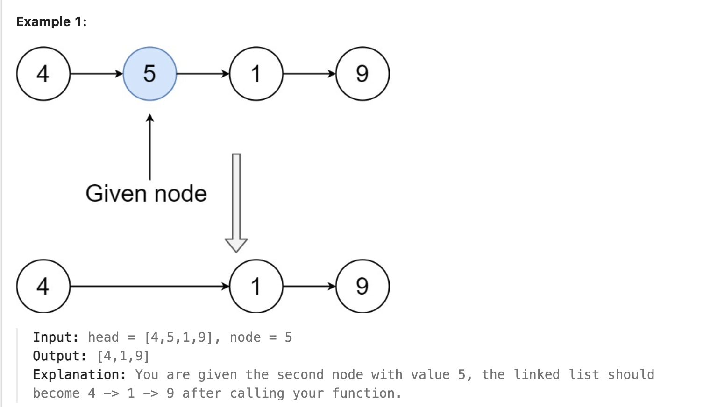

## 237. Delete Node in a Linked List

Date: 9/19/2026
Difficulty: Medium
Tags: Linked List



### 一刷 (9/19/2026) ❌ 移动了局部 reference，没有修改 node 的连接

最初想找到 prev，让它跳过 node；但本题只给待删除的 node，无法访问前一个 node。提示后，理解了「复制下一个 node 的 val，再跳过它」。

我的代码：

```java
ListNode cur = node;
ListNode next1 = cur.next;

cur.val = next1.val; // ✅ 复制 val

ListNode next2 = next1.next;
next1 = next2;      // ❌ 只移动 next1，cur.next 没变
```

**根因**：`next1 = cur.next` 只是复制 reference，两者没有绑定。重新给 next1 赋值，不会改变 cur 对象里的 next。

**Dry run**：删除 `4 → 5 → 1 → 9` 中的 5。复制 val 后是 `4 → 1 → 1 → 9`；执行 `next1 = next2` 后连接不变，重复的 1 仍在链上。

> **自检信号**：要改哪个 node 的连接，就给那个 node 的 `.next` 赋值。

**自测点**：为什么复制下一个 node 的 val，再跳过它，就满足删除要求？为什么这个做法不能删除最后一个 node？

---

### 核心思路（一句话）

**让当前 node 接替下一个 node 的 val 和 next，从链上跳过下一个 node。**

### 正确写法

```java
class Solution {
    public void deleteNode(ListNode node) {
        ListNode next = node.next;
        node.val = next.val;
        node.next = next.next;
    }
}
```

```text
原来：      4 → 5 → 1 → 9
                ↑ node

复制 val：  4 → 1 → 1 → 9
修改 next： 4 → 1 ─────→ 9
```

当前 node 对象仍然存在；题目要求的值序列中，原来的 5 已被删除。

### 复杂度分析

**Time: O(1)**：只复制一个 val、修改一个 next，无需遍历。
**Space: O(1)**：只使用一个额外 reference，没有创建 node。

### 沉淀

- **改连接，看等号左边**：`next = ...` 移动局部 reference；`node.next = ...` 修改 node 的连接。
- **没有 prev，就让当前 node 接替下一站**：不必物理移除传入的那个对象。
- **不能处理最后一个 node**：它没有下一站可接替；本题保证 node 不是最后一个。

### 关联

- LC206：同样要区分「移动 reference」和「修改 .next」；反转与删除最终都要落实到连接的改变。
