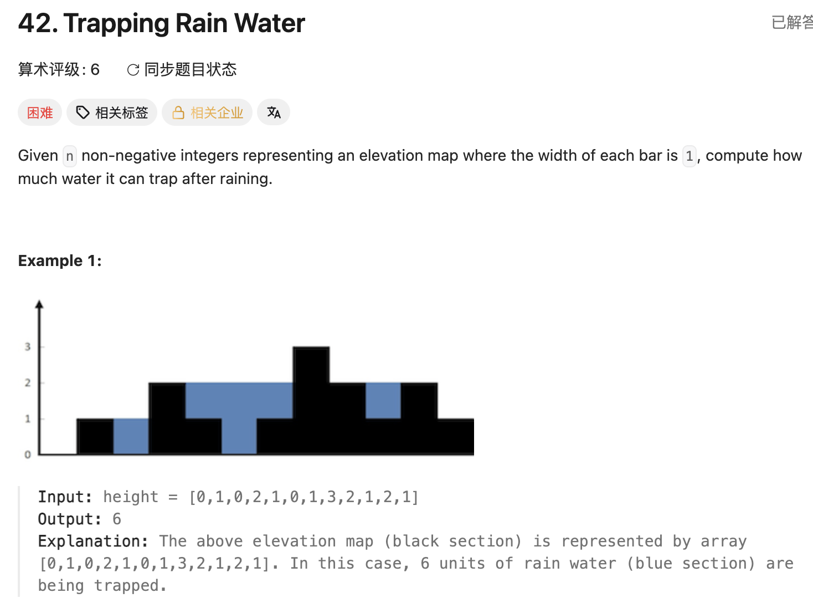

## 42. Trapping Rain Water

Date: 4/16/2026, 8/24/2026
Difficulty: Hard
Tags: monotonic stack, two pointers



### 一刷 (8/24/2026) ❌ 看答案后重写，非独立解出

**这一轮不是裸写**：开口就要了单调栈的完整代码，照着写出来仍有两个错。四月那轮做的是理解和追问（栈顶栈底方向、`[3,1,4]` 手算、与 84 对比），从未产出过代码。我的代码：

```java
while(!stack.isEmpty() && height[i] > height[stack.peek()]){
    int mid = stack.pop();
    int left = stack.peek();          // ❌① pop 之后栈可能空了，peek() 返回 null
                                      //    → 拆箱 NPE。缺 if (stack.isEmpty()) break;
    int h = Math.min(height[left], height[i] - height[mid]);
                                      // ❌❌② 核心错：括号位置。应为
                                      //    Math.min(height[left], height[i]) - height[mid]
    int w = i - left - 1;
    res += h * w;
}
```

**①的根因**：while condition 只在**进入这一轮时**验过栈非空，`pop()` 把那个保证消耗掉了，`peek()` 是在一个已经变了的栈上调用的。栈空意味着 mid 左边没有更高的柱子，这一格接不住水。**更深一层：口述机制时我说 while「一直弹到当前元素不再比栈顶高」——只说了出口一，出口二（栈空）根本不在模型里**，所以 pop 之后自然想不到要再查一次。不是手滑，是模型少了一支。

**②的根因**：`height[left]` 是**绝对高度**（从地面量），`height[i] - height[mid]` 是**相对高度**（右墙高出凹槽底多少）。**两个参考系不同的量塞进同一个 min 里比大小，比出来的真假没有意义。** 正确顺序是先在绝对高度上取 min 选出较矮的墙，再统一减掉凹槽底。`[3,1,4]` → 我的写法 `min(3, 4-1) = 3`，正确 `min(3,4)-1 = 2`。

**静默且极易蒙混**：`min(a, c-b)` 与 `min(a,c)-b` **只有 b == 0 时才相等**——而 42 的样例里 0 特别多，前几个 case 很容易过。

> **自检信号**：一个表达式里出现减法和 min/max 时，先问「参与比较的两个量，是不是从同一个基准量起的」。基准不同就一定要先统一再比。

**自测点**：`pop()` 之后的新栈顶，凭什么一定是 mid 左边**第一个**比它高的柱子？（不是随便某个更高的柱子）

---

<!-- ↓↓↓ 复习时先自己想一遍，再往下翻看答案 ↓↓↓ -->

### 核心思路（一句话）

**单调递减栈按「一层水」横向结算**：遇到比栈顶高的柱子，就找到了栈顶那根的右墙，用「左墙、凹槽底、右墙」三根柱子切下一块横向矩形。

### 代码

```java
class Solution {
    public int trap(int[] height) {
        Deque<Integer> stack = new ArrayDeque<>();   // 存 index，栈底→栈顶高度递减
        int res = 0;

        for (int i = 0; i < height.length; i++) {
            while (!stack.isEmpty() && height[i] > height[stack.peek()]) {
                int mid = stack.pop();               // 凹槽底
                if (stack.isEmpty()) break;          // 左边没墙 → 接不住，这个 i 收工
                int left = stack.peek();             // 左墙（弹完之后的新栈顶）
                int h = Math.min(height[left], height[i]) - height[mid];
                int w = i - left - 1;                // 两墙之间的开区间
                res += h * w;
            }
            stack.push(i);                           // 无条件入栈：任何柱子都可能是
        }                                            // 未来的左墙或凹槽底
        return res;
    }
}
```

### 一层水是怎么切的

关键在于**每次 `res +=` 的那块水是什么形状**：

- **双指针 / 预处理数组**：固定 index i，`min(leftMax, rightMax) - height[i]` 求出**第 i 列**的水，宽度恒为 1，一列一次结清
- **单调栈**：每次 pop 结算一个**横向矩形**——从 `height[mid]` 这条水平线往上切一片，宽 `w = i - left - 1`（可能横跨好几列），高 `h = min(左墙, 右墙) - height[mid]`

`height = [4,2,0,3,2,5]`（答案 9），四次结算：

```
index:    0  1  2  3  4  5
height:   4  2  0  3  2  5

i=3 弹 mid=2: left=1, h=min(2,3)-0=2, w=1 → +2   底 0→面 2, 覆盖 index 2
i=3 弹 mid=1: left=0, h=min(4,3)-2=1, w=2 → +2   底 2→面 3, 覆盖 index 1~2
i=5 弹 mid=4: left=3, h=min(3,5)-2=1, w=1 → +1   底 2→面 3, 覆盖 index 4
i=5 弹 mid=3: left=0, h=min(4,5)-3=1, w=4 → +4   底 3→面 4, 覆盖 index 1~4
i=5 弹 mid=0: 栈空 → break
                                            res = 9
```

**index 2 那一列总共接了 4 格水，是在三个不同轮次里被算完的**（第 1 块拿 0→2 两格、第 2 块拿 2→3 一格、第 4 块拿 3→4 一格）。按列算的话它一次就结清；单调栈里同一列的水被水平切成好几片，分散在不同轮次。

**这也解释了为什么 42 不需要首尾补 0**（84 需要）：遍历完栈里剩的柱子都没找到右墙，它们头顶那些层压根不存在水，直接丢掉就对。84 剩的柱子面积还没算，必须靠末尾的 0 强制弹出。

### 复杂度分析

**Time: O(n)**：每个 index 进栈恰好一次、出栈至多一次，while 的总弹出次数被 n 摊平。
**Space: O(n)**：严格递减数组（如 `[5,4,3,2,1]`）时全部 index 压在栈上。

对比 brute force O(n²)（每一列各向左右扫一遍求 leftMax / rightMax）：单调栈把「找左右边界」这件事摊进一次遍历，栈本身就是左边界的缓存。

### 沉淀

- **两个各自成立的陈述，不等于它们之间存在因果**。本轮我说「等高还是入栈，因为等高接不到水」——两句都对，但接不到水**不是**入栈的理由（比栈顶矮的柱子这轮同样接不到水，入栈理由却完全不同）。入栈的真正判据只有一条：**任何柱子都可能是未来的左墙或凹槽底，所以一律入栈**。**②是同一个动作的另一次发作**——两个各自有意义的量，被放进一个并不成立的比较关系里
- **min / max 遇上减法，先统一基准再比**（见上方自检信号）
- **while condition 有几个操作数，就有几个出口**。`pop()` 之后要重新验一遍被消耗掉的那个前提
- **一次结算三个角色，「弹出的」和「左墙」是两根不同的柱子**：`mid = pop()` 是凹槽底（水面之下），`left = peek()` 是弹完之后的新栈顶
- **收尾写法定一版就别再改**：`if (stack.isEmpty()) break;` 与把结算整个包进 `if (!stack.isEmpty()) { ... }` 完全等价（后者的退出由 while condition 的 `!isEmpty()` 接走）。break 版把「栈空就没戏了」写死在出错那一行旁边，读代码不用回头看 while 头，选它。**不要发明第三种**

### 引申：condition 写 `>` 还是 `>=`

**都对**，因为两根等高的柱子之间夹不住水——水面高度就是它们自己的高度，`h` 恒为 0。区别只在什么时候算这个 0：`>` 版等高不弹、留到后面某一轮；`>=` 版当场弹出、白算一轮 `h = 0`。

**推荐 `>`**：少跑一轮无效结算，且栈内维持「非严格递减」，等高的柱子全部保留、每根都有机会当左墙。

**`>=` 有个隐藏耦合**：它让栈空这条路径触发得频繁得多（`[1,1]` 在 `>` 版下一次都不弹，`>=` 版 i=1 就把栈弹空）。**缺 ① 那个 guard 时，`>=` 版会在更小更常见的输入上炸。**

**84 的同一选择性质不同**：那题等高弹出会算出偏窄的矩形，但同高柱子里最后一根会把完整宽度补回来，结果仍对。42 是「贡献恒为 0」，84 是「先算窄的、后面补回来」，两题别混着记。

### 关联

- 84（单调**递增**栈，找左右第一个更**矮**的边界；42 找更高、84 找更矮，是镜像。42 不补 0、84 必须补）
- 739（同族入门题，找右边第一个更大值，只用到本题的触发条件那一半）
- 238（同为「位置 i 需要两侧信息」→ 双向扫描；且同样能把预处理数组降成 variable）

### Interview pitch (练口述)

> "There are three approaches. The brute force computes, for each column, the max height on its left and right, and takes the min minus its own height — that's O(n²). Precomputing those two max arrays brings it to O(n) time and O(n) space, and two pointers collapses the arrays into two variables for O(1) space, which is the optimal solution. The monotonic stack is a completely different angle: instead of summing column by column, it settles water in horizontal layers. I keep a stack of indices with decreasing heights. When the current bar is taller than the stack top, I've found a right wall — I pop the top as the valley floor, and the new stack top becomes the left wall. The layer's height is min of the two walls minus the floor, and the width is the open interval between them. Two edge cases matter: after popping, the stack may be empty, meaning there's no left wall and no water; and each index is pushed exactly once and popped at most once, so it's O(n) time, O(n) space in the worst case."

<!-- 双指针版待补：8/26 裸写单调栈之后另开一轮 -->
