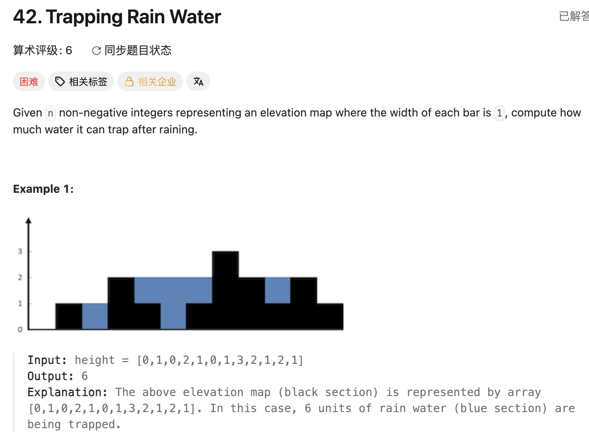

## 42. Trapping Rain Water

Date: 4/16/2026, 8/24/2026, 9/2/2026, 10/9/2026  
Difficulty: Hard  
Tags: Array, Monotonic Stack, Two Pointers



### 一刷 (8/24/2026) ❌ 看答案后重写，仍漏掉 empty check，面积公式也写错

4/16 只讨论了思路，没有写代码。8/24 看过 monotonic stack 的完整代码后重写，出现两个错误：

```java
int mid = stack.pop();
int left = stack.peek(); // ❌① pop 后 stack 可能为空，null 拆箱会导致 NPE

int h = Math.min(height[left], height[i] - height[mid]);
// ❌❌② 应先取两侧 boundary 的 min，再减 height[mid]
```

**①的根因**：进入 while 时 stack 非空，不代表 pop 后仍非空。pop 后如果没有 left boundary，就不能接水。

**②的根因**：`height[left]` 是柱子的完整高度，`height[i] - height[mid]` 是两根柱子的高度差，不能直接放在同一个 min 中比较。

例如 `[3,1,4]`：

```text
错误：min(3, 4 - 1) = 3
正确：min(3, 4) - 1 = 2
```

当 bottom 为 0 时，两种写法结果相同，容易掩盖错误。

> **自检信号**：pop 后先查空；算 water height 时，先找较矮的 boundary，再减 bottom。

**自测点（当时）**：pop 后的新 stack top 为什么能作为 left boundary？旧笔记中的“第一个严格更高”表述不准确，等高情况见后文。

---

### 二刷 (9/2/2026) ❌ 独立写出结构，但把 index 当成 height 比较

一刷的 empty check 和面积公式错误没有再犯；width、push 位置均正确。

```java
while (!stack.isEmpty() && height[i] > stack.peek()) {
    // ❌ stack.peek() 是 index，应为 height[stack.peek()]
}
```

**根因**：stack 存的是 index。计算面积时记得取 height，但在 while condition 中漏了 `height[]`。两者都是 int，代码可以编译，却会静默出错。

例如 `[4,2,0,3,2,5]`，i=1 时错误地比较 `2 > 0`，但实际应该比较 `2 > 4`。

> **自检信号**：看到 peek / pop，先问这一行需要的是 index，还是该位置的 height。

**当日讨论**：

- Monotonic stack：能解释 stack 内有序，但未完整解释 pop 后为什么能结算。原追问使用“第一个严格更高”，问法有误，不能据此判断没有理解。
- Two pointers：提示“中间还有未检查的位置”后，理解了为什么较小的 running maximum 可以确定当前水量。
- `push(i)` 在 while 外，无条件执行；“当前 bar 较矮”不是入栈条件。
- 水量为 0，是因为当前 bar 已达到该位置的 water level，不是因为它一定在端点。

原自测点已经讲解，不再作为独立口答依据。

---

### 三刷 (10/9/2026) ❌ Monotonic stack 未独立完成；two pointers 理解更清楚

先确认了 Java 声明方式：

```java
Deque<Integer> stack = new ArrayDeque<>();
```

独立尝试中的错误：

```java
stack.push(i); // ❌① 过早入栈，下面变成当前 bar 与自己比较

if (!stack.isEmpty() && height[i] > height[stack.peek()]) {
    // ❌② 应用 while，当前 bar 可能触发多次 pop

    int mid = stack.pop();
    // ❌③ pop 后没有检查 stack 是否为空

    int width = i - stack.peek() + 1;
    // ❌④ width 不包含两侧 boundary，应为 -1

    int he = Math.min(height[i], height[stack.peek()]);
    // ❌⑤ 忘记减 height[mid]

    ans += width * he;
}
```

**根因**：三个角色还没有稳定对应到代码：当前 i 是 right boundary，pop 出来的是 bottom，pop 后的 stack top 才是 left boundary。提前 push 导致 condition 永远为 false；面积公式也漏掉了 boundary 和 bottom 的区别。

> **自检信号**：先指出 left、bottom、right；pop 后查空，width 排除两侧 boundary，water height 减 bottom，最后再 push 当前 index。

**Two pointers 的进展**：能从之前的 prefix / suffix 经验想到两侧 maximum。讲解后能用自己的话说明：如果 leftMax 更小，右侧已经足够高；没检查的位置即使更高，也不会改变当前 left 的水量。

现在更容易理解 two pointers，选它作为首选解法。本轮尚未独立写出该版本，不记独立通过。

**自测点**：monotonic stack 的 condition 改为 `>=` 后，遇到等高 bars 会算出多少水？为什么仍然需要 pop 后的 empty check？

---

<!-- ↓↓↓ 复习时先自己想一遍，再往下翻看答案 ↓↓↓ -->

### 核心思路

**一个位置能接多少水，取决于两侧较矮的 boundary。**

```text
water level = min(左侧 maximum, 右侧 maximum)
water       = water level - 当前 bar height
```

例如 `[3,1,4]` 的中间位置：

```text
water level = min(3,4) = 3
water       = 3 - 1 = 2
```

Prefix / suffix maximum 都包含当前 bar，因此计算结果不会为负。

### 解法一：Prefix / suffix maximum arrays

先记录每个位置两侧的 maximum，再逐个位置计算水量。

```java
class Solution {
    public int trap(int[] height) {
        int n = height.length;

        int[] preMax = new int[n];
        preMax[0] = height[0];
        for (int i = 1; i < n; i++) {
            preMax[i] = Math.max(preMax[i - 1], height[i]);
        }

        int[] sufMax = new int[n];
        sufMax[n - 1] = height[n - 1];
        for (int i = n - 2; i >= 0; i--) {
            sufMax[i] = Math.max(sufMax[i + 1], height[i]);
        }

        int ans = 0;
        for (int i = 0; i < n; i++) {
            ans += Math.min(preMax[i], sufMax[i]) - height[i];
        }

        return ans;
    }
}
```

本题保证 height 非空。

**Time: O(n)**：三次 traversal。  
**Extra space: O(n)**：保存两个 arrays。

### 解法二：Two pointers（首选）

不保存每个位置的 maximum，只保存从两端走到当前位置时见过的 maximum。

```java
class Solution {
    public int trap(int[] height) {
        int left = 0, right = height.length - 1;
        int leftMax = 0, rightMax = 0;
        int ans = 0;

        while (left <= right) {
            leftMax = Math.max(leftMax, height[left]);
            rightMax = Math.max(rightMax, height[right]);

            if (leftMax <= rightMax) {
                ans += leftMax - height[left];
                left++;
            } else {
                ans += rightMax - height[right];
                right--;
            }
        }

        return ans;
    }
}
```

#### 为什么还没遍历完，就能算水量？

每轮 update 后：

```text
leftMax  = max(height[0 ... left])
rightMax = max(height[right ... n-1])
```

Left 从 0 逐格走过来，所以 leftMax 是当前 left 准确的 prefix maximum。

RightMax 不一定是 left 完整的 suffix maximum，因为中间还有没看过的位置。但：

```text
left 真正的 suffix maximum ≥ rightMax
```

如果 `leftMax <= rightMax`：

```text
left 真正的 suffix maximum ≥ rightMax ≥ leftMax
```

右侧已经足够挡水，当前 left 的 water level 就确定为 leftMax。

```java
ans += leftMax - height[left];
```

**只需知道右侧足够高，不需要知道它到底有多高。**

例如：

```text
height = [3, 1, ?, ?, 4]
             ↑       ↑
           left    right
```

LeftMax 是 3，rightMax 是 4。未知位置即使有高度 100 的 bar，也改变不了 left 只能接 `3 - 1 = 2` 的水。

RightMax 更小时，同理计算 right。

#### Dry run

```text
height = [4,2,0,3,2,5]
每个位置的水量 = [0,2,4,1,2,0]
总水量 = 9
```

#### 为什么使用 left <= right？

本版每轮计算一个位置，再移动对应 pointer。使用 `<=`，表示相遇的那个位置也处理一次。

旧笔记曾说 `[3,1,3]` 使用 `<` 会漏掉中间的水，这是错误的。按这里的算法，中间位置会在相遇前处理；最后相遇处是一个全局 maximum，贡献为 0。因此这份完整算法使用 `<` 也能得到正确答案，笔记固定保留 `<=`。

LC167 的要求不同：它要选两个不同的 indices，因此使用 `<`。

**Time: O(n)**：每轮处理一个位置。  
**Extra space: O(1)**：只维护固定数量的 variables。

### 解法三：Monotonic stack

Stack 保存 index，对应的 heights 从 stack bottom 到 top 非递增。

当前 bar 比 stack top 高时，它可以作为 right boundary，尝试接水。

```java
class Solution {
    public int trap(int[] height) {
        Deque<Integer> stack = new ArrayDeque<>();
        int ans = 0;

        for (int i = 0; i < height.length; i++) {
            while (!stack.isEmpty()
                    && height[i] > height[stack.peek()]) {
                int mid = stack.pop();

                if (stack.isEmpty()) {
                    break;
                }

                int left = stack.peek();
                int width = i - left - 1;
                int waterHeight =
                    Math.min(height[left], height[i]) - height[mid];

                ans += width * waterHeight;
            }

            stack.push(i);
        }

        return ans;
    }
}
```

#### 三个 index 分别是什么？

```text
pop 后的 stack top    pop 出来的 mid    当前 i
left boundary        bottom           right boundary
```

```java
int width = i - left - 1;
int waterHeight =
    Math.min(height[left], height[i]) - height[mid];
```

Width 不包含两侧 boundary；water height 是较矮的 boundary 高出 bottom 的部分。

#### 为什么用 while？

当前 bar 可能比多个 stack 中的 bars 都高，所以一次 pop 后还要继续检查。

例如 `[4,2,0,3,2,5]`：

```text
i=3：先弹 height 0，再弹 height 2，分别增加 2、2
i=5：先弹 height 2，再弹 height 3，分别增加 1、4

总水量 = 2 + 2 + 1 + 4 = 9
```

**Two pointers 一次算一个 column；monotonic stack 一次算一个 horizontal layer。** 同一个 column 的水，可能由多次 pop 分别算出。

#### 等高 bars 怎么处理？

本版使用 `>`，等高 bars 会保留在 stack 中。因此 pop 后的新 top 可能与 bottom 等高，不能说它一定“严格更高”。

如果二者等高，这次算出的 water height 为 0。

使用 `>=` 也可以，但会更早 pop 等高 bars。无论选哪种，都需要 pop 后的 empty check。本笔记固定使用 `>`。

#### 复杂度分析

**Time: O(n)**：每个 index push 一次，最多 pop 一次。虽然有 nested loops，但所有 pop 加起来最多 n 次。

**Extra space: O(n)**：例如 `[5,4,3,2,1]` 不触发 pop，stack 会保存全部 indices。

### 三种解法对比

| 解法                   | Time | Extra space | 计算方式              |
| ---------------------- | ---- | ----------- | --------------------- |
| Prefix / suffix arrays | O(n) | O(n)        | 逐个 column           |
| Two pointers           | O(n) | O(1)        | 逐个 column           |
| Monotonic stack        | O(n) | O(n)        | 逐个 horizontal layer |

Brute force 对每个位置分别向左右找 maximum，time 为 O(n²)。

面试可以先解释 prefix / suffix 公式，再说明 two pointers 如何省去 arrays。Monotonic stack 作为另一种解法保留。

### 沉淀

- **先确认 index 的角色，再写公式。** Stack 存 index，比较 height 时需要 `height[index]`。
- **Pop 后重新检查 stack。** 之前非空，不代表现在还有 left boundary。
- **Water level 不等于 water height。** 取两侧 boundary 的 min 后，还要减 bottom。
- **Two pointers 只处理水量已经确定的一侧。** 另一侧已足够高，就不需要继续寻找它真正的 maximum。
- **Condition 与操作顺序一起检查。** 先更新 maximum，再计算水量，最后移动 pointer；stack 则先处理，再 push。

### 关联

- LC84：常见 monotonic stack 写法用末尾的 0 触发剩余面积结算；LC42 不需要强制清空 stack。
- LC739：同样用当前值触发较小值的 pop。
- LC704：index 与 value 混淆，与二刷漏套 height[] 互为镜像。
- LC238：prefix / suffix 的经验帮助理解本题。
- LC167：同为 two pointers，但本题处理一个位置，LC167 选择两个不同位置。

### Interview pitch

> "The amount of water we can trap is limited by the shorter boundary—the smaller of the prefix and suffix maximums.
>
> I use two pointers starting at opposite ends and track the maximum height seen so far from each side. In each iteration, I update both maximums to include the current bars.
>
> If leftMax is no greater than rightMax, we already have a tall enough boundary on the right. Any taller bars in the unexplored region won't change the water level at left.
>
> I add leftMax minus height[left] to the total and move the left pointer inward. Otherwise, I do the same on the right. I continue until the pointers cross.
>
> Each position is processed once, so the time complexity is O(n), and the extra space is O(1)."
