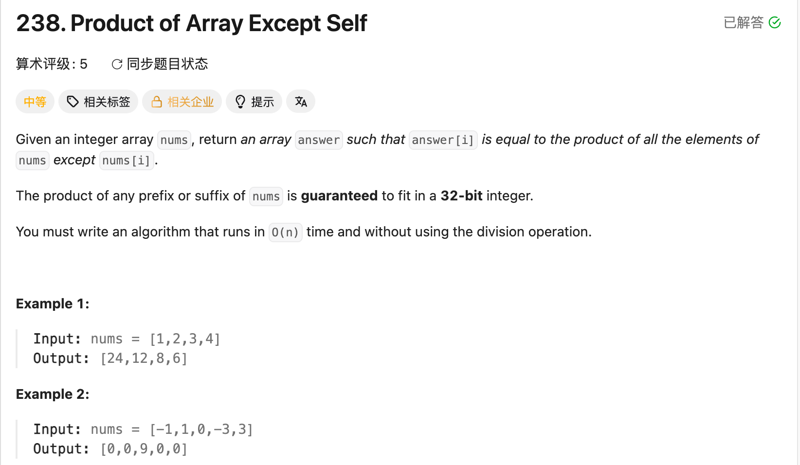

## 238. Product of Array Except Self

Date: 8/15/2026, 8/23/2026, 8/25/2026, 9/9/2026, 9/29/2026
Difficulty: Medium
Tags: array, prefix product, suffix product



### 一刷 (8/15/2026) 原记 ⚠️：结构正确，合并时抓错 array 和 index

```java
int temp = 1;
for (int j = nums.length - 2; j >= 0; j--) {
    temp *= ans[j+1];          // ❌① 应为 nums[j+1]
    ans[j] = ans[j+1] * temp;  // ❌② 应为 ans[j] * temp
}
```

**①**：`temp` 累积的是右侧原始 element 的乘积；`ans[j+1]` 存的是计算结果，不能代替 `nums[j+1]`。

**②**：需要的是 index j 左边的乘积，应读取 `ans[j]`。读取右邻还会遇到 in-place 覆盖：右邻可能已经变成最终答案，不再是 prefix product。

反例 `[1,2,3,4]`：仅修好①后，j=2 算出 24 而非 8；接着 j=1 读到已覆盖的 24，得到 288，错误继续放大。

> **自检信号**：读某个 array 位置前，确认它属于哪个 array，以及此刻存的是原始值、prefix product，还是最终答案。

历史标题保留原来的 ⚠️；上述代码存在实际错误，不能当作独立通过记录。

---

### 二刷 (8/23/2026) ❌ 没有 variable 承担跨 iteration 的累积

```java
int last = 1;
for (int j = nums.length - 2; j >= 0; j--) {
    int suffix = last * nums[j+1]; // ❌ last 始终是 1，每轮只得到一个 element
    ans[j] = suffix * ans[j];
}
```

**根因**：`last` 没有 update，`suffix` 每轮重新计算，后缀积没有累积起来。问题不只是声明位置，而是上一轮的结果没有传到下一轮。

`[1,2,3,4]` 得到 `[2,3,8,6]`。最右两格碰巧正确：最后一格不进第二趟，倒数第二格的后缀本来就只有一个 element。

> **自检信号**：累积量写完后，指出「上一轮的结果」在下一轮从哪里读入、又存回哪里。

---

### 三刷 (8/25/2026) ⚠️卡推导 修改后代码正确，prefix 定义不够稳定

历史上的 array、index 和累积问题未再犯。但第一趟曾写成乘 `nums[i]`，随后自行改成 `nums[i-1]`，因此不应记为初稿一次写对。

**口答**：问第一趟改成包含自己的 prefix product 后，下游怎么调整，未能答出。

旧笔记随后把这种写法解释成「必须除法、所以走不通」，该解释错误，已在下方引申中修正。

> **自检信号**：改递推式后，重新写出每格表示的范围，再核对初值和下游读取位置。

---

### 四刷 (9/9/2026) ❌ 前缀漏掉末位，后缀乘数写死

```java
for (int i = 1; i < nums.length - 1; i++) {
    //             ❌① 应为 i < nums.length，否则 ans[n-1] 未计算
    ans[i] = ans[i-1] * nums[i-1];
}

// 第二趟中的错误 update：
suffix = suffix * nums[nums.length - 1];
// ❌❌② 应为 nums[j+1]：每轮都乘最后一个 element，未随 j 移动
```

**根因**：① 第一趟必须填满整个 ans；② suffix 虽然在累乘，但乘数固定，累积成了末位 element 的幂。两处错误均通过运行结果自行发现。

②与二刷相近：二刷没有累积，这次有累积，但累积的内容错误。

> **自检信号**：分别核对「最后一格有没有被写到」和「这一轮新纳入的是哪个 element」，不要只看有没有乘法和 loop。

---

### 五刷 (9/29/2026) 代码一次写对，口答未完成

能独立说明：

- index i 的答案是 `[0, i-1]` 与 `[i+1, n-1]` 的乘积。
- ans 先保存前缀积；从右往左累积后缀积，算出后立即乘进对应位置，无须保存全部后缀积。

本轮代码与下方正确写法一致。第一趟覆盖末位，第二趟乘数随 index 移动，历史错误未再犯。`surfix` 只是命名拼写，统一改为 `suffix`。

**口答记录**：对「改成包含自己的 prefix product 后如何调整」回答不会。给出具体 array 和所需乘积后，回答「第一格」，指的是 index 1 还是第一格未确认；随后提示了 `prefix[i-1]`，边界问题未继续回答。

旧笔记对此变体曾给出错误结论，本轮又经过提示，因此口答未完成，暂不据此推进或升级档位，也不记毕业。

> **自检信号**：先写清 prefix 是否包含自己，再决定读哪一格；不要把某个固定递推式当成唯一合法定义。

**自测点**：第二趟为什么可以直接覆盖 ans[i]？说明尚未处理的位置还需要哪些旧值。

---

<!-- ↓↓↓ 复习时先自己想一遍，再往下翻看答案 ↓↓↓ -->

### 核心思路

**每格答案 = 排除自己的前缀积 × 排除自己的后缀积。**

第一趟把前缀积写进 ans；第二趟从右往左，用一个 suffix 累积后缀积并立即合并。

### 代码

```java
class Solution {
    public int[] productExceptSelf(int[] nums) {
        int[] ans = new int[nums.length];

        ans[0] = 1;
        for (int i = 1; i < nums.length; i++) {
            ans[i] = ans[i-1] * nums[i-1];
        }

        int suffix = 1;
        for (int i = nums.length - 2; i >= 0; i--) {
            suffix *= nums[i+1];
            ans[i] *= suffix;
        }

        return ans;
    }
}
```

合并 index i 时：

- `ans[i]` 仍是 `[0, i-1]` 的乘积。
- update 后的 suffix 是 `[i+1, n-1]` 的乘积。

最后一格右侧没有 element，后缀积为 1，因此不需要进入第二趟。`ans[0] = 1` 同样表示空积；若保留默认值 0，整条前缀积都会变成 0。

### 复杂度分析

**Time: O(n)**：两趟线性扫描。
**额外 Space: O(1)**：不计返回用的 ans；计入它则为 O(n)。

分别保存完整前后缀积需要 O(n) 额外空间；对每个位置重新计算其余 element 的乘积需要 O(n²) 时间。

### 引申：包含自己的 prefix product 也可以使用

两种定义都合法，但初值、递推式和读取位置必须配套：

| 定义                 | 初值                  | 递推式                                | index i 所需的左侧乘积             |
| -------------------- | --------------------- | ------------------------------------- | ---------------------------------- |
| 不含自己：`[0, i-1]` | `prefix[0] = 1`       | `prefix[i] = prefix[i-1] * nums[i-1]` | `prefix[i]`                        |
| 包含自己：`[0, i]`   | `prefix[0] = nums[0]` | `prefix[i] = prefix[i-1] * nums[i]`   | i>0 时取 `prefix[i-1]`，i=0 时取 1 |

因此，**包含自己的版本不需要除法，可以读取前一格。**

若将包含自己的 prefix product 存在 ans 中，第二趟仍可从右往左 in-place 合并：

```java
int suffix = 1;
for (int i = nums.length - 1; i >= 0; i--) {
    int left = (i == 0) ? 1 : ans[i-1];
    ans[i] = left * suffix;
    suffix *= nums[i];
}
```

读取 `ans[i-1]` 时，左侧尚未被覆盖，因此仍是原来的 prefix product。

**只改成乘 nums[i]，却保留 ans[0] = 1，并不能得到完整的包含自己版本**：它会漏掉 nums[0]。改定义时必须同时核对初值。

### 如果允许用除法

`total / nums[i]` 在 `nums[i] == 0` 时会除零；total 为 0 本身没有问题。

需要区分：

- 没有 0：直接除。
- 恰好一个 0：只有该位置可能非零，值为其他 element 的乘积。
- 至少两个 0：所有答案都是 0。

本题禁止除法；前后缀积不需要为 0 单独分类。

### 沉淀

- **先定范围，再写递推。** 是否包含当前 element，决定初值和合并时读取哪一格。
- **累积需要上一轮的结果，也需要正确的新乘数。** 有 `*=` 不代表累积内容就正确。
- **in-place 覆盖前检查依赖。** 读邻居不一定错，关键是那一格是否仍保存所需的旧值。
- **array 名与 index 一起核对。** 同一个 index 下，nums 和 ans 表示不同的量。
- **空范围取运算的 identity。** 乘法是 1，加法是 0。

### 关联

- LC80 / LC380：state 的声明位置与生命周期。
- LC704：index 与 value 的角色不能混淆。
- LC135：同样需要两侧信息，但第二趟合并的是约束，不是乘积。
- LC303 / LC560：prefix 是否包含当前 element，会改变区间计算方式。

### Interview pitch (练口述)

> "Each answer is the product of everything to its left times everything to its right. I first store exclusive prefix products in the output array. Then I scan backwards, maintain a running suffix product, and multiply it into each position. The prefix at that position is still available when I need it, so I can overwrite it with the final answer. This takes O(n) time and O(1) extra space beyond the output array, without division."
