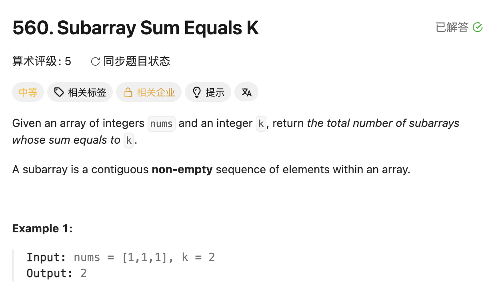

## 560. Subarray Sum Equals K

Date: 9/19/2026
Difficulty: Medium
Tags: Prefix Sum, Hash Table



### 一刷 (9/19/2026) ❌ 从找 index 切到计数时，没同步改 HashMap 的含义

最初的错误片段：

```java
while (map.containsKey(need)) {
    count++;                  // ❌① 只加 1，漏掉相同 need 对应的其他起点
    map.remove(need);         // ❌② 历史 prefix sum 后面还会用，不能消耗掉
}
map.putIfAbsent(sum, i);      // ❌❌③ 核心错误：存 index，丢失出现次数
```

**根因**：把「找一个 subarray 的位置」的写法带进了「统计所有 subarray」。**HashMap 的 value 由题目要什么决定**：这里需要 frequency，每个历史起点都要保留。

改成 frequency 后提交，仍然 TLE：

```java
Map<Integer, Integer> map = new HashMap<>();
// ❌④ 漏了 map.put(0, 1)，从 index 0 开始的答案会漏算

for (int i = 0; i < nums.length; i++) {
    sum += nums[i];
    int need = sum - k;
    while (map.containsKey(need)) { // ❌⑤ condition 不变，命中后 infinite loop
        count += map.get(need);
    }
    map.put(sum, map.getOrDefault(sum, 0) + 1);
}
```

**④⑤的根因**：④ 遍历前的 empty prefix 也算一个起点；⑤ frequency 已经一次加完，不能再用 `while` 重复加。

**Dry run**：`nums = [0, 0], k = 0`。正确过程每轮分别新增 1、2 个答案，共 3 个；只存一个 index 会丢起点。提交版第一轮存入 `0 → 1`，第二轮命中 `need = 0` 后卡在 `while`；只改成 `if` 仍只得 1，因为漏了 empty prefix。

最初草稿另有 mechanical errors：漏分号、未声明 `map`、`arr` 写成 `nums`。

**自测点**：为什么同一个 prefix sum 出现多次，每次都能贡献一个不同的答案，而且用过后不能删除？

---

### 核心思路（一句话）

**当前 `sum` 想凑出 `k`，就找以前有多少个 `sum - k`；有几个，就新增几个答案。**

### 代码

```java
class Solution {
    public int subarraySum(int[] nums, int k) {
        Map<Integer, Integer> map = new HashMap<>();
        map.put(0, 1); // empty prefix：sum = 0 出现过一次
        int sum = 0, count = 0;

        for (int num : nums) {
            sum += num;
            count += map.getOrDefault(sum - k, 0);
            // 先查再存，保证匹配的是之前的 prefix
            map.put(sum, map.getOrDefault(sum, 0) + 1);
        }
        return count;
    }
}
```

### 复杂度分析

**Time: O(n)**：遍历一次，HashMap 每次操作平均 O(1)。
**Space: O(n)**：最多存 n + 1 个不同的 prefix sum。
对比 brute force O(n²)：省掉了逐个枚举起点的过程。

### 沉淀

- **先定义 value 的含义，再写 put**：找位置存 index，统计个数存 frequency。
- **先查历史，再登记当前**：顺序反过来，`k = 0` 时会把当前 prefix 和自己配对，多算 empty subarray。
- **写 while 前检查如何退出**：这里只需一次取出全部 frequency，用 `if` 或 `getOrDefault`。

### 关联

- Find Subarray with Target Sum：同样查 `sum - k`；从返回位置改为统计个数，HashMap 的 value 和更新方式也必须一起改。
