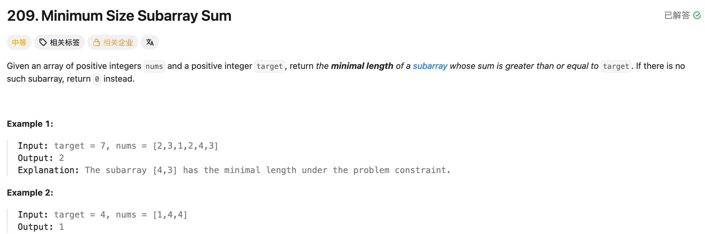

## 209. Minimum Size Subarray Sum

Date: 10/9/2026  
Difficulty: Medium  
Tags: Array, Sliding Window



### 一刷 (10/9/2026) ❌ 最小值初始化错误，遗漏边界，window 没有持续缩小

能写出右侧加入、左侧移出的动作，但下面几处没有接好：

```java
int ans = 0; // ❌① 正长度与 0 取 min，ans 永远是 0
int left = 0, right = 1;
int sum = nums[left]; // ❌② 没检查只有 nums[0] 的 window

while (right < nums.length - 1) { // ❌③ 漏掉最后一个 element
    sum += nums[right];

    // ...

    sum -= nums[left];
    left++;

    if (sum >= target) { // ❌④ 只再记录一次，没有继续缩小 window
        ans = Math.min(ans, right - left + 1);
    }
}
```

**根因**：求最小值时把 ans 初始化为 0；从第二个 element 开始检查，又漏掉末尾。缩小 window 的次数取决于 sum 是否仍达标，不能只移动一次 left。

例如 `target = 7, nums = [1,1,1,7]`，需要持续缩小到 `[7]`，才能得到最短 length 1。

讲解后能总结：right 固定逐个遍历，用 for 管推进；left 在 sum 达标时可能连续移动多次，用 while。本轮尚未独立重写验收。

> **自检信号**：求 min 时检查初始值；用单个 element 测 boundary；找到合法 window 后，检查是否还能继续缩小。

**自测点**：为什么 sum 达标后可以不断移出左侧 element？题目保证所有 elements 为正数，在这里起什么作用？

---

<!-- ↓↓↓ 复习时先自己想一遍，再往下翻看答案 ↓↓↓ -->

### 核心思路（一句话）

**右侧加入一个数；只要 sum 达标，就记录当前 length，并继续从左侧缩小 window。**

### 正确写法

```java
class Solution {
    public int minSubArrayLen(int target, int[] nums) {
        int ans = Integer.MAX_VALUE;
        int left = 0;
        int sum = 0;

        for (int right = 0; right < nums.length; right++) {
            sum += nums[right];

            while (sum >= target) {
                ans = Math.min(ans, right - left + 1);

                sum -= nums[left];
                left++;
            }
        }

        return ans == Integer.MAX_VALUE ? 0 : ans;
    }
}
```

### Window 中的三个量

```text
left / right：当前 window 的两个 endpoints，均包含
sum：nums[left ... right] 的总和
right - left + 1：当前 window 的 length
```

加入右侧 element：

```java
sum += nums[right];
```

移出左侧 element：

```java
sum -= nums[left];
left++;
```

**先减掉旧 left 对应的值，再移动 left。** 这样 sum 才始终对应当前 window。

### 为什么要持续缩小

例如：

```text
target = 7
nums = [1,1,1,7]
```

right 到最后一个位置时：

```text
window       sum    length
[1,1,1,7]    10       4
  [1,1,7]     9       3
    [1,7]     8       2
      [7]     7       1
       []     0       停止缩小
```

只用 if，就只能处理一次。使用 while，才能找到当前 right 对应的最短合法 window。

**先记录，再移出。** 当前 window 已经满足要求，移出之后不一定仍满足，不能漏记当前答案。

### 为什么正数条件重要

所有 elements 都是正数：

- 加入右侧 element，sum 增大。
- 移出左侧 element，sum 减小。

所以 sum 不够时，需要向右扩展；sum 达标时，可以尝试从左侧缩小。

移出一个 left 之前，已经记录过以它为起点的合法 window。之后 right 再往右走，以这个旧 left 为起点的 window 只会更长，不可能改善最短答案，因此不需要把 left 移回去。

如果允许负数，上述 sum 的变化方向就不确定，这套写法不能直接套用。

### For 与 while 怎么分工

```java
for (int right = 0; right < nums.length; right++) {
    // right 固定每轮前进一步

    while (sum >= target) {
        // left 根据 condition，可能移动零次、一次或多次
    }
}
```

**选择依据是推进方式，不是移动方向。** 两个 pointers 都向右走，但职责不同。

- right：依次加入每个 element，for 更方便。
- left：只要 sum 仍达标就继续移动，while 更合适。

用 while 管 right 也可以，但必须自己维护 update 和 boundary。

### 为什么 ans 不能从 0 开始

```java
Math.min(0, 正长度)
```

结果永远是 0，所以先用一个足够大的值：

```java
int ans = Integer.MAX_VALUE;
```

如果最终没有更新过，说明不存在合法 window，返回 0。

### 复杂度分析

**Time: O(n)**：right 遍历 n 个 elements；left 只向右移动，总共最多 n 次。虽然有 nested loops，但内层不会为每个 right 从头扫描。

**Extra space: O(1)**：只维护固定数量的 variables。

对比 brute force O(n²)：逐个选择起点，再向右累加寻找答案，会重复扫描；sliding window 复用当前 sum，两个 pointers 都不回头。

### 沉淀

- **求最小正长度，不要把 ans 初始化为 0。**
- **从空 window 开始，统一处理每个 element。** 避免漏掉只有第一个 element 的情况。
- **Sum 达标后，先记录，再持续缩小。**
- **For 管固定推进，while 管按 condition 重复处理。**
- **判断 nested loops 的复杂度，要数总移动次数。** 本题 left 不会在每轮重新回到起点。

### 关联

- LC15：每换一个 i，two pointers 都重新初始化，因此总扫描为 O(n²)；本题 left 不重置，总扫描为 O(n)。
- LC11：width 是两个 indices 的距离，用 `right - left`；本题 length 包含两个 endpoints，用 `right - left + 1`。

### Interview pitch

> "I use a sliding window and maintain its sum. I move the right pointer forward to add each element.
>
> Whenever the sum reaches the target, I record the current length and keep removing elements from the left to look for a shorter valid window.
>
> This works because all elements are positive. Both pointers only move forward, so the time complexity is O(n), and the extra space is O(1). If no valid window is found, I return zero."
