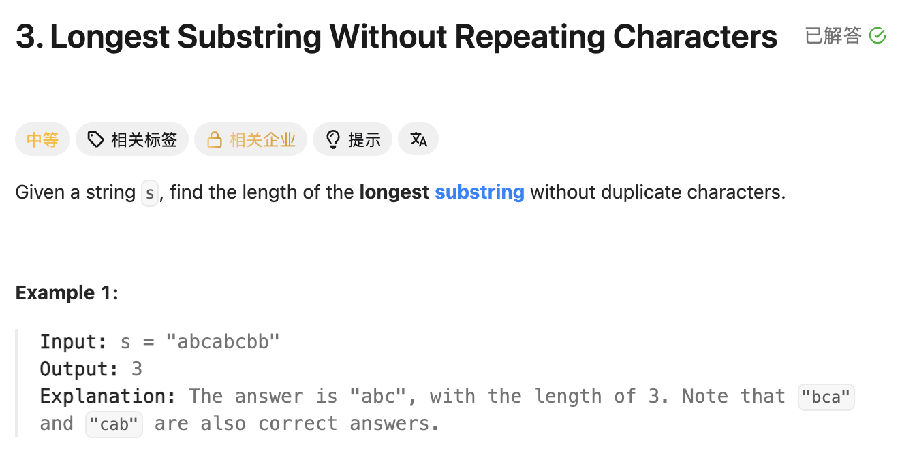

## 3. Longest Substring Without Repeating Characters

Date: 10/9/2026  
Difficulty: Medium  
Tags: String, Hash Table, Sliding Window



### 一刷 (10/9/2026) ❌ 能搭出 sliding window，移出对象与答案更新时机不对

独立想到用 HashSet 检查重复，并用 while 缩小 window。错误集中在实现：

```java
int ans = Integer.MIN_VALUE; // ❌① 空 string 时直接返回负数，应从 0 开始

for (int right = 0; right < s.length(); right++) {
    char c = s.charAt(i); // ❌② i 未定义，应为 right

    while (set.contains(c)) {
        ans = Math.max(ans, right - left);
        // ❌③ 只在重复时更新，会漏掉不重复的 window

        set.remove(c); // ❌❌④ 核心错误：应移出 s.charAt(left)
        left++;
    }

    set.add(c);
}
```

**根因**：left 向右移动，表示移出旧 left 对应的 character；直接删除 c，会让 set 与实际 window 不一致。答案应在消除重复、加入 c 后更新，而不是只在遇到重复时更新。

例如 `"abc"` 没有重复，原 while 不执行，ans 完全没有更新。

`i` 是 variable 名字写错；移出对象和答案更新位置属于逻辑问题。本轮已讲解，尚未独立重写验收。

> **自检信号**：移动 left 前，确认删除的正是旧 left 对应的 character；更新 ans 前，确认当前 window 已合法，并检查无重复和空 string 是否也能正确返回。

**自测点**：读到 `"abba"` 的第二个 b 时，为什么不能直接从 set 删除 b，再只让 left 前进一步？

---

<!-- ↓↓↓ 复习时先自己想一遍，再往下翻看答案 ↓↓↓ -->

### 核心思路（一句话）

**右侧 character 已存在时，持续从左侧移出，直到可以加入它；再更新最长合法 window。**

### 正确写法

```java
class Solution {
    public int lengthOfLongestSubstring(String s) {
        Set<Character> set = new HashSet<>();
        int left = 0;
        int ans = 0;

        for (int right = 0; right < s.length(); right++) {
            char c = s.charAt(right);

            while (set.contains(c)) {
                set.remove(s.charAt(left));
                left++;
            }

            set.add(c);
            ans = Math.max(ans, right - left + 1);
        }

        return ans;
    }
}
```

### Set 与 window 必须对应

加入 c 之前：

```text
set 保存 s[left ... right-1] 中的 characters
这段 window 没有重复
```

如果 c 已存在，就从 left 开始逐个移出。直到旧的 c 被移出，才可以加入当前 c。

加入之后：

```text
set 保存 s[left ... right] 中的 characters
当前 window 仍然没有重复
```

因此每次移动 left，都必须配套：

```java
set.remove(s.charAt(left));
left++;
```

### 为什么不能直接 remove(c)

以 `"abba"` 为例，right 指向第二个 b：

```text
index:  0  1  2  3
char:   a  b  b  a
        ↑     ↑
       left  right

set = {a, b}
c = 'b'
```

正确处理：

```text
移出 s[0] = a，left → 1
set = {b}，仍包含 c，继续

移出 s[1] = b，left → 2
set = {}，不再包含 c

加入当前 b
window = "b"，set = {b}
```

如果直接 remove(c)，再 left++：

```text
set 删除 b，却保留 a
left 从 0 移到 1
```

此时 left 跳过的是 a，但 set 删除的是 b，二者不再对应。重新加入当前 b 后，实际范围是 `"bb"`，set 却是 `{a,b}`，这个 length 不能作为合法答案。

### 为什么最后更新 ans

```java
set.add(c);
ans = Math.max(ans, right - left + 1);
```

此时重复已经消除，当前 window 合法，才能用它更新答案。

如果只在 while 中更新，`"abc"` 这种没有重复的 input 就一次也不会更新。

**执行顺序：先消除重复 → 加入 c → 记录 length。**

### 与 LC209 的区别

|            | LC209                | LC3                                     |
| ---------- | -------------------- | --------------------------------------- |
| 目标       | 最短达标 window      | 最长无重复 window                       |
| 缩小的原因 | 已经达标，尝试更短   | 新 character 重复，必须移出旧 character |
| 更新答案   | 达标时先记录，再缩小 | 消除重复并加入新 character 后记录       |

两题都用 while 移动 left，但 while 的含义不同，不能直接照搬答案更新位置。

### 为什么 ans 从 0 开始

本题求最大 length，所有候选都不小于 0，所以：

```java
int ans = 0;
```

空 string 不进入 for，自然返回 0。

LC209 求最小正 length，需要把初始值设得足够大；本题求最大值，不需要 Integer.MIN_VALUE。

### 常用 API

```java
s.length();               // string 的 length
s.charAt(right);          // 取指定 index 的 character
set.contains(c);          // 检查 c 是否存在
set.remove(s.charAt(left)); // 移出左侧 character
set.add(c);               // 加入当前 character
```

### 复杂度分析

设 n = s.length()。

**Time: expected O(n)**：right 遍历一次；left 只向右移动，总共最多 n 次。HashSet 的 add / remove / contains 按 average O(1) 计。

**Extra space: O(min(n, Σ))**：set 只保存当前无重复 window 中的 characters，Σ 是 character set 的大小；通常简写为 O(n)。

### 沉淀

- **移动 left，必须移出旧 left 对应的 character。**
- **Set 保存的是当前 window，不是所有见过的 characters。**
- **先恢复合法状态，再记录最长 length。**
- **最大值与最小值的初始化分开考虑。** 本题从 0 开始，LC209 用足够大的初始值。
- **用无重复 input 检查答案更新位置，用空 string 检查初始值。**

### 关联

- LC209：同为 sliding window，但缩小原因与答案更新时机不同。
- LC219：同样需要判断重复；LC219 保存最近的 index，本解法用 Set 保存当前 window 中的 characters。

### Interview pitch

> "I use a sliding window and a HashSet to track the characters in the current window.
>
> For each new character, if it is already in the set, I keep removing characters from the left until the previous occurrence is removed.
>
> Then I add the new character and update the maximum window length. Both pointers only move forward, so the expected time complexity is O(n), and the extra space is O(n)."
