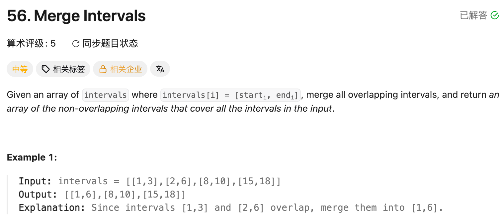

## 56. Merge Intervals

Date: 9/19/2026
Difficulty: Medium
Tags: Array, Sorting



### 一刷 (9/19/2026) ❌ 搞混了读取的原 array 和合并后的结果

最初的错误片段：

```java
List<int[]> result = new ArrayList<>();
// ❌① 没有先按 start 排序，也没有把第一段放入 result

for (int i = 1; i < intervals.length; i++) {
    if (intervals[i][0] <= intervals[i - 1][1]) { // ❌❌② 比的是原输入上一段
        result.add(new int[]{intervals[i - 1][0], intervals[i][1]});
        // ❌③ 重叠时应更新已合并的最后一段；直接取当前 end 还可能缩短范围
    } else {
        result.add(new int[]{intervals[i][0], intervals[i][1]});
    }
}
// ❌④ 漏 return
```

**根因**：我搞混了「读」和「结果」的 array。`intervals[i]` 是当前待处理的段，`last` 才是 result 中最后一段，可能已经合并过多个 interval。

修改后仍有两处：

```java
int[] last = result.get(result.size() - 1);

if (intervals[i][0] <= intervals[i - 1][1]) { // ❌② 比较对象仍未改成 last[1]
    last[1] = Math.max(last[i], intervals[i][1]); // ❌⑤ last[i] 应为 last[1]
}
```

**⑤是 index 混淆**：last 只有 start、end 两个 element；i 表示当前读到第几个 interval，i ≥ 2 时访问 `last[i]` 会越界。

**Dry run**：`[[1,10], [2,3], [4,5]]`

```text
先放入 [1,10]
读 [2,3] → 被包含，last 仍是 [1,10]，不能缩成 [1,3]
读 [4,5] → 比较 4 <= last[1] 的 10，可以合并
若与原输入上一段 [2,3] 比 → 4 <= 3 为 false，错误地新增一段
```

**自测点**：为什么只需要和 result 最后一段比较？为什么不能改成原输入上一段？

---

### 核心思路（一句话）

**按 start 排序后，读当前段、和 last 比较：重叠就延长 last，不重叠才新增一段。**

### 代码

```java
class Solution {
    public int[][] merge(int[][] intervals) {
        Arrays.sort(intervals, (a, b) -> Integer.compare(a[0], b[0]));

        List<int[]> result = new ArrayList<>();
        result.add(new int[]{intervals[0][0], intervals[0][1]});

        for (int i = 1; i < intervals.length; i++) {
            int[] last = result.get(result.size() - 1);

            if (intervals[i][0] <= last[1]) {
                last[1] = Math.max(last[1], intervals[i][1]);
            } else {
                result.add(new int[]{intervals[i][0], intervals[i][1]});
            }
        }

        return result.toArray(new int[result.size()][]);
    }
}
```

本题输入非空；只有一段时，loop 自动跳过，不必单独 return。

### 为什么只看 last

排序后，当前 start 不小于之前的 start；result 中各段已经互不重叠。更早的段都结束在 last 的 start 之前，不可能与当前段重叠，因此只需检查 last。

### 本题不熟悉的 API

```java
// a、b 各是一整行；比较第一个数，移动整行
Arrays.sort(intervals, (a, b) -> Integer.compare(a[0], b[0]));

// List 长度可变，每个 element 是一个 int[]
List<int[]> result = new ArrayList<>();
result.add(new int[]{1, 6});

// 取到已有 array 的 reference；修改 last，result 中的内容也会变
int[] last = result.get(result.size() - 1);

// List<int[]> → int[][]；不带参数的 toArray() 返回 Object[]
return result.toArray(new int[result.size()][]);
```

### 复杂度分析

**Time: O(n log n)**：排序 O(n log n)，扫描合并 O(n)。
**Space: O(n)**：result 最多保存 n 段；Java 对 int[][] 的 comparator 排序也可能使用 O(n) 辅助空间。

### 沉淀

- **分清读和结果**：原输入上一段不等于合并后的最后一段。
- **按 start 排序，不代表 end 也递增**：遇到包含关系，用 Math.max 保留更远的 end。
- **端点相同也重叠**：condition 用 `<=`，例如 `[1,4]` 和 `[4,5]`。
- **先定义每层 index 的含义**：`intervals[i]` 是第 i 段；一段内部 `[0]` 是 start、`[1]` 是 end。
