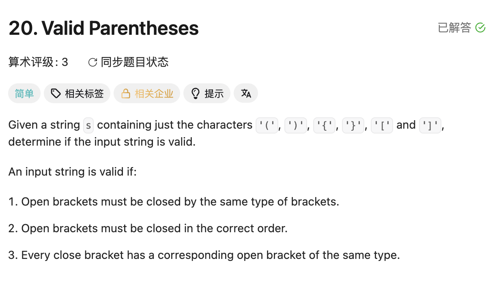

## 20. Valid Parentheses

Date: 9/19/2026
Difficulty: Easy
Tags: String, Stack



### 一刷 (9/19/2026) ❌ 知道用 stack 消消乐，但没分清什么时候 push / pop

最初的错误片段：

```java
stack.append(s.charAt(0)); // ❌① Deque 没有 append，用 push
for (int i = 1; i < s.length(); i++) {
    char cur = s.charAt(i);
    char pop = stack.pop(); // ❌② 每轮直接 pop：左括号也被提前移除，empty 时抛异常
}
```

**根因**：stack 存「尚未配对的左括号」。左括号来了要 push；只有右括号来了，才检查能否与 top 配对。

**Dry run**：`"([])"` 读到 `[` 时应保留 `(` 并 push `[`；直接 pop 会提前丢掉 `(`，后面的 `)` 就没法配对。

看解后重写，逻辑正确，只剩一处 mechanical error：

```java
if (cur == '(' || cur = '[' || cur == '{') { // ❌③ = 应为 ==，导致 compile error
```

> **自检信号**：多个 condition 用 `||` / `&&` 连接时，逐项检查比较符号。

**自测点**：为什么右括号只能和 top 配对，不能去 stack 更深处找一个同类型的左括号？

---

### 正确写法

```java
class Solution {
    public boolean isValid(String s) {
        Deque<Character> stack = new ArrayDeque<>();

        for (int i = 0; i < s.length(); i++) {
            char cur = s.charAt(i);

            if (cur == '(' || cur == '[' || cur == '{') {
                stack.push(cur);
            } else {
                if (stack.isEmpty()) return false;

                char top = stack.pop();
                if ((cur == ')' && top != '(')
                        || (cur == ']' && top != '[')
                        || (cur == '}' && top != '{')) {
                    return false;
                }
            }
        }
        return stack.isEmpty();
    }
}
```

### 复杂度分析

**Time: O(n)**：每个 character 扫描一次，最多 push / pop 各一次。
**Space: O(n)**：全是左括号时，stack 存下所有 character。

### 沉淀

- **最晚出现的左括号，必须最先配对**：这就是用 stack 的原因。
- **先排除失败，再检查剩余**：右括号无对应或类型不符就 false；最后 stack 为空才 true。
- **从 i = 0 统一处理**：不需要提前 push 第一个 character，也不需要单独判断 length == 1。
