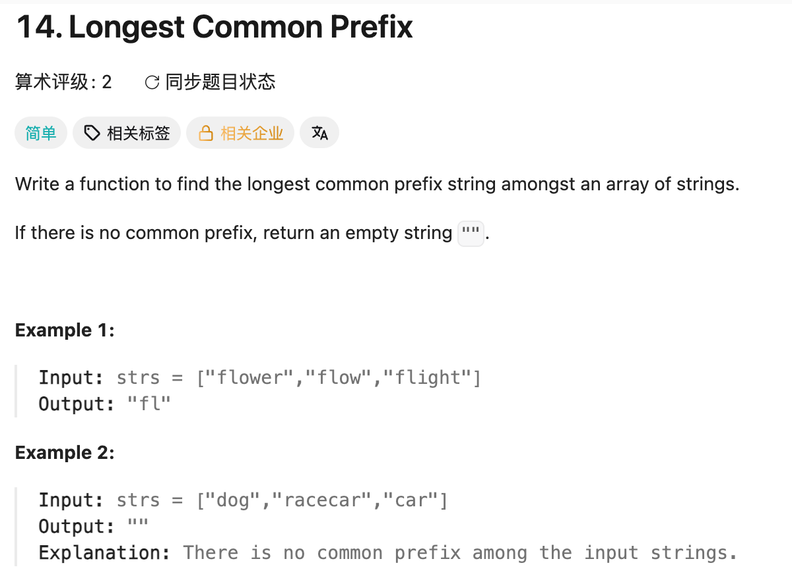

## 14. Longest Common Prefix

Date: 9/16/2026  
Difficulty: Easy  
Tags: String



### 一刷 (9/16/2026) ❌ 没思路，看答案后理解

**卡在哪**：不知道两个 loop 分别负责什么，也不理解为什么遇到 mismatch 就能 return。

**真正的坎**：固定 character 的 index `i`，用 `j` 检查其他所有 String；全部通过，才进入下一个位置。

抄写时的两处 mechanical errors：

```java
for (int j = 1; i < strs.length; j++) { // ❌ condition 应用 j，否则不能限制 j
    if (i >= strs[j].length() || strs[j]charAt(i) != c) { // ❌ 少了 .
```

**自测点**：为什么遇到 mismatch 或某个 String 到头时，可以直接返回 `substring(0, i)`？

---

### 核心思路（一句话）

**一列一列比：整列相同才继续，遇到 mismatch 或某个 String 到头，就返回前面通过的部分。**

```text
flower
flow
flight
↑ f 相同
 ↑ l 相同
  ↑ o / o / i 不同 → return "fl"
```

### 正确写法

```java
class Solution {
    public String longestCommonPrefix(String[] strs) {
        for (int i = 0; i < strs[0].length(); i++) {
            char c = strs[0].charAt(i);

            for (int j = 1; j < strs.length; j++) {
                // 先检查 index 是否存在，再取 character
                if (i >= strs[j].length() || strs[j].charAt(i) != c) {
                    return strs[0].substring(0, i);
                }
            }
        }
        return strs[0];
    }
}
```

### 沉淀

- **`i` 管位置，`j` 管 String**：内层 loop 中 `i` 不变。
- **先检查再访问**：合法 index 必须 `< length`，所以 `i >= length` 表示已到头；`||` 左边成立就不执行右边。
- **走到 `i`，说明 `[0, i)` 已全部通过**：当前位置失败，返回 `substring(0, i)`，不包含 `i`；`return` 直接结束整个 method。
- **array 用 `.length`，String 用 `.length()`**。

### 复杂度分析

设 n 为 String 数量，m 为最短 String 的长度。

**Time: O(n × m)**：逐列检查，worst case 下最优。  
**Space: O(1)** auxiliary space；计入返回的 String 则为 O(m)。
